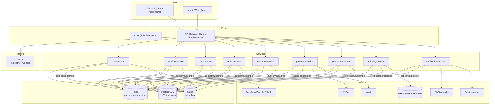
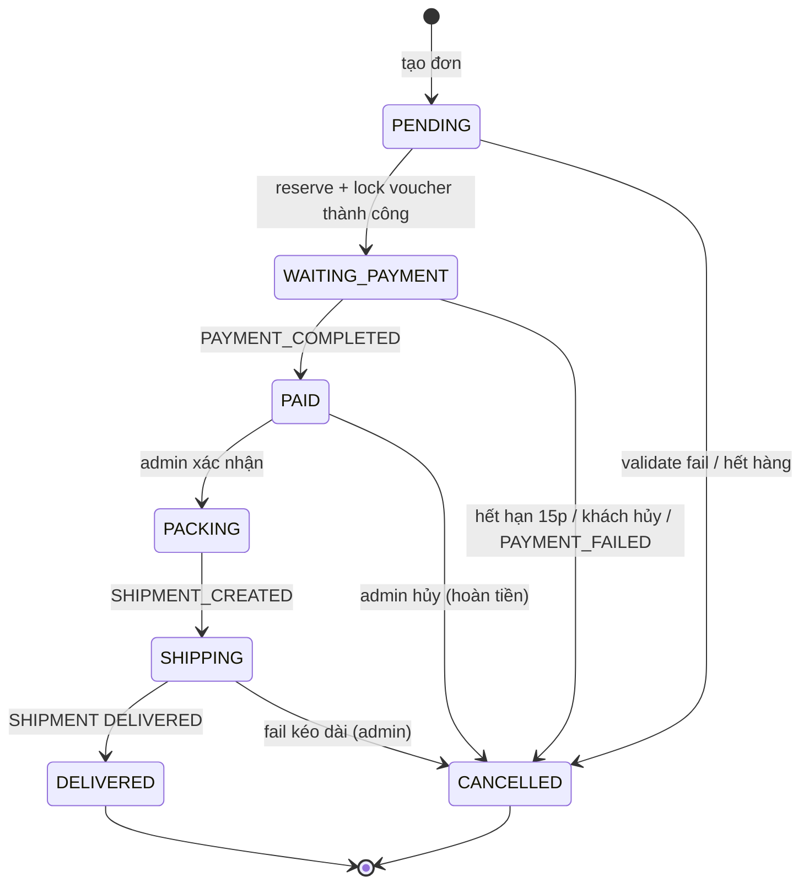
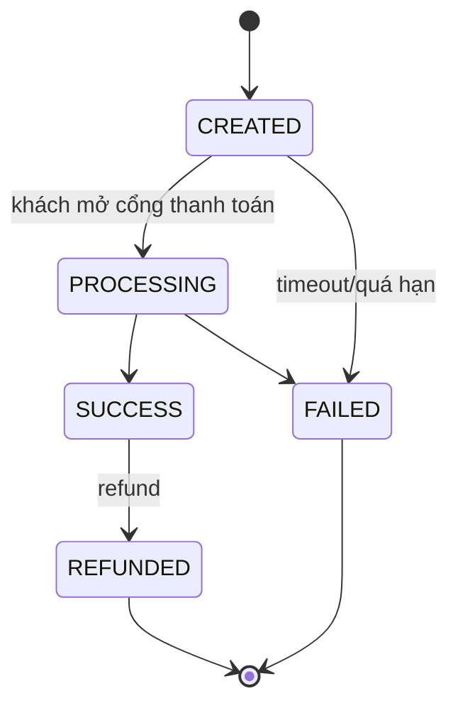
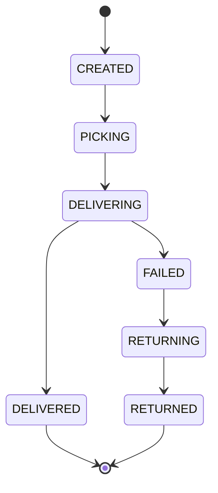
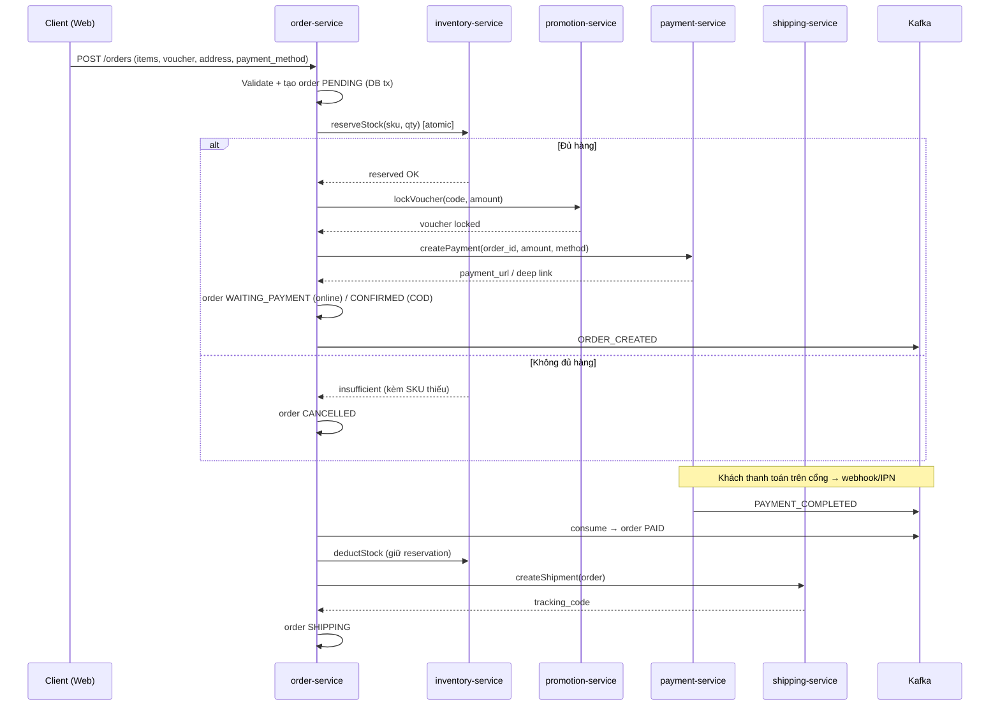

# PRD — Nền tảng E-commerce Thời Trang (Microservices)

| | |
|---|---|
| **Ngày** | 2026-09-11 |
| **Trạng thái** | Draft v0.2 — chi tiết hóa (data model, API, event, business rules) |
| **Tác giả** | Product & Architecture Team |
| **Phiên bản** | v0.2 |

---

## 1. Tổng quan dự án

### 1.1 Bối cảnh & Vấn đề

Shop thời trang cần một nền tảng bán hàng trực tuyến hiện đại, có khả năng **chịu tải cao** trong các chiến dịch sale (flash sale, ngày lễ lớn), với mô hình **bán lẻ một shop** (không phải marketplace). Thị trường mục tiêu: **Việt Nam** — giao diện **Tiếng Việt + Tiếng Anh**, giao dịch bằng **VND**.

Sản phẩm thời trang có đặc thù riêng mà mọi quyết định thiết kế phải phục vụ:
- **Nhiều biến thể** (size × màu) với tồn kho riêng theo SKU → hệ thống tồn kho chi tiết, chống oversell.
- **Trải nghiệm ảnh quan trọng** (ảnh nhiều góc độ, zoom, lookbook) → CDN + object storage + tối ưu ảnh.
- **Nhu cầu theo mùa** (collections, flash sale) → khả năng cập nhật giá/tồn kho nhanh, cache invalidation.

### 1.2 Mục tiêu giai đoạn đầu (Release 1)

1. **Ra mắt web bán hàng responsive** với đầy đủ hành trình mua hàng: duyệt sản phẩm → chọn size/màu → giỏ hàng → thanh toán (VNPay/MoMo/COD) → theo dõi đơn → nhận hàng.
2. **Kiến trúc microservices** (Java Spring Boot) triển khai trên **Kubernetes**, thiết kế để scale ngang từng service độc lập khi tải tăng.
3. **Saga pattern + Kafka** cho giao dịch phân tán (đặt hàng → trừ kho → thanh toán → giao hàng) với tính nhất quán cuối cùng (eventual consistency).
4. **Admin dashboard** cho đội vận hành quản lý sản phẩm, đơn hàng, tồn kho, khuyến mãi, doanh thu.

### 1.3 Phạm vi (Scope)

#### Trong phạm vi (Release 1)

- 9 microservices: `user`, `catalog`, `cart`, `order`, `inventory`, `payment`, `promotion`, `shipping`, `notification`.
- Hạ tầng: Spring Cloud Gateway, Nacos (Service Registry/Config), Kafka, PostgreSQL (1 DB / service), Redis (cache, session, rate limiting).
- Web: SPA React responsive (khách hàng) + React Admin (quản trị).
- Tích hợp ngoài: VNPay, MoMo, COD; GHN, GHTK, Viettel Post, tự giao hàng; SMS OTP, Email, Facebook/Google login.
- Tính năng đặc thù thời trang: Collections/Lookbook, Size Guide, Reviews kèm ảnh, Wishlist + Restock alert, Zoom ảnh sản phẩm.
- i18n: Tiếng Việt + Tiếng Anh; tiền tệ: VND.

#### Ngoài phạm vi (sau Release 1)

- Recommendation engine (gợi ý sản phẩm bằng AI).
- Mobile app native (iOS/Android).
- Marketplace nhiều seller.
- Đa tiền tệ / giao dịch quốc tế.
- Live chat / chatbot hỗ trợ.

### 1.4 Tiêu chí thành công (định lượng)

| Tiêu chí | Chỉ số |
|---|---|
| Tính khả dụng | ≥ 99.9% uptime hàng tháng |
| Latency API đọc (p95) | < 300 ms khi cache warm |
| Peak tải thiết kế | Chịu được flash sale với hàng chục nghìn concurrent users sau khi scale |
| Check-out khi peak | < 2 s hoàn tất tạo đơn |
| Tỷ lệ đơn đặt thành công ở flash sale | ≥ 99.5% (không mất đơn do lỗi hệ thống) |
| Thời gian ra mắt MVP | ≤ 1 quý (phần lõi: catalog → cart → order → payment) |

### 1.5 Nguyên tắc thiết kế (Design Principles)

| # | Nguyên tắc | Hệ quả trong thiết kế |
|---|---|---|
| DP-1 | **Database per service** | Không service nào truy cập DB của service khác; chỉ giao tiếp qua API/Kafka |
| DP-2 | **Event-driven** | Mọi thay đổi trạng thái quan trọng đều publish event; consumer tự xử lý |
| DP-3 | **Idempotency bắt buộc** | API ghi + consumer Kafka phải xử lý lặp an toàn (idempotency key / event_id) |
| DP-4 | **API-first, OpenAPI** | Mỗi service expose OpenAPI; hợp đồng dữ liệu là nguồn sự thật |
| DP-5 | **Async mặc định cho tích hợp ngoài** | VNPay/MoMo/carrier/SMS đều qua webhook + retry, không blocking checkout |
| DP-6 | **Fail-safe bên phụ** | Service phụ (review, notification) lỗi không chặn luồng chính (checkout, payment) |
| DP-7 | **Config & secret không trong code** | Spring Cloud Config/Nacos + Kubernetes Secrets/Vault |
| DP-8 | **YAGNI** | Không thêm tính năng không phục vụ Release 1 hoặc không có metric rõ ràng |

---

## 2. Người dùng & User Stories

### 2.1 Personas

| Vai trò | Mô tả | Nhu cầu chính |
|---|---|---|
| **Khách hàng (Guest)** | Người duyệt web chưa đăng nhập | Xem sản phẩm, tìm kiếm, xem giá, đặt hàng không cần tài khoản |
| **Khách hàng (Member)** | Đã đăng ký/đăng nhập | Lịch sử đơn, wishlist, restock alert, điểm/ưu đãi cá nhân |
| **Admin — Vận hành** | Quản lý sản phẩm, tồn kho, đơn hàng | CRUD sản phẩm/biến thể, xử lý đơn, cập nhật tồn kho |
| **Admin — Marketing** | Quản lý khuyến mãi | Tạo voucher/chiến dịch sale, theo dõi hiệu quả |
| **Admin — Tài chính** | Quản lý đối soát | Tra cứu giao dịch thanh toán, đối soát VNPay/MoMo |
| **Dev/SRE** | Vận hành hệ thống | Observability, log, metric, alert, deploy |

### 2.2 User stories ưu tiên (P0)

| ID | Story | Vai trò | Điều kiện hoàn thành (Acceptance) |
|---|---|---|---|
| US-001 | Tôi muốn duyệt sản phẩm theo collection mùa, lọc theo size/màu/giá | Guest | Trang danh mục tải < 300 ms (cache warm) |
| US-002 | Tôi muốn xem chi tiết sản phẩm: ảnh zoom, size guide, review, còn bao nhiêu hàng | Guest | Đủ thông tin, số hàng còn trong 5 s |
| US-003 | Tôi muốn đặt hàng mà không cần đăng ký tài khoản | Guest | Guest checkout hoàn tất, đơn tạo thành công |
| US-004 | Tôi là member, muốn giỏ hàng đồng bộ giữa các thiết bị | Member | Sau login, giỏ hợp nhất đúng số lượng |
| US-005 | Tôi muốn được báo khi size mình cần có hàng trở lại | Member | Nhận email trong < 5 phút sau khi nhập hàng |
| US-006 | Tôi là admin OPS, muốn xử lý đơn và cập nhật tồn kho nhanh | Admin | Xử lý 1 đơn < 1 phút |
| US-007 | Tôi là admin Marketing, muốn tạo flash sale không bị oversell | Admin | Flash sale chạy đúng giờ, không bán quá số lượng |

---

## 3. Yêu cầu chức năng chi tiết

> Ký hiệu ưu tiên: **P0** bắt buộc MVP · **P1** quan trọng · **P2** sau MVP.
> Quy ước API chung áp dụng toàn hệ thống xem **mục 4.6** (auth, mã lỗi, phân trang, idempotency). Data model liệt kê các bảng chính (có thể bổ sung cột phụ khi implement). API `{internal}` chỉ gọi nội bộ, không public ra khách hàng.

---

### 3.1 `user-service` — Người dùng & Xác thực

**Trách nhiệm**: đăng ký/đăng nhập (email-PW, OTP, social), phát hành & kiểm tra JWT, hồ sơ, địa chỉ giao hàng, RBAC admin.

| ID | Yêu cầu | Ưu tiên | Business rules / ghi chú |
|---|---|---|---|
| USR-01 | Đăng ký email + mật khẩu | P0 | Email unique (normalize lowercase); mật khẩu ≥ 8 ký tự, hash BCrypt (cost ≥ 10) |
| USR-02 | Đăng nhập SĐT + OTP | P0 | OTP 6 số, hết hạn 5 phút, tối đa 5 lần gửi/ngày/SĐT; OTP lưu Redis `otp:{phone}` |
| USR-03 | Đăng nhập email + mật khẩu | P0 | Sai 5 lần liên tiếp → khóa 15 phút; quên mật khẩu qua email reset link (hết hạn 30 phút) |
| USR-04 | Social login Facebook/Google | P1 | OAuth2/OIDC; lần đầu tự tạo account; nếu email trùng → merge/warn |
| USR-05 | JWT access + refresh token | P0 | Access 15 phút; refresh 30 ngày, rotate mỗi lần dùng, revoke khi đổi mật khẩu |
| USR-06 | Hồ sơ + nhiều địa chỉ | P0 | 1 địa chỉ mặc định; địa chỉ gồm province/district/ward code (tương thích GHN) + chi tiết |
| USR-07 | Guest checkout | P0 | Tạo đơn với thông tin liên hệ tạm, không bắt buộc tài khoản |
| USR-08 | RBAC admin | P1 | Roles: `SUPER_ADMIN`, `OPS`, `MARKETING`, `FINANCE`; phân quyền theo từng endpoint |

**Data model (user-db)**

| Bảng | Cột chính | Ghi chú |
|---|---|---|
| `users` | id (PK, UUID), email (unique), phone (unique), password_hash, full_name, avatar_url, status (ACTIVE/LOCKED/INACTIVE), locale (vi/en), created_at, updated_at | |
| `user_addresses` | id, user_id (FK), recipient_name, phone, province_code, district_code, ward_code, address_line, is_default | |
| `roles`, `permissions`, `user_roles` | id, code, name | Seed 4 roles trên |
| `user_oauth` | id, user_id, provider (FACEBOOK/GOOGLE), provider_subject, email | unique (provider, provider_subject) |
| `refresh_tokens` | id, user_id, token_hash, expires_at, revoked_at, device_info | Rotate + revoke |

**API endpoints**

| Method | Path | Mô tả | Auth |
|---|---|---|---|
| POST | /api/v1/auth/register | Đăng ký email | Public |
| POST | /api/v1/auth/login | Login email-PW → access + refresh | Public |
| POST | /api/v1/auth/otp/request | Gửi OTP tới SĐT | Public |
| POST | /api/v1/auth/otp/verify | Xác thực OTP → token | Public |
| POST | /api/v1/auth/refresh | Refresh token mới | Refresh |
| POST | /api/v1/auth/logout | Revoke refresh token | Bearer |
| GET/PUT | /api/v1/users/me | Hồ sơ của tôi | Bearer |
| GET/POST/PUT/DELETE | /api/v1/users/me/addresses | Quản lý địa chỉ | Bearer |
| GET | /admin/api/v1/users | Danh sách users (RBAC) | Admin |

---

### 3.2 `catalog-service` — Sản phẩm & Danh mục

**Trách nhiệm**: sản phẩm, biến thể, category, brand, collections, size guide, reviews, tìm kiếm/lọc, cache giá/tồn kho hiển thị.

| ID | Yêu cầu | Ưu tiên | Business rules / ghi chú |
|---|---|---|---|
| CAT-01 | CRUD sản phẩm | P0 | Mô tả rich text; publish/unpublish; không xóa cứng sản phẩm đã có đơn |
| CAT-02 | Biến thể size × màu | P0 | Mỗi biến thể 1 SKU; giá biến thể có thể khác giá gốc; ảnh theo màu sắc |
| CAT-03 | Collections & Lookbook | P0 | Sản phẩm thuộc nhiều collection; có sort_order; ảnh lookbook riêng |
| CAT-04 | Tìm kiếm & lọc | P0 | Lọc: category, brand, size, color, giá min-max, tag; sort: MỚI/BÁN CHẠY/GIÁ↑↓; phân trang cursor |
| CAT-05 | Trang chi tiết sản phẩm | P0 | Ảnh zoom nhiều góc, size guide, reviews, "còn X sản phẩm" (từ inventory event, TTL 5s) |
| CAT-06 | Size guide | P0 | Bảng size theo danh mục (ÁO/QUẦN/GIÀY); admin cấu hình, hiển thị theo locale |
| CAT-07 | Reviews kèm ảnh | P1 | Chỉ member đã mua (dựa `order.completed`) mới review; 1 đơn × 1 variant = 1 review; tối đa 5 ảnh; admin duyệt |
| CAT-08 | Nút "Báo khi có hàng" | P1 | Khi SKU available = 0; subscribe giữ ở inventory-service |
| CAT-09 | Đồng bộ tồn kho/giá hiển thị | P0 | Consume `inventory.updated` + `promotion.price.changed` → invalidate cache Redis |

**Data model (catalog-db)**

| Bảng | Cột chính | Ghi chú |
|---|---|---|
| `categories` | id, parent_id, name_vi, name_en, slug, sort_order, status | Cây 2 cấp |
| `brands` | id, name, logo_url, status | |
| `products` | id, category_id, brand_id, name_vi, name_en, description_html, base_price (VND), status (DRAFT/ACTIVE/INACTIVE), published_at | |
| `product_variants` | id, product_id, sku (unique), size, color, price_override, status | unique (product_id, size, color) |
| `product_images` | id, product_id, variant_color, url, thumb_url, sort_order | Lưu object storage + CDN |
| `collections`, `collection_items` | id, name_vi/en, slug, cover_url, start_at, end_at; collection_id, product_id, sort_order | |
| `size_guides` | id, category_id, guideline_html, table_json | |
| `reviews` | id, user_id, order_id, variant_id, rating (1-5), title, content, images[], status (PENDING/APPROVED/REJECTED), helpful_count | |

**API endpoints**

| Method | Path | Mô tả |
|---|---|---|
| GET | /api/v1/catalog/products | Danh sách + lọc + sort + cursor |
| GET | /api/v1/catalog/products/{id} | Chi tiết: variants, ảnh, reviews tóm tắt |
| GET | /api/v1/catalog/products/{id}/reviews | Danh sách review (phân trang) |
| POST | /api/v1/catalog/products/{id}/reviews | Tạo review (member đã mua) |
| GET | /api/v1/catalog/collections/{slug} | Sản phẩm theo collection |
| GET | /api/v1/catalog/categories | Cây danh mục |
| GET | /api/v1/catalog/search?q= | Tìm kiếm (Phase 3: Elasticsearch; trước đó ILIKE) |
| POST/PUT/DELETE | /admin/api/v1/catalog/products… | CRUD admin |
| POST | /admin/api/v1/catalog/reviews/{id}/approve · /reject | Duyệt review |

**Cache strategy**: list `catalog:products:{hash}` TTL 30s; detail `catalog:product:{id}` TTL 5 phút (invalidate khi admin sửa); stock hiển thị `inventory:sku:{sku}` TTL 5s. Cache-aside + invalidate qua Kafka.

---

### 3.3 `cart-service` — Giỏ hàng

**Trách nhiệm**: giỏ guest/member, thêm/sửa/xóa, hợp nhất giỏ, xem trước tổng tiền + phí ship.

| ID | Yêu cầu | Ưu tiên | Business rules / ghi chú |
|---|---|---|---|
| CART-01 | Giỏ hàng guest | P0 | Gắn `cart_id` (cookie 30 ngày); giỏ guest lưu Redis + DB; TTL 30 ngày không truy cập |
| CART-02 | Thêm/sửa/xóa item | P0 | Kiểm tra tồn kho khi thêm; số lượng tối đa 99/SKU; lưu `price_snapshot` tại thời điểm thêm |
| CART-03 | Hợp nhất giỏ khi login | P0 | Merge guest → member: cộng số lượng, giữ item cũ hơn; bỏ SKU không còn tồn |
| CART-04 | Giỏ đồng bộ đa thiết bị | P1 | Giỏ member lưu DB, đọc qua API |
| CART-05 | Preview tổng + phí ship ước tính | P0 | Gọi shipping fee estimate + promotion validate (không lock) |

**Data model (cart-db)**

| Bảng | Cột chính | Ghi chú |
|---|---|---|
| `carts` | id, user_id (nullable), status (ACTIVE/CHECKED_OUT/ABANDONED), expires_at | unique user_id khi member |
| `cart_items` | id, cart_id, variant_id, sku, quantity, price_snapshot, added_at | unique (cart_id, variant_id) |

**API endpoints**

| Method | Path | Mô tả |
|---|---|---|
| GET | /api/v1/carts/{cart_id} | Xem giỏ kèm tổng tiền + phí ship ước tính |
| POST | /api/v1/carts/{cart_id}/items | Thêm item |
| PUT | /api/v1/carts/{cart_id}/items/{item_id} | Sửa số lượng |
| DELETE | /api/v1/carts/{cart_id}/items/{item_id} | Xóa item |
| POST | /api/v1/carts/merge | Hợp nhất guest → member (sau login) |
| DELETE | /api/v1/carts/{cart_id} | Xóa giỏ sau checkout |

---

### 3.4 `order-service` — Đơn hàng (Saga Orchestrator)

**Trách nhiệm**: tạo/duy trì đơn, điều phối saga, lịch sử trạng thái, tính tiền.

| ID | Yêu cầu | Ưu tiên | Business rules / ghi chú |
|---|---|---|---|
| ORD-01 | Tạo đơn từ giỏ | P0 | `subtotal − discount + shipping_fee + COD_fee = total`; snapshot địa chỉ giao; dùng giá snapshot từ cart |
| ORD-02 | State machine đơn | P0 | Trạng thái: `PENDING → WAITING_PAYMENT → PAID → PACKING → SHIPPING → DELIVERED` (online); `PENDING → CONFIRMED` (COD). Nhánh `CANCELLED / REFUNDING / REFUNDED`. Chuyển trạng thái chỉ qua cạnh hợp lệ (xem 5.1); mọi chuyển đổi ghi `order_status_history` |
| ORD-03 | Hết hạn chờ thanh toán | P0 | Đơn WAITING_PAYMENT quá 15 phút → auto-cancel + release reserve/voucher (scheduled job mỗi phút) |
| ORD-04 | Hủy đơn | P0 | Khách hủy khi WAITING_PAYMENT; admin hủy mọi trạng thái (bắt buộc ghi lý do) |
| ORD-05 | Tra cứu & theo dõi | P0 | Khách xem đơn của mình + tracking code; admin lọc theo status/ngày/keyword |
| ORD-06 | Admin cập nhật trạng thái | P0 | OPS chuyển CONFIRMED→PACKING→SHIPPING kèm ghi chú |

**Data model (order-db)**

| Bảng | Cột chính | Ghi chú |
|---|---|---|
| `orders` | id, order_no (unique), user_id, status, subtotal, discount_amount, shipping_fee, total_amount, payment_method, voucher_code, shipping_address_json, note, expire_at, created_at, updated_at | order_no: `ORD{yyyymm}{seq}` |
| `order_items` | id, order_id, variant_id, sku, name, size, color, unit_price, quantity, image_url | Snapshot đầy đủ để độc lập catalog |
| `order_status_history` | id, order_id, from_status, to_status, changed_by, note, created_at | Audit |
| `outbox_events` | id, aggregate_type, aggregate_id, event_type, payload_json, status (PENDING/SENT), created_at | Transactional outbox |

**API endpoints**

| Method | Path | Mô tả |
|---|---|---|
| POST | /api/v1/orders | Tạo đơn (checkout) — khởi động saga |
| GET | /api/v1/orders/mine | Đơn của tôi (filter status) |
| GET | /api/v1/orders/{order_no} | Chi tiết + trạng thái + tracking |
| POST | /api/v1/orders/{order_no}/cancel | Khách hủy đơn |
| GET | /admin/api/v1/orders | Danh sách đơn (filter, phân trang, export CSV) |
| POST | /admin/api/v1/orders/{order_no}/status | Cập nhật trạng thái |

---

### 3.5 `inventory-service` — Tồn kho

**Trách nhiệm**: tồn kho theo SKU, reserve/release/deduct, restock alert, chống oversell.

| ID | Yêu cầu | Ưu tiên | Business rules / ghi chú |
|---|---|---|---|
| INV-01 | Quản lý tồn kho SKU | P0 | `available = on_hand − reserved`; mọi biến động ghi `stock_transactions` (audit) |
| INV-02 | Reserve stock | P0 | Reservation TTL 15 phút (chờ thanh toán); kết thúc: deduct khi paid, release khi cancel/expire |
| INV-03 | Deduct & release | P0 | Idempotent theo (order_id, sku); deduct khi consume `payment.completed` |
| INV-04 | Restock alert | P1 | on_hand từ 0 → >0 → publish `inventory.restocked` → notification |
| INV-05 | Cảnh báo tồn thấp | P1 | Threshold `min_stock`/SKU; batch hàng ngày gửi admin |
| INV-06 | Chống oversell | P0 | Reserve bằng SQL atomic: `UPDATE stock_items SET reserved = reserved + ? WHERE sku = ? AND (on_hand - reserved) >= ?` — 0 dòng = fail; Redis Lua cho peak |

**Data model (inventory-db)**

| Bảng | Cột chính | Ghi chú |
|---|---|---|
| `stock_items` | sku (PK), product_id, variant_id, on_hand, reserved, min_stock, status, updated_at | |
| `stock_transactions` | id, sku, type (INBOUND/OUTBOUND/RESERVE/RELEASE/ADJUST), quantity, ref_id, note, created_at, created_by | Audit đầy đủ |
| `stock_reservations` | id, order_id, sku, quantity, status (ACTIVE/COMMITTED/RELEASED/EXPIRED), expire_at | |
| `restock_subscriptions` | id, user_id, sku, status (ACTIVE/SENT), created_at | unique (user_id, sku) |

**API endpoints**

| Method | Path | Mô tả |
|---|---|---|
| POST | /api/v1/inventory/reserve {internal} | Reserve theo order; body `{order_id, items[]}` |
| POST | /api/v1/inventory/commit {internal} | Deduct khi paid |
| POST | /api/v1/inventory/release {internal} | Release khi cancel/expire |
| GET | /api/v1/inventory/skus/{sku} {internal} | Kiểm tra available |
| POST | /admin/api/v1/inventory/adjust | Điều chỉnh tay (bắt buộc lý do) |
| POST | /admin/api/v1/inventory/import | Nhập hàng batch (file) |

---

### 3.6 `payment-service` — Thanh toán

**Trách nhiệm**: giao dịch VNPay/MoMo/COD, webhook/return, refund, đối soát, idempotency.

| ID | Yêu cầu | Ưu tiên | Business rules / ghi chú |
|---|---|---|---|
| PAY-01 | Tạo giao dịch VNPay | P0 | `vnp_TxnRef` = order_no; checksum SHA-256 SecureHash (v2); trả URL chuyển hướng |
| PAY-02 | Tạo giao dịch MoMo | P0 | Signature HMAC-SHA256; trả deep link (popup/redirect) |
| PAY-03 | COD | P0 | Payment status = COD_PENDING; COD fee tính ở order |
| PAY-04 | Webhook/return | P0 | Xác thực checksum; idempotent theo transaction_id; publish `payment.completed/failed` |
| PAY-05 | Refund | P1 | Refund toàn phần/1 phần; VNPay refund API + MoMo refund API; fail → queue retry + cảnh báo |
| PAY-06 | Đối soát | P1 | Batch hàng ngày: so khớp local vs cổng, báo lệch |
| PAY-07 | Idempotency | P0 | 1 order_no = 1 giao dịch chính; duplicate webhook không tạo trùng; body ghi nhận `raw_webhook` |

**Data model (payment-db)**

| Bảng | Cột chính | Ghi chú |
|---|---|---|
| `payments` | id, order_no (unique), user_id, method (VNPAY/MOMO/COD), amount, fee, status (CREATED/PROCESSING/SUCCESS/FAILED/REFUNDED/COD_PENDING), idempotency_key, created_at | |
| `payment_transactions` | id, payment_id, provider_txn_id, provider, request_payload, response_payload, status, raw_webhook, created_at | Log đầy đủ cho đối soát |
| `refunds` | id, payment_id, amount, reason, status (REQUESTED/PROCESSING/SUCCESS/FAILED), provider_refund_id, created_at | |

**API endpoints**

| Method | Path | Mô tả |
|---|---|---|
| POST | /api/v1/payments | Tạo giao dịch từ order → trả URL/deep link |
| GET | /api/v1/payments/vnpay/return | VNPay return URL (redirect client) |
| POST | /api/v1/payments/vnpay/ipn | VNPay IPN (server-to-server, verify checksum) |
| POST | /api/v1/payments/momo/notify | MoMo notify (verify signature) |
| POST | /api/v1/payments/{payment_id}/refund | Refund |
| GET | /admin/api/v1/payments | Tra cứu + đối soát |

---

### 3.7 `promotion-service` — Khuyến mãi

**Trách nhiệm**: voucher, flash sale, chiến dịch giảm giá/freeship, khóa voucher khi checkout.

| ID | Yêu cầu | Ưu tiên | Business rules / ghi chú |
|---|---|---|---|
| PRO-01 | Tạo voucher | P0 | Loại PERCENT (có max_discount) / FIXED / SHIPPING; phạm vi toàn đơn hoặc nhóm SKU; điều kiện min_subtotal, user segment, thời gian hiệu lực; giới hạn use_per_code, use_per_user |
| PRO-02 | Validate & lock tại checkout | P0 | Validate điều kiện → lock (Redis INCR atomic + DB) → chống dùng trùng; unlock khi hủy đơn |
| PRO-03 | Flash sale | P1 | Khung giờ (start/end), giảm % theo SKU, quantity_limit; hiển thị đếm ngược; chống oversell bằng atomic update sold_quantity |
| PRO-04 | Chiến dịch giảm giá sản phẩm | P1 | `sale_price = base − discount`; publish `promotion.price.changed` → catalog invalidate cache |
| PRO-05 | Freeship | P1 | Voucher loại SHIPPING giảm shipping_fee |

**Data model (promotion-db)**

| Bảng | Cột chính | Ghi chú |
|---|---|---|
| `vouchers` | id, code (unique), type, value, max_discount, min_subtotal, start_at, end_at, usage_limit, per_user_limit, status | |
| `voucher_redemptions` | id, voucher_id, order_no, user_id, amount, status (LOCKED/REDEEMED/RELEASED), locked_at | unique (voucher_id, order_no) |
| `campaigns` | id, name, type (FLASH_SALE/SALE), start_at, end_at, status | |
| `campaign_items` | id, campaign_id, variant_id, discount_percent, sale_price, quantity_limit, sold_quantity | |

**API endpoints**

| Method | Path | Mô tả |
|---|---|---|
| POST | /api/v1/promotions/vouchers/validate | Validate + trả discount preview |
| POST | /api/v1/promotions/vouchers/lock {internal} | Lock voucher cho order |
| POST | /api/v1/promotions/vouchers/release {internal} | Release khi hủy |
| GET | /api/v1/promotions/flash-sales/active | Flash sale đang chạy + countdown |
| POST/PUT | /admin/api/v1/promotions/vouchers · /campaigns | CRUD admin |

---

### 3.8 `shipping-service` — Vận chuyển

**Trách nhiệm**: tính phí ship, tạo shipment (GHN/GHTK/VTPL/tự giao), tracking, webhook.

| ID | Yêu cầu | Ưu tiên | Business rules / ghi chú |
|---|---|---|---|
| SHP-01 | Tính phí ship | P0 | Theo province/district + weight + COD fee; rules nội bộ + GHN fee API; cache kết quả 1 giờ |
| SHP-02 | Tạo shipment | P0 | Khi đơn PAID; gọi carrier API; lưu tracking_code + label URL; fail → retry 3 → queue admin xử lý tay |
| SHP-03 | Webhook trạng thái | P0 | Vận đơn: CREATED→PICKING→DELIVERING→DELIVERED/FAILED/RETURNED; verify HMAC carrier; publish `shipment.status.updated` |
| SHP-04 | Tự giao nội thành | P1 | `SELF_DELIVERY`: admin gán shipper, cập nhật thủ công |
| SHP-05 | Chọn carrier thông minh | P2 | So sánh fee/thời gian các carrier |

**Data model (shipping-db)**

| Bảng | Cột chính | Ghi chú |
|---|---|---|
| `shipments` | id, order_no (unique), carrier (GHN/GHTK/VTPL/SELF), tracking_code, status, fee, weight_grams, from_address_json, to_address_json, cod_amount, label_url, created_at | |
| `shipment_status_history` | id, shipment_id, from_status, to_status, raw_payload, created_at | |
| `shipping_rules` | id, rule_type (FLAT/PROVINCE/WEIGHT), priority, config_json, active | |

**API endpoints**

| Method | Path | Mô tả |
|---|---|---|
| POST | /api/v1/shipping/fee/estimate | Ước tính phí ship (cart preview) |
| POST | /admin/api/v1/shipping/shipments | Tạo shipment từ order |
| POST | /api/v1/shipping/webhook/{carrier} | Webhook carrier (verify) |
| GET | /admin/api/v1/shipping/shipments | Danh sách vận đơn |

---

### 3.9 `notification-service` — Thông báo

**Trách nhiệm**: email, SMS, in-app notification; template i18n; retry/chuyển kênh dự phòng.

| ID | Yêu cầu | Ưu tiên | Business rules / ghi chú |
|---|---|---|---|
| NOT-01 | Email giao dịch | P0 | Order confirmed (online payment), payment success, shipment status, delivered; retry 5 lần exponential backoff |
| NOT-02 | SMS OTP | P0 | Queue ưu tiên cao riêng; retry 3 lần; fail → log + cảnh báo |
| NOT-03 | Email marketing | P1 | Campaign qua email provider; bắt buộc unsubscribe link |
| NOT-04 | In-app notification | P2 | Bảng notifications + websocket (Phase 3) |
| NOT-05 | Template i18n | P1 | Template engine (Thymeleaf); key `order.confirmed.{vi|en}`; admin CRUD template |

**Data model (notification-db)**

| Bảng | Cột chính | Ghi chú |
|---|---|---|
| `notifications` | id, user_id (nullable), channel (EMAIL/SMS/IN_APP), template_key, payload_json, status (PENDING/SENT/FAILED), retry_count, sent_at, created_at | |
| `notification_templates` | id, channel, template_key, locale, subject, body, active | |

**Nguồn vào**: consume `notification.events` từ Kafka (ORDER_*, PAYMENT_*, SHIPMENT_*, OTP_REQUEST). Admin CRUD template qua `/admin/api/v1/notifications/templates`.

---

### 3.10 Admin Dashboard

| ID | Yêu cầu | Ưu tiên |
|---|---|---|
| ADM-01 | CRUD sản phẩm/biến thể/ảnh/collections | P0 |
| ADM-02 | Quản lý đơn + cập nhật trạng thái | P0 |
| ADM-03 | Tồn kho + nhập hàng + điều chỉnh | P0 |
| ADM-04 | Voucher/chiến dịch/flash sale | P0 |
| ADM-05 | Dashboard doanh thu, đơn, tồn kho | P1 |
| ADM-06 | Users & RBAC admin | P1 |
| ADM-07 | Nội dung trang chủ/lookbook | P1 |
| ADM-08 | Audit log hành động admin | P1 |

### 3.11 Yêu cầu xuyên suốt (Cross-cutting)

| ID | Yêu cầu | Ưu tiên |
|---|---|---|
| XCT-01 | i18n VN/EN toàn bộ giao diện + template | P0 |
| XCT-02 | Rate limiting công khai API (chống spam/attack) | P0 |
| XCT-03 | Audit log hành động admin | P1 |
| XCT-04 | Đo lường funnels: view product → add cart → checkout → paid | P2 |

---

## 4. Kiến trúc hệ thống

### 4.1 Kiến trúc tổng thể



### 4.2 Phân rã services (Domain Decomposition)

Nguyên tắc: mỗi service sở hữu **dữ liệu riêng** (database riêng), giao tiếp qua **API đồng bộ (REST)** cho query và **Kafka (async)** cho sự kiện nghiệp vụ.

| Service | Sở hữu dữ liệu | Trách nhiệm | Giao tiếp chính |
|---|---|---|---|
| `user-service` | `user-db` | Auth (JWT/OTP/social), hồ sơ, địa chỉ, RBAC | REST + Kafka (`user.created`) |
| `catalog-service` | `catalog-db` (+ Elasticsearch sau) | Sản phẩm, biến thể, category, collections, reviews, search | REST (đọc mạnh, cache Redis) + consume `inventory.updated`, `order.completed`, `promotion.price.changed` |
| `cart-service` | `cart-db` + Redis | Giỏ hàng guest/member, hợp nhất giỏ | REST |
| `order-service` | `order-db` | **Saga orchestrator**, đơn hàng, trạng thái | REST + publish `order.*` |
| `inventory-service` | `inventory-db` + Redis | Tồn kho theo SKU, reserve/release/deduct, restock | REST {internal} + consume `order.*`,`payment.completed` + publish `inventory.*` |
| `payment-service` | `payment-db` | VNPay/MoMo/COD, webhook, refund, đối soát | REST + consume `order.created` + publish `payment.*` |
| `promotion-service` | `promotion-db` + Redis | Voucher, flash sale, chiến dịch; lock voucher | REST + publish `promotion.price.changed` |
| `shipping-service` | `shipping-db` | Tính phí ship, tích hợp carrier, tracking | REST + consume `order.paid` + publish `shipping.*` |
| `notification-service` | `notification-db` | Email/SMS/in-app, template i18n | Kafka consume toàn bộ |

### 4.3 Data Management & Distributed Transactions

- **Database per service**: 9 PostgreSQL database riêng; không share schema giữa các service. Migration bằng Flyway (versioned scripts, mỗi service 1 schema migration).
- **Outbox pattern** (transactional outbox): mọi service phát sinh event hệ trọng (order, payment, inventory, shipping) ghi `outbox_events` **trong cùng transaction** với business write, sau đó relay job đọc outbox → publish Kafka → đánh dấu SENT. Đảm bảo không mất event giữa DB write và Kafka publish.
- **Saga orchestrated**: `order-service` là orchestrator duy nhất của luồng checkout (chi tiết mục 4.5 và 5.2).

### 4.4 Kafka topics & Event schema

| Topic | Key | Producer | Consumers | Quy ước |
|---|---|---|---|---|
| `order.events` | order_no | order-service | inventory, payment, promotion, catalog, notification | `ORDER_CREATED`, `ORDER_PAID`, `ORDER_CANCELLED`, `ORDER_COMPLETED` |
| `inventory.events` | sku | inventory-service | catalog (invalidate cache), notification (restock) | `INVENTORY_RESERVED`, `INVENTORY_RELEASED`, `INVENTORY_DEDUCTED`, `INVENTORY_UPDATED`, `INVENTORY_RESTOCKED` |
| `payment.events` | order_no | payment-service | order-service, notification | `PAYMENT_CREATED`, `PAYMENT_COMPLETED`, `PAYMENT_FAILED`, `PAYMENT_REFUNDED` |
| `shipping.events` | order_no | shipping-service | order-service, notification | `SHIPMENT_CREATED`, `SHIPMENT_STATUS_UPDATED` |
| `promotion.events` | variant_id | promotion-service | catalog | `PRICE_CHANGED` |
| `notification.events` | user_id | mọi service | notification-service | `NOTIFY_*` (order.confirmed, payment.success, shipment.*, otp) |

**Envelope chuẩn cho mọi event**:

```json
{
  "event_id": "uuid-v4",          // bắt buộc — dùng cho idempotency của consumer
  "event_type": "ORDER_CREATED",
  "version": 1,                    // version hợp đồng payload
  "occurred_at": "2026-09-11T10:00:00Z",
  "aggregate_id": "ORD202609110001",
  "payload": { }
}
```

**Ví dụ payload `ORDER_CREATED`**: `{"user_id":"u1","items":[{"sku":"SKU-A","qty":2}],"total":550000,"method":"VNPAY","voucher_code":"SALE10"}`
**Ví dụ payload `PAYMENT_COMPLETED`**: `{"order_no":"ORD202609110001","txn_id":"VNP123","amount":550000,"method":"VNPAY"}`
**Ví dụ payload `INVENTORY_UPDATED`**: `{"sku":"SKU-A","available":12,"reserved":3}`

Quy ước: consumer commit offset **sau khi** xử lý thành công và ghi idempotency record; với event lặp → bỏ qua. Event không xử lý được → DLQ `{topic}.dead-letter` + alert. Retention 7 ngày.

### 4.5 Saga & Compensation (Checkout)

| # | Bước | Thành công → | Thất bại → Compensation | Trạng thái đơn sau lỗi |
|---|---|---|---|---|
| 1 | Validate + tạo order (DB tx) | PENDING | — | CANCELLED (validation fail) |
| 2 | Reserve inventory (từng SKU atomic) | reserved | trả về danh sách SKU thiếu | CANCELLED (out of stock) |
| 3 | Lock voucher (nếu có) | locked | release inventory | CANCELLED |
| 4 | Tạo payment (VNPay/MoMo URL) | CREATED, trả URL | release voucher + release inventory | CANCELLED |
| 5 | Khách thanh toán → webhook | `PAYMENT_COMPLETED` → PAID | `PAYMENT_FAILED` → release voucher + inventory | CANCELLED |
| 6 | Deduct stock | deduct | refund payment (nếu đã pay trước đó) + release | REFUNDING → CANCELLED |
| 7 | Tạo shipment | SHIPPING | retry 3; fail kéo dài → manual queue cho OPS | PACKING (chờ xử lý) |

### 4.6 API conventions chung

- **Base path**: `/api/v1` (public) · `/admin/api/v1` (admin, RBAC) · `/internal/api/v1` (service-to-service, chỉ qua Gateway, chặn public).
- **Auth**: header `Authorization: Bearer <JWT>`; admin endpoints kiểm tra role/permission; internal endpoints kiểm tra mTLS/service token.
- **Idempotency**: header `Idempotency-Key` cho POST tạo tài nguyên (order, payment); trùng key (cùng nội dung) → trả resource đã tạo.
- **Phân trang**: cursor-based (`?limit=20&cursor=...`) cho danh sách lớn phía khách; page-based (`?page=1&size=20`) cho admin.
- **Mã lỗi chuẩn** (HTTP status + `code` trong body):

| HTTP | code | Ý nghĩa |
|---|---|---|
| 400 | `VALIDATION_ERROR` | Sai định dạng input (kèm field) |
| 401 | `UNAUTHORIZED` | Thiếu/sai token |
| 403 | `FORBIDDEN` | Không đủ quyền |
| 404 | `NOT_FOUND` | Không tồn tại |
| 409 | `CONFLICT` | Chuyển trạng thái không hợp lệ |
| 409 | `OUT_OF_STOCK` | Hết hàng (kèm danh sách SKU) |
| 422 | `VOUCHER_INVALID` | Voucher không hợp lệ/hết hạn/đã dùng |
| 429 | `RATE_LIMITED` | Vượt rate limit |
| 500 | `INTERNAL` | Lỗi hệ thống |

- **Correlation**: header `X-Correlation-Id` sinh tại Gateway, lan truyền toàn tuyến, log ở mọi service (tích hợp trace id).
- **Response body chuẩn**: `{"code":"OK","data":...,"metadata":{"request_id":...}}`.

### 4.7 Hạ tầng triển khai

| Thành phần | Công nghệ | Ghi chú |
|---|---|---|
| Container orchestration | Kubernetes (EKS/GKE) | Namespace riêng mỗi môi trường (dev/staging/prod) |
| API Gateway | Spring Cloud Gateway | Routing, auth enrich, rate limit, correlation id |
| Service Discovery & Config | Nacos | Registry + Config Center (hot reload) |
| Message broker | Kafka (KRaft) | 3 broker, replication 3, retention 7 ngày |
| Cache/Session | Redis (cluster 3 nodes) | Cache catalog, giỏ guest, session, lock phân tán, rate limit |
| Database | PostgreSQL 15+ | 1 DB/service; PgBouncer pooling; replica đọc cho catalog |
| Object storage + CDN | S3-compatible + CloudFront/CDN | Ảnh sản phẩm, lookbook; resize/optimize pipeline |
| CI/CD | GitHub Actions → ArgoCD | Build image → push registry → GitOps sync |
| Observability | Prometheus + Grafana + Loki + OpenTelemetry + Tempo | Metrics, logs, traces |
| API Document | OpenAPI/Swagger + SpringDoc | Mỗi service expose; publish sang API portal |

### 4.8 Scalability & Resilience

- **Auto-scaling (HPA)**: catalog theo QPS (custom metric), các service theo CPU 70% / memory; min 2 replica, max 20.
- **Rate limit tiers** (khởi điểm, tinh chỉnh sau load test): anonymous 60 rpm/IP · member 300 rpm/user · checkout 10 rpm/user · admin 60 rpm/user · route flash-sale riêng 5 rpm/user.
- **Cache**: cache-aside + invalidate qua Kafka. Catalog list TTL 30s, product detail TTL 5 phút, stock TTL 5s, shipping fee 1 giờ, flash-sale stock dùng Redis Lua.
- **Resilience4j**: timeout nội bộ 2s; retry 2 lần (chỉ idempotent); circuit breaker mở khi 50% lỗi trong 10s → open 30s; bulkhead mỗi dependency 20 threads.
- **Graceful degradation**: promotion lỗi → checkout chạy không voucher (flag `promotion_circuit_open`); shipping estimate lỗi → phí ship mặc định + ghi chú; notification lỗi → không chặn luồng chính.
- **Kill switches**: tính năng phụ (reviews, in-app notif) có thể tắt độc lập qua Config Center khi quá tải.

---

---

## 5. Quy trình nghiệp vụ chi tiết

### 5.1 State machines

**Order (order-service)**



**Payment (payment-service)**



**Shipment (shipping-service)**



### 5.2 Checkout — các bước chi tiết



**Luồng xử lý bước 1-4 (order-service)**:
1. Client `POST /orders` với `Idempotency-Key` (bắt buộc) + items, voucher_code (tùy chọn), address, payment_method.
2. order-service đọc giỏ (price từ `price_snapshot`), gọi `shipping/fee/estimate`, gọi `promotions/vouchers/validate` (không lock).
3. Tạo order `PENDING` + ghi outbox `ORDER_CREATED` (cùng transaction).
4. Gọi `inventory/reserve` từng SKU (SQL atomic). Thiếu 1 SKU → toàn bộ rollback, order `CANCELLED`, trả `OUT_OF_STOCK` kèm SKU thiếu.
5. Nếu có voucher → `promotions/vouchers/lock` (Redis INCR atomic + ghi redemption). Fail → release inventory → `CANCELLED`.
6. `payment/create`: VNPay → trả `payment_url`; MoMo → deep link; COD → `COD_PENDING` thành công luôn.
7. Order → `WAITING_PAYMENT` (online) hoặc `CONFIRMED` (COD, chờ OPS xác nhận). Publish sự kiện.
8. Scheduled job mỗi phút: đơn `WAITING_PAYMENT` quá 15 phút → auto-cancel + release reserve/voucher.

**Edge cases bắt buộc xử lý**:
- Retry `POST /orders` trùng `Idempotency-Key` → trả order cũ (200), không tạo mới.
- Hết hàng giữa chừng → rollback toàn bộ, không giữ reserve rác.
- Chuyển trạng thái không hợp lệ (vd: `PAID → PENDING`) → 409 `CONFLICT`.
- Inventory/voucher service chậm > 2s → timeout + fallback (đơn fail nhanh, không kẹt).

**Compensation (rollback)** chi tiết:

| Bước lỗi | Hành động bù trừ |
|---|---|
| Reserve inventory fail | Hủy đơn ngay, không tạo payment |
| Lock voucher fail | Release inventory reservation |
| Payment fail / timeout | Release inventory + release voucher, order → CANCELLED |
| Payment refund yêu cầu | Refund VNPay/MoMo → release inventory + voucher |
| Deduct stock fail (sau khi paid) | Refund payment → release → CANCELLED |

### 5.3 Thanh toán VNPay

1. payment-service tạo payment `CREATED`, build params VNPay: `vnp_Version=2.1.0`, `vnp_TxnRef=order_no`, `vnp_Amount=total*100` (VND), `vnp_ReturnUrl`, `vnp_IpnUrl`, `vnp_SecureHash` (SHA-256, chuỗi sort A-Z).
2. Khách redirect tới cổng → thanh toán (QR / internet banking).
3. VNPay gọi **IPN** (server-to-server) và redirect tới **ReturnUrl** (client).
4. payment-service verify checksum; lưu `raw_webhook`; cập nhật trạng thái transaction (idempotent theo `vnp_TxnRef` + `vnp_TransactionNo`).
5. `SUCCESS` → publish `PAYMENT_COMPLETED`; `FAILED` → `PAYMENT_FAILED` → order-service release inventory/voucher.
6. Đối soát: batch hàng ngày query VNPay theo ngày, đối chiếu `amount` + trạng thái.

### 5.4 Thanh toán MoMo

1. payment-service gọi MoMo create: `partnerCode`, `orderId=order_no`, `amount`, `redirectUrl`, `ipnUrl`, `signature=HMAC-SHA256(raw)`.
2. MoMo popup/redirect khách thanh toán (ví, QR, banking app).
3. MoMo gọi **notify** (ipnUrl) + redirect như VNPay.
4. Verify signature; idempotent theo `orderId` + `transId`; cập nhật trạng thái; publish `PAYMENT_COMPLETED/FAILED`.
5. Refund: MoMo refund API (`transId` gốc), ghi `refunds`.

### 5.5 Hủy đơn & hoàn tiền

- **Khách hủy**: chỉ khi đơn ở `WAITING_PAYMENT` (online) hoặc theo chính sách cho phép (P2).
- **Admin hủy**: mọi trạng thái trừ DELIVERED; bắt buộc ghi lý do.
- Quy trình hủy (orchestrated bởi order-service):
  1. Order → `CANCELLED` + ghi history.
  2. Publish `ORDER_CANCELLED` → inventory release reservation.
  3. Nếu voucher đã lock/dùng → promotion release.
  4. Nếu đã PAID → tạo `refunds` (VNPay/MoMo refund API) → payment `REFUNDED` → publish `PAYMENT_REFUNDED`.
  5. Notification gửi email xác nhận hủy + thời gian hoàn tiền dự kiến (3-5 ngày làm việc tùy cổng).

### 5.6 Flash sale

1. Admin tạo campaign `FLASH_SALE` + campaign_items (sale_price, quantity_limit, thời gian).
2. promotion-service publish `PRICE_CHANGED` → catalog invalidate cache → giá mới hiển thị + countdown (API `flash-sales/active` poll 10s hoặc SSE).
3. Checkout: order-service validate (thời điểm trong khung giờ, số lượng ≤ limit còn lại); lock stock + `sold_quantity` atomic (Redis Lua + SQL).
4. Hết limit → `OUT_OF_STOCK` 409 ngay, không kẹt vào DB.
5. Hết giờ → giá tự quay về base price (khi cache expire/invalidate `PRICE_CHANGED` end).

### 5.7 Restock alert

1. SKU `available = 0` → catalog hiển thị nút "Báo khi có hàng" → gọi inventory `restock_subscriptions` (unique user+sku).
2. Nhập hàng → on_hand tăng → publish `INVENTORY_RESTOCKED`.
3. notification-service: batch gửi email subscriber (tối đa 1 email/user/SKU/ngày), đánh dấu subscription `SENT`.
4. User đặt hàng thành công SKU đó → subscription tự inactive.

### 5.8 Đánh giá sản phẩm

1. Order `DELIVERED` → order publish `ORDER_COMPLETED` → catalog đánh dấu user được review (hiệu lực 30 ngày).
2. Member gửi review + tối đa 5 ảnh → status `PENDING` → admin duyệt → `APPROVED` hiển thị (chống spam).
3. 1 đơn × 1 variant = 1 review; cho phép sửa trong 7 ngày.
4. `/products/{id}/reviews` trả về rating trung bình + phân bố sao (cache 5 phút).

### 5.9 Xử lý lỗi vận hành (runbook tóm tắt)

| Tình huống | Cách xử lý |
|---|---|
| VNPay IPN lặp/trễ | Idempotency theo TxnRef; batch đối soát hàng ngày tự chữa |
| Mất event Kafka (hiếm) | Outbox relay retry; DLQ alert; manual replay tool |
| Service chết giữa saga | Trạng thái lưu DB; job scan order WAITING_PAYMENT quá 15p → cancel; payment timeout → cancel |
| Kafka down | Checkout vẫn chạy (gọi REST trực tiếp), outbox tích lũy, replay khi Kafka up |
| Carrier API lỗi | Retry 3 + circuit breaker; chuyển manual queue cho OPS |
| Thanh toán thành công nhưng không nhận webhook | Đối soát batch phát hiện lệch → tự verify + cập nhật (P1) |

---

---

## 6. Yêu cầu phi chức năng (NFR)

### 6.1 Performance & Scalability

| Yêu cầu | Chỉ số |
|---|---|
| Latency đọc catalog (p95, cache warm) | < 300 ms |
| Latency tạo đơn (p95) | < 2 s |
| Latency mọi API khác (p99) | < 1 s |
| Cache hit ratio (catalog) | ≥ 90% |
| Peak tải thiết kế | Hàng chục nghìn concurrent; scale ngang từng service |
| Throughput Kafka peak | ≥ 10k event/s |
| Web LCP (3G) | < 2.5 s |
| Checkout flash sale | Ổn định ≤ 5 s khi inventory nhận 10k req/s |

### 6.2 Availability & Reliability

- Uptime mục tiêu ≥ 99.9%/tháng (~43 phút downtime cho phép).
- Không SPOF: Gateway ≥ 2 replica, Kafka ≥ 3 broker, DB replica + backup định kỳ, Redis cluster.
- Deploy zero-downtime: rolling update + readiness/liveness probe; blue/green cho phép rollback nhanh.
- RPO ≤ 15 phút; RTO ≤ 1 giờ (backup + restore plan, game day hàng tháng).

### 6.3 Security

- **Xác thực**: JWT access 15 phút + refresh 30 ngày (rotate, revoke); password BCrypt cost ≥ 10; rate limit login/OTP (5 lần/SĐT/ngày).
- **Secrets**: không hardcode; Kubernetes Secrets + External Secrets/Vault; tự động rotate.
- **Transport**: HTTPS toàn tuyến (HSTS), TLS 1.2+; CORS whitelist; CSP header.
- **Webhook verify**: VNPay SecureHash (SHA-256), MoMo signature (HMAC-SHA256), carrier HMAC.
- **OWASP Top 10**: input validation (Bean Validation), SQL injection (parameterized), XSS (React sanitize), CSRF cho admin, RBAC least privilege.
- **Audit log**: append-only, bất biến cho hành động admin (ai, khi nào, làm gì, IP, trước/sau).

### 6.4 Observability

- **Metrics**: Prometheus (RED rate/errors/duration cho mọi endpoint; USE cho Kafka/Postgres/Redis).
- **Logs**: structured JSON + `X-Correlation-Id`; Loki retention 30 ngày; không log PII (che SĐT, token).
- **Traces**: OpenTelemetry lan truyền mọi service → Tempo; sample 10% (100% cho checkout).
- **Alerting** (mức khởi điểm): error rate > 1% trong 5 phút · p95 > 500 ms trong 10 phút · Kafka lag > 5.000 · 5xx Gateway > 1% · disk > 80% · job reconcile fail.

### 6.5 Compliance (VN)

- Tuân thủ Nghị định 52/2013 về thương mại điện tử (thông tin website, điều khoản, hóa đơn).
- Bảo vệ dữ liệu cá nhân theo Nghị định 13/2023: consent, quyền xem/xóa dữ liệu, thông báo vi phạm.
- Lưu trữ hóa đơn/giao dịch tối thiểu theo quy định pháp luật hiện hành.

---

## 7. Lộ trình triển khai (Roadmap)

| Phase | Tuần | Deliverables | Definition of Done |
|---|---|---|---|
| **Phase 0 — Nền tảng** | W1-W3 | Monorepo (Java 21, Spring Boot 3), CI/CD build+test+deploy, K8s cluster dev/staging, Kafka 3 nodes, PostgreSQL per-service, Nacos, Gateway skeleton (routing + auth + rate limit + correlation id), OTel + Prometheus + Grafana + Loki + Tempo, template service dùng lại | Deploy 1 service mẫu tự động tới staging; dashboard hiển thị metric/log/trace; smoke test đạt |
| **Phase 1 — MVP lõi** | W4-W11 | user (email-PW login, JWT), catalog (CRUD, variants, collections, search ILIKE), cart, order (saga reserve/release), inventory (reserve/deduct/release atomic), payment VNPay + MoMo + COD (webhook idempotent), notification (email giao dịch), web khách responsive VN/EN, admin cơ bản (product/order/inventory) | E2E test 3 luồng: mua hàng thành công bằng VNPay / MoMo / COD; load test 100 concurrent; khóa scope P0 |
| **Phase 2 — Vận hành & Marketing** | W12-W17 | OTP SMS, social login, voucher + flash sale, shipping GHN/GHTK/VTPL (tạo vận đơn + webhook), restock alert, reviews + ảnh (duyệt admin), admin báo cáo, RBAC hoàn chỉnh, đối soát VNPay tự động | Test flash sale 1.000 concurrent ổn định không oversell; tài liệu training OPS; runbook lỗi |
| **Phase 3 — Tối ưu & mở rộng** | W18+ | Elasticsearch search, autoscaling tinh chỉnh, A/B test, funnel analytics, PWA | Load test 10k concurrent flash sale đạt SLO; SLO dashboard công khai nội bộ |

**Critical Path MVP**: Portal/Web → catalog → cart → order → inventory → payment (chuỗi phụ thuộc của checkout).

---

## 8. Rủi ro & Giả định

| Rủi ro | Mức | Kế hoạch giảm thiểu |
|---|---|---|
| Đội ngũ 3-5 dev vận hành nhiều service | Cao | CI/CD chuẩn, template service chung, ranh giới rõ, tránh tách service quá nhỏ |
| Distributed transaction phức tạp (saga) | Cao | Luồng checkout chuẩn hóa, outbox pattern, test thất bại từng bước (Toxiproxy/Chaos) |
| Peak flash sale vượt dự kiến | Trung bình | Load test trước chiến dịch, autoscaling, cache nóng, kill-switch tính năng phụ |
| Tích hợp bên thứ 3 không ổn định (VNPay/MoMo/carrier) | Trung bình | Async webhook + retry + circuit breaker; fallback COD; đối soát tự động |
| Trễ tiến độ do phạm vi rộng | Trung bình | Ưu tiên P0, tách Phase rõ, YAGNI |

**Giả định chính**:

- Quy mô khởi đầu: vài nghìn đơn/ngày; thiết kế sẵn cho scale lớn khi có chiến dịch.
- Đội ngũ đã quen Java/Spring Boot; có kiến thức cơ bản Docker/K8s.
- Có ít nhất môi trường dev + staging + production trên cloud (AWS hoặc GCP).

---

## 9. Chỉ số theo dõi thành công (Metrics)

| Loại | Metric |
|---|---|
| Kinh doanh | GMV/ngày, đơn/ngày, AOV, add-to-cart → checkout rate, checkout → paid rate, tỷ lệ hủy/trả |
| Hệ thống | Availability %, error rate, latency p50/p95/p99, cache hit ratio, Kafka lag |
| Vận hành | MTTR, deploy frequency, change failure rate, release lead time |

---

## 10. Phụ lục

### A. Ví dụ payload sự kiện Kafka

**ORDER_PAID** (order-service → inventory, shipping, catalog, notification):

```json
{
  "event_id": "a1b2c3d4-...",
  "event_type": "ORDER_PAID",
  "version": 1,
  "occurred_at": "2026-09-11T10:05:00Z",
  "aggregate_id": "ORD202609110001",
  "payload": {
    "user_id": "u-123",
    "items": [{"sku": "SKU-A", "qty": 2}],
    "total_amount": 550000,
    "payment_method": "VNPAY"
  }
}
```

**SHIPMENT_STATUS_UPDATED** (shipping-service → order-service, notification):

```json
{
  "event_id": "e5f6...",
  "event_type": "SHIPMENT_STATUS_UPDATED",
  "version": 1,
  "occurred_at": "2026-09-12T02:30:00Z",
  "aggregate_id": "ORD202609110001",
  "payload": {
    "tracking_code": "GHN-123456",
    "carrier": "GHN",
    "status": "DELIVERING",
    "note": "Đơn đang trên đường giao"
  }
}
```

### B. Glossary

| Thuật ngữ | Nghĩa |
|---|---|
| SKU | Stock Keeping Unit — đơn vị tồn kho (1 biến thể size+màu) |
| Saga | Mẫu quản lý giao dịch phân tán: chuỗi bước địa phương + compensating action |
| Outbox pattern | Ghi event trong cùng DB transaction với business write, relay ra Kafka sau |
| Transactional outbox | Biến thể outbox đảm bảo không mất event khi DB lỗi giữa chừng |
| Eventually consistent | Các service đạt trạng thái nhất quán sau một khoảng thời gian, qua event |
| Idempotency | Thao tác lặp lại cho kết quả giống lần đầu (an toàn khi retry) |
| DLQ | Dead Letter Queue — nơi chứa event xử lý thất bại để điều tra lại |
| Circuit breaker | Cắt tạm lời gọi tới dependency đang lỗi, tránh cascade |
| RPO / RTO | Recovery Point Objective (mất dữ liệu tối đa) / Recovery Time Objective (thời gian khôi phục) |