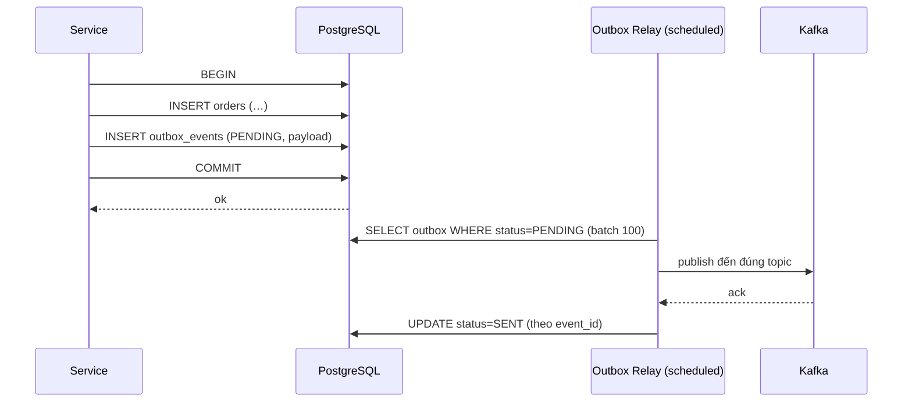
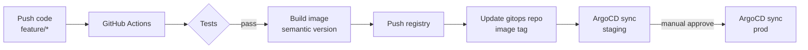
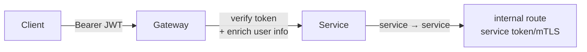

# 04 — System Architecture

| | |
|---|---|
| **Ngày** | 2026-09-11 |
| **Trạng thái** | Draft — đồng bộ với PRD v0.2 |
| **Phiên bản** | v0.1 |
| **Tài liệu liên quan** | [01 — Brief](01_brief.md) · [02 — PRD](02_prd.md) · [03 — Interfaces](03_interfaces.md) |

> Tài liệu mô tả kiến trúc tổng thể: thành phần, ranh giới service, cơ chế giao tiếp, chiến lược dữ liệu, hạ tầng triển khai, observability, bảo mật và khả năng mở rộng. Đây là tài liệu tham chiếu cho mọi quyết định kỹ thuật của dự án.

---

## 1. Mục tiêu kiến trúc & Ràng buộc

### 1.1 Mục tiêu

| # | Mục tiêu | Yêu cầu hệ thống |
|---|---|---|
| A1 | **Chịu tải cao khi flash sale** | Scale ngang độc lập từng service; cache nóng; chống oversell |
| A2 | **Tính nhất quán giao dịch phân tán** | Saga + outbox + Kafka; eventual consistency có kiểm soát |
| A3 | **Khả dụng cao** | ≥ 99.9%; không SPOF; deploy zero-downtime |
| A4 | **Đội ngũ 3-5 dev** | Đơn giản hóa vận hành: CI/CD chuẩn, template service, observability sẵn sàng |
| A5 | **Mở rộng dần** | Bắt đầu nhỏ (replica thấp, DB 1 node) nhưng thiết kế sẵn cho scale lớn |

### 1.2 Ràng buộc (Constraints)

- Ngôn ngữ thống nhất: **Java 17+ / Spring Boot 3**; riêng frontend dùng **React** (TypeScript).
- Hạ tầng: **Kubernetes** trên cloud (AWS EKS hoặc GCP GKE) — quyết định Phase 0.
- Toàn bộ service chạy **stateless** (session/state đưa ra Redis/Kafka/DB).
- Không dùng 2PC; mọi giao dịch xuyên service dùng **Saga**.
- Database per service; **không** truy cập chéo DB.

### 1.3 Nguyên tắc thiết kế (từ PRD §1.5)

Database per service · Event-driven · Idempotency bắt buộc · API-first (OpenAPI) · Async cho tích hợp ngoài · Fail-safe bên phụ · Config/secret ngoài code · YAGNI.

---

## 2. Tổng quan kiến trúc

### 2.1 Sơ đồ tổng thể

```mermaid
flowchart TB
    subgraph Client
        WEB["Web SPA (React)"]
        ADMIN["Admin Web (React)"]
    end

    subgraph Edge
        CDN["CDN (ảnh, asset)"]
        API_GW["API Gateway<br/>(Spring Cloud Gateway)"]
        IDS["WAF + Rate Limit"]
    end

    subgraph Platform
        NACOS["Nacos (Registry + Config)"]
        KAFKA[("Kafka (KRaft, 3 broker)")]
        REDIS[("Redis Cluster (3 nodes)<br/>cache · session · lock · rate")]
    end

    subgraph Services
        USR["user-service"]
        CAT["catalog-service"]
        CRT["cart-service"]
        ORD["order-service"]
        INV["inventory-service"]
        PAY["payment-service"]
        PRO["promotion-service"]
        SHP["shipping-service"]
        NOT["notification-service"]
    end

    subgraph Data
        DB_USR[("user-db")]
        DB_CAT[("catalog-db")]
        DB_CRT[("cart-db")]
        DB_ORD[("order-db")]
        DB_INV[("inventory-db")]
        DB_PAY[("payment-db")]
        DB_PRO[("promotion-db")]
        DB_SHP[("shipping-db")]
        DB_NOT[("notification-db")]
    end

    subgraph External
        VNPAY["VNPay"]
        MOMO["MoMo"]
        GCS[("GHN / GHTK / ViettelPost")]
        SMS["SMS provider"]
        MAIL["Email provider"]
        OAUTH["Facebook / Google OAuth"]
        OBJ[("Object Storage + CDN")]
    end

    WEB --> CDN
    WEB --> IDS --> API_GW
    ADMIN --> IDS --> API_GW
    API_GW --> NACOS
    API_GW --> USR & CAT & CRT & ORD & INV & PAY & PRO & SHP & NOT

    USR --> DB_USR
    CAT --> DB_CAT
    CRT --> DB_CRT
    ORD --> DB_ORD
    INV --> DB_INV
    PAY --> DB_PAY
    PRO --> DB_PRO
    SHP --> DB_SHP
    NOT --> DB_NOT

    USR & CAT & CRT & ORD & INV & PAY & PRO & SHP & NOT --> KAFKA
    CAT --> REDIS
    CRT --> REDIS
    ORD --> REDIS
    INV --> REDIS
    PRO --> REDIS

    PAY --> VNPAY
    PAY --> MOMO
    SHP --> GCS
    NOT --> SMS
    NOT --> MAIL
    USR --> OAUTH
    CAT --> OBJ
```



### 2.2 Luồng dữ liệu chính

1. **Đọc (browse)**: Web → CDN (ảnh) · API → Gateway → `catalog-service` (cache Redis) → trả về. Stock hiển thị là cache `inventory:sku:*` TTL 5s (từ Kafka `INVENTORY_UPDATED`).
2. **Ghi (checkout)**: Web → Gateway → `order-service` (orchestrator) → gọi sync REST đến inventory/promotion/payment → kết quả ghi DB riêng + publish **sự kiện ra Kafka** → các service khác phản ứng async.
3. **Sự kiện (event)**: mọi sự kiện nghiệp vụ đi qua Kafka với envelope chuẩn, consumer idempotent (xem `03_interfaces` §5).
4. **Tích hợp ngoài**: VNPay/MoMo/carrier dùng **webhook inbound** + gọi ra ngoài qua HTTP client với circuit breaker/retry.

### 2.3 Các pattern kiến trúc được dùng

| Pattern | Dùng ở đâu | Mục đích |
|---|---|---|
| Saga (orchestrated) | Checkout, hủy đơn, hoàn tiền | Giao dịch phân tán nhiều bước + compensation |
| Transactional Outbox | order, payment, inventory, shipping | Không mất event giữa DB write và Kafka publish |
| Event Sourcing (nhẹ) | `order_status_history` | Audit lịch sử trạng thái |
| CQRS (nhẹ) | catalog read cache | Tách luồng đọc mạnh khỏi DB chính |
| Cache-aside + invalidate | catalog, shipping fee, flash-sale | Giảm tải DB, tăng throughput |
| Circuit Breaker / Bulkhead / Retry | Mọi call sync + gọi ngoài | Resilience4j |
| API Gateway + BFF nhẹ | Edge | Định tuyến, auth, rate limit, correlation |

---

## 3. Phân rã service (chi tiết)

> Ranh giới dữ liệu & API đầy đủ tại `03_interfaces.md`. Đây là phần giải thích "tại sao tách thế này".

### 3.1 Bản đồ service

| Service | Vai trò chính | Vì sao tách riêng | Điểm nóng scale |
|---|---|---|---|
| `user-service` | Auth (JWT/OTP/social), hồ sơ, địa chỉ, RBAC | Bảo mật; thay đổi logic auth độc lập | Login peak khi flash sale → rate limit |
| `catalog-service` | Sản phẩm, biến thể, category, collection, reviews, search | **Đọc mạnh nhất** (95% traffic); cache riêng | QPS đọc → autoscale + cache + replica đọc |
| `cart-service` | Giỏ guest/member, merge | Ghi liên tục (add/update) nhưng nhỏ | Redis cho guest; DB cho member |
| `order-service` | Saga orchestrator, đơn hàng | **Lõi nghiệp vụ**; thay đổi phức tạp nhất | Write chính khi checkout |
| `inventory-service` | Stock SKU, reserve/deduct/release, restock | Nhạy cảm nhất (chống oversell); atomic update | Peak checkout → atomic + Lua |
| `payment-service` | VNPay/MoMo/COD, webhook, refund, đối soát | Rủi ro tài chính; tách biệt thay đổi cổng | Webhook spike → idempotent + queue |
| `promotion-service` | Voucher, flash sale, campaign | Khuyến mãi đổi nhiều; ảnh hưởng giá | Flash sale → Redis atomic sold count |
| `shipping-service` | Fee, carrier, tracking | Tích hợp ngoài không ổn định → cô lập lỗi | Webhook carrier |
| `notification-service` | Email/SMS/in-app, template i18n | Phụ thuộc ngoài chậm → không block luồng chính | Queue retry |

### 3.2 Quy tắc ranh giới

- **Dữ liệu**: service sở hữu bảng nào thì chỉ mình nó đọc/ghi (kể cả qua ORM). Truy vấn dữ liệu của service khác phải đi qua API/Kafka, không query chéo DB.
- **Giao tiếp đồng bộ**: chỉ dùng cho **query cần dữ liệu ngay** (stock check, fee estimate, voucher validate preview).
- **Giao tiếp bất đồng bộ**: dùng cho **thay đổi trạng thái nghiệp vụ** (order paid → deduct stock → create shipment) — không chặn luồng.
- **Không vòng phụ thuộc**: `order-service` không được gọi ngược `shipping-service` bằng REST để lấy trạng thái (dùng Kafka consume `SHIPMENT_STATUS_UPDATED`).
- **Service đọc mạnh ≠ ghi mạnh**: catalog là read-heavy; order/inventory là write-heavy — replica/cache khác nhau.

### 3.3 Template service (chuẩn hoá)

Mỗi service là một module Maven riêng sinh từ template chung, gồm:

```
<service>/
├── src/main/java/com/fashionecom/<service>/
│   ├── controller/        # REST + OpenAPI
│   ├── service/           # Business logic
│   ├── repository/        # JPA/Spring Data
│   ├── domain/            # Entity + value object
│   ├── event/             # Producer/Consumer Kafka + DTO
│   ├── client/            # HTTP client tới service khác (OpenFeign)
│   └── config/            # Security, Resilience4j, Kafka, Redis
├── src/main/resources/
│   ├── application.yml     # cấu hình (profile-aware)
│   └── db/migration/       # Flyway scripts V1__*.sql
├── Dockerfile
└── pom.xml                 # thừa kế parent BOM
```

Thư viện dùng chung (module `common`): envelope response, mã lỗi, correlation filter, outbox starter, kafka envelope, tracing starter, metric starter.

---

## 4. Chiến lược dữ liệu

### 4.1 Database per service

| Service | DB | Quan hệ dữ liệu duy nhất |
|---|---|---|
| user | `user-db` (PostgreSQL) | users, addresses, roles, oauth, refresh_tokens |
| catalog | `catalog-db` + Elasticsearch (Phase 3) | products, variants, images, collections, reviews |
| cart | `cart-db` + Redis | carts, cart_items |
| order | `order-db` | orders, order_items, status_history, outbox |
| inventory | `inventory-db` + Redis | stock_items, transactions, reservations, subscriptions |
| payment | `payment-db` | payments, transactions, refunds |
| promotion | `promotion-db` + Redis | vouchers, redemptions, campaigns, campaign_items |
| shipping | `shipping-db` | shipments, status_history, rules |
| notification | `notification-db` | notifications, templates |

- **Migration**: Flyway, script versioned riêng từng DB, chạy tự động trong CI/CD trước khi deploy.
- **Kết nối**: mỗi service 1 connection pool riêng (HikariCP); PgBouncer giữa service và DB nếu cần pool lớn.
- **Backup**: base backup hàng ngày + WAL archive (PITR); RPO 15 phút, RTO 1 giờ.

### 4.2 Transactional Outbox (chi tiết)

**Vấn đề**: service ghi DB thành công nhưng Kafka publish thất bại → mất event → 2 service lệch trạng thái.

**Giải pháp**: mọi business write + insert `outbox_events` (PENDING) trong **cùng 1 DB transaction**:



- Relay chạy mỗi 500ms (có thể cấu hình), batch 100, retry với exponential backoff.
- Idempotency publish: Kafka producer idempotent (`enable.idempotence=true`).
- Event không gửi được sau N lần → alert + giữ PENDING để xử lý tay (không tự xóa).

### 4.3 Cache & Redis key design

| Key pattern | TTL | Vdụ | Ghi chú |
|---|---|---|---|
| `catalog:product:{id}` | 5 phút | detail | Invalid khi admin sửa / PRICE_CHANGED |
| `catalog:list:{hash}` | 30s | danh sách/lọc | Hash theo query params |
| `inventory:sku:{sku}` | 5s | stock hiển thị | Update từ INVENTORY_UPDATED |
| `cart:guest:{cart_id}` | 30 ngày | giỏ guest | LRU + TTL |
| `shipping:fee:{hash}` | 1 giờ | fee estimate | Hash theo address+weight |
| `promo:flash:{variant}` | 10s | số lượng flash còn lại | Redis Lua atomic |
| `otp:{phone}` | 5 phút | OTP code + retries | INCR để đếm lần gửi |
| `ratelimit:{tier}:{id}` | sliding window | rate limit | Lua script |
| `lock:voucher:{code}` / `lock:stock:{sku}` | 15s | distributed lock | Redisson/SETNX + Lua |

**Naming rules**: lowercase, namespace bằng colon, expires hợp lý, luôn set TTL (tránh memory leak). Prefix môi trường: `dev:`, `staging:`, `prod:`.

### 4.4 Elasticsearch (Phase 3)

- Đồng bộ từ catalog-db qua CDC (Debezium) hoặc outbox `catalog.changed`.
- Search: tokenizer tiếng Việt (ICU), synonyms thời trang, boost theo bán chạy/xếp hạng.
- Fallback khi ES down → query ILIKE trên PostgreSQL (giảm chất lượng, không chết).

---

## 5. Giao tiếp & Sự kiện

### 5.1 REST sync (khi nào dùng)

| Trường hợp | Gọi REST | Timeout | Fallback |
|---|---|---|---|
| Checkout: reserve stock | order → inventory | 2s | Fail nhanh → CANCELLED |
| Checkout: lock voucher | order → promotion | 2s | Circuit open → checkout không voucher |
| Checkout: fee estimate | order → shipping | 2s | Phí mặc định + ghi chú |
| Cart preview | cart → shipping/promotion | 1s | Bỏ qua phần ước tính |
| Stock display | catalog → inventory | 500ms | Cache cũ 5s |

### 5.2 Kafka (async — mặc định cho sự kiện)

- Topics & envelope: xem `03_interfaces` §5.
- Consumer groups: 1 group/event consumer cụ thể (vd `order-consumer-inventory`, `order-consumer-shipping`) → mỗi service scale độc lập.
- Partitioning: theo key tự nhiên (order_no, sku, user_id) đảm bảo thứ tự trên cùng key.
- Error handling: retry topic → DLQ → alert (xem `03_interfaces` §5.1).

```mermaid
flowchart LR
    P[Producer] -->|event| T[Chính topic]
    T --> C[Consumer xử lý]
    C -->|fail| R[retry topic]
    R -->|fail N lần| D[DLQ {topic}.dead-letter]
    D --> A[Alert + manual tool]
```

### 5.3 Saga orchestrator (order-service)

Chi tiết bảng 7 bước + compensation tại PRD §4.5. Kiến trúc runtime:

- **Saga state machine**: `SagaFlow` định nghĩa steps + compensating steps (Spring Statemachine / custom).
- **Persistence**: trạng thái saga lưu trong `orders.status` + `saga_state` (JSON) → crash recovery an toàn.
- **Trigger async**: bước sau saga được kích hoạt bằng event Kafka (vd `PAYMENT_COMPLETED` → bước deduct stock) — không cần job polling cho checkout.
- **Timeout**: mỗi bước có deadline; quá hạn → chạy compensation (vd order hết hạn 15 phút WAITING_PAYMENT).

---

## 6. Hạ tầng triển khai (Deployment Topology)

### 6.1 Môi trường

| Môi trường | Namespace | Mục đích | Replica mặc định |
|---|---|---|---|
| dev | `dev` | Dev tự do | 1 |
| staging | `staging` | QA/test tích hợp, load test | 2 |
| prod | `prod` | Production | 2-20 (HPA) |

### 6.2 Kubernetes topology

| Thành phần | Deploy | Replica | Notes |
|---|---|---|---|
| API Gateway | Deployment + Service | 2 | HPA theo QPS |
| user/catalog/cart/order | Deployment + Service | 2 (HPA) | — |
| inventory/payment/promotion/shipping/notification | Deployment + Service | 2 (HPA) | — |
| Nacos | StatefulSet 3 nodes | 3 | Registry + Config |
| Kafka (KRaft) | StatefulSet 3 broker | 3 | Replication 3 |
| Redis | (Managed Redis hoặc StatefulSet 3) | 3 | — |
| PostgreSQL | (Managed RDS/CloudSQL hoặc StatefulSet + Operator) | 1 + replica | PITR bật |
| object storage | Managed S3/GCS | — | — |

- **Networking**: Ingress Controller (NGINX) → Service Gateway; mTLS giữa pods qua service mesh (tùy chọn Phase 2, Istio/Linkerd) — tối thiểu dùng service token.
- **Deploy**: GitOps với ArgoCD; image từ GitHub Actions build & push; rolling update `maxUnavailable=0`, `maxSurge=1`; readiness probe = health endpoint + dependency checks.

### 6.3 CI/CD pipeline



- Branching: `main` (production), `staging`, feature branches (template service).
- Quality gates: lint (Checkstyle/SpotBugs), unit test (JUnit + Mockito), contract test (Spring Cloud Contract), SonarQube, build image chỉ khi pass.
- Rollback: revert gitops manifest → ArgoCD tự sync về image cũ.

---

## 7. Observability

### 7.1 Ba trụ cột

| Trụ cột | Công cụ | Nội dung chính |
|---|---|---|
| Metrics | Prometheus + Grafana | RED (rate/errors/duration) cho mọi endpoint; USE (saturation) cho Kafka/Postgres/Redis/JVM |
| Logs | Loki (Grafana) | Structured JSON; correlation id; 30 ngày; che PII |
| Traces | OpenTelemetry → Tempo | Trace toàn tuyến; sample 10% (checkout 100%) |

### 7.2 Dashboard & Alert (mức khởi điểm)

| Metric | Threshold alert | Ghi chú |
|---|---|---|
| Error rate (5xx) | > 1% trong 5 phút | Mọi service |
| Latency p95 | > 500 ms trong 10 phút | Mọi API public |
| Kafka lag | > 5.000 msg | consumer group |
| Gateway 5xx | > 1% trong 5 phút | — |
| CPU/Memory pod | > 80% trong 10 phút | HPA xử lý tự động |
| Disk PostgreSQL/Redis | > 80% | — |
| Saga timout job fail | > 0 | Reconcile |

Dashboards: **Overview** (service health + SLO), **Checkout** (saga steps, payment success rate), **Catalog** (cache hit, QPS), **Infra** (Kafka/DB/Redis).

### 7.3 SLO (mục tiêu ban đầu)

- Availability 99.9%/tháng.
- p95 latency < 500ms (API public).
- Error budget: 0.1% hay ~43 phút/tháng — cảnh báo burn rate khi dùng quá 50%.

---

## 8. Bảo mật

### 8.1 Mô hình xác thực



- **JWT**: access 15 phút (RS256, kid rotate), refresh 30 ngày (rotate/revoke). Secret qua Vault/K8s Secret.
- **Gateway**: verify/parse token, inject `X-User-Id`, `X-User-Roles` header cho service; chặn route internal.
- **RBAC**: role từ JWT + kiểm tra tại service (annotate endpoint bằng `@PreAuthorize`).

### 8.2 Bảo vệ chuẩn

| Tầng | Biện pháp |
|---|---|
| Edge | WAF, TLS 1.2+, HSTS, rate limit, CORS whitelist, request size limit |
| Application | Bean Validation, parameterized SQL (JPA), sanitize output (XSS), CSRF disabled cho API (JWT), OpenAPI security scheme |
| Data | Encryption at rest (RDS/k8s), secret quản lý ngoài image |
| Webhook | Verify checksum/signature từng cổng (VNPay SHA-256, MoMo HMAC-SHA256, carrier HMAC) |
| Audit | Append-only log hành động admin: ai/khigì/lúc nào/IP/trước-sau |

### 8.3 Chống tấn công tải (DoS/và abuse)

- Rate limit từng tier (xem `03_interfaces` §1.6).
- Redis Lua atomic cho login/fail count (chống brute force).
- Flash sale: 5 rpm/user + sliding window + kill switch.

---

## 9. Khả năng mở rộng & Dự phòng

### 9.1 Chiến lược scale

| Tầng | Khi tải tăng | Hành động |
|---|---|---|
| Catalog (đọc) | QPS cao | HPA tăng replica → cache hit cao → replica đọc DB |
| Inventory (ghi) | Checkout cao | Atomic Lua giảm chạm DB; Redis pre-check; sharding theo SKU (Phase 3) |
| Order (write) | Checkout cao | HPA; partition theo thời gian (Phase 3) |
| Payment (webhook) | Spike | Queue webhook, xử lý idempotent, HPA theo lag |
| Kafka | Event tăng | Tăng partition (chọn partition cố định từ đầu phù hợp) |
| DB | Write tăng | Replica đọc + connection pool; sharding (Phase 3) |

### 9.2 Kịch bản lỗi & khả năng phục hồi

| Sự cố | Ứng xử hệ thống | Phục hồi |
|---|---|---|
| Mất 1 pod service | HPA/ReplicaSet tự giữ số lượng; traffic chuyển pod khác | Tự động |
| Mất 1 broker Kafka | Producer/consumer failover tự động (replication 3) | Tự động |
| Mất node worker | Pods reschedule | Tự động |
| Mất DB chính | Failover sang replica (managed) | trong vài phút |
| Mất cả cụm DB | Restore từ backup + WAL (PITR) | ≤ 1 giờ |
| Mất Redis | Cache miss → quay về DB (degraded), session mất | Tự động warm-up |

### 9.3 Load test & game day

- Load test bằng **k6** (script bằng JS): profile bình thường (100 req/s) và peak flash sale (1.000 → 10.000 concurrent).
- Kịch bản: browse 70% / add-cart 15% / checkout 10% / payment callback 5%.
- Game day hàng tháng: kill pod ngẫu nhiên, dừng Redis, trì hoãn Kafka, dừng carrier mock → kiểm tra ứng xử & runbook.

---

## 10. Quyết định kiến trúc & ADR (tóm tắt)

| # | Quyết định | Lựa chọn | Lý do |
|---|---|---|---|
| ADR-01 | Kiến trúc tổng thể | Microservices ngay từ đầu | Yêu cầu scale độc lập; đội đã chốt |
| ADR-02 | Ngôn ngữ | Java 17 + Spring Boot 3 | Kỹ năng team; hệ sinh thái Spring Cloud |
| ADR-03 | Message broker | Kafka (KRaft) | Throughput cao, replay, DLQ, hệ sinh thái |
| ADR-04 | DB | PostgreSQL 15 | Mạnh, JSONB (cần cho snapshot), quen thuộc |
| ADR-05 | Cache | Redis Cluster | Đa năng: cache, lock, rate limit, giỏ hàng |
| ADR-06 | Registry/Config | Nacos | Spring Cloud Alibaba, hot reload |
| ADR-07 | Giao dịch phân tán | Saga orchestrated (order-service) | Kiểm soát rõ luồng, dễ debug |
| ADR-08 | API Gateway | Spring Cloud Gateway | Reactive, filter mạnh, cùng hệ sinh thái |
| ADR-09 | Deploy | ArgoCD GitOps + GitHub Actions | Audit, rollback nhanh |
| ADR-10 | Observability | OTel + Prometheus + Loki + Tempo + Grafana | Open standard, 1 UI |
| ADR-11 | Search | Elasticsearch (Phase 3) | Chất lượng search tiếng Việt |
| ADR-12 | Không dùng 2PC | Theo nguyên tắc | Đơn giản, chấp nhận eventual consistency |

---

## 11. Việc chưa quyết định (Open Questions)

| Câu hỏi | Ảnh hưởng | Cần quyết định khi |
|---|---|---|
| AWS EKS hay GCP GKE? | Deploy, cost | Phase 0 |
| Managed Redis/Postgres hay tự deploy trên K8s? | Vận hành, cost | Phase 0 |
| Service mesh (Istio/Linkerd) ngay hay sau? | mTLS, observability nâng cao | Phase 2 |
| Sharding inventory khi nào? | Chỉ khi inventory write > ngưỡng | Phase 3 |
| Avro hay JSON Schema cho Kafka? | Schema evolution | Phase 1 (đã chọn JSON Schema ban đầu) |
