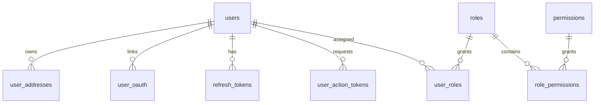
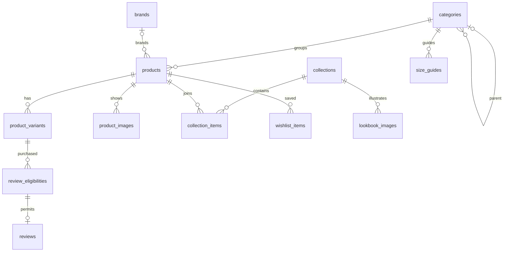
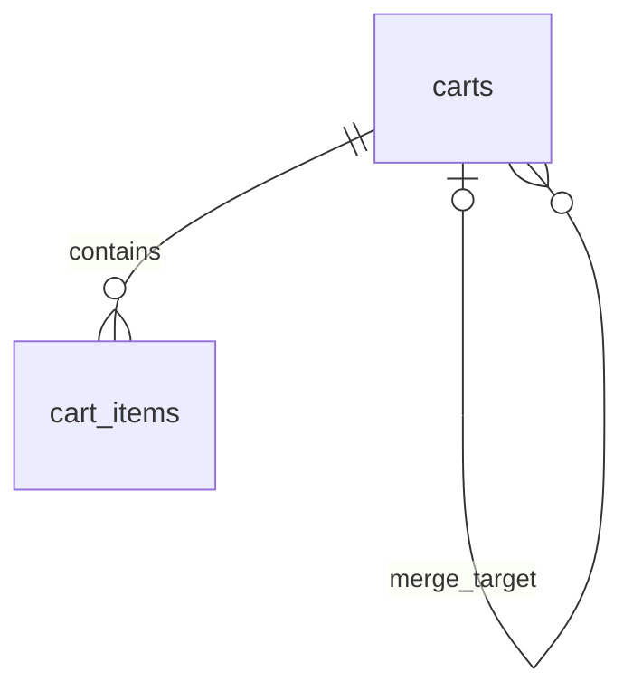
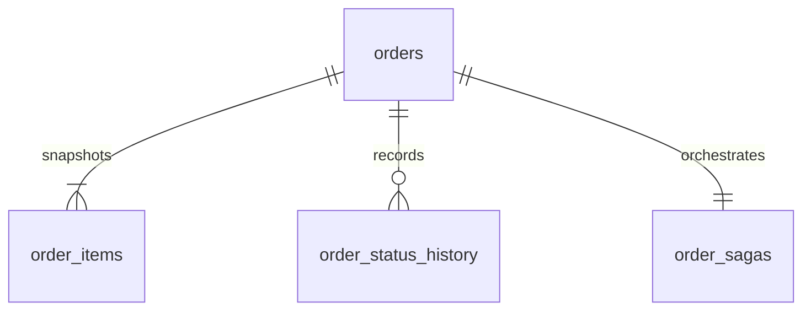
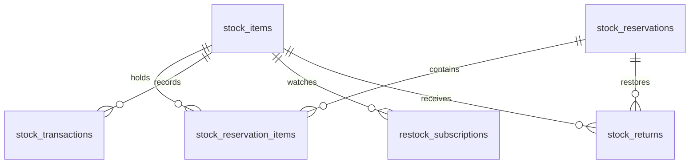
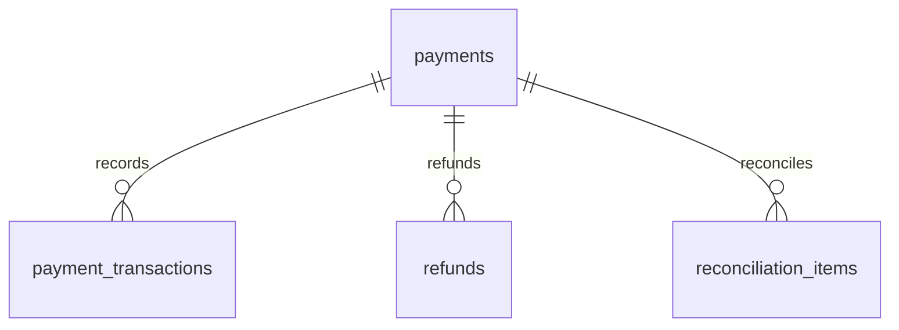
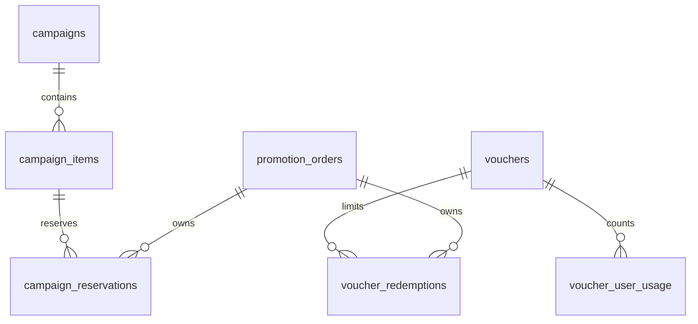
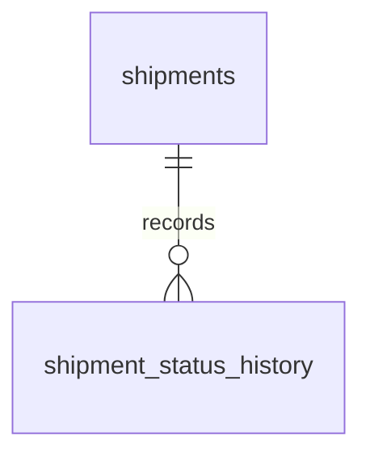
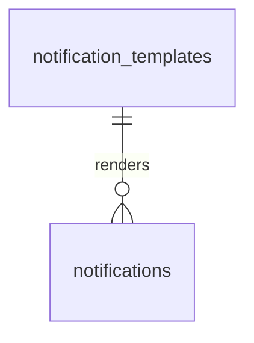
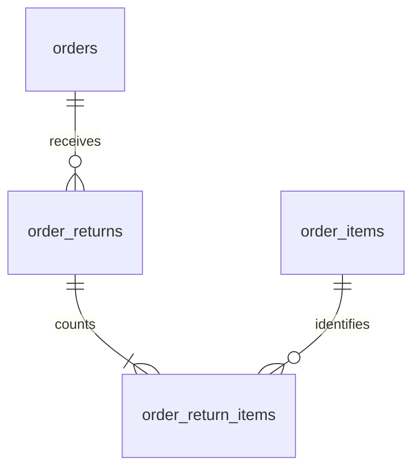

# 05 — Database Design

| Thuộc tính | Giá trị |
|---|---|
| Ngày | 2026-09-19 |
| Phiên bản | B1 |
| Trạng thái | **Baseline đồng bộ — migration chưa triển khai/kiểm thử; giả định nghiệp vụ theo 08** |
| Cơ sở | [PRD](02_prd.md), [Interfaces](03_interfaces.md), [Architecture](04_architecture.md) |
| Đọc cùng | [Luồng xử lý từng service](06_service_flows.md) · [Bộ sơ đồ thiết kế](07_diagrams.md) |

Thiết kế B1 cho MVP và Phase 2; bảng Phase 2 chỉ tạo khi triển khai tính năng đó. Đây là nguồn schema thống nhất với 02–04 và 06–07, chưa phải migration đã kiểm thử. Trạng thái D01–D12 và quyết định còn mở ở [08](08_decisions.md); không coi việc đồng bộ là PO đã ký chính sách.

## 1. Các giả định thiết kế đang dùng

| ID | Đề xuất | Hệ quả / giới hạn |
|---|---|---|
| D01 | Một shop, **một kho logic** trong Release 1 | Tồn kho theo SKU; nhiều kho cần thiết kế allocation riêng |
| D02 | PostgreSQL là nguồn quyết định tồn kho và hạn mức khuyến mãi | Redis chỉ cache/pre-check; không ghi Redis và DB như hai nguồn sự thật |
| D03 | Giá trong giỏ chỉ để tham khảo; checkout lấy báo giá server, khách xác nhận tổng mới nếu thay đổi | Lưu snapshot bất biến khi tạo đơn; không tin số tiền client gửi |
| D04 | `order-service` là bên duy nhất điều phối reserve/commit/release và tạo shipment | Inventory không tự trừ kho khi consume payment event |
| D05 | Online giữ hàng 15 phút; COD giữ hàng chờ OPS xác nhận tối đa 24 giờ | COD chỉ trừ kho khi OPS xác nhận; các thời hạn cấu hình được |
| D06 | Một payment cho một order, một lần tạo giao dịch bên cổng; retry kỹ thuật dùng cùng mã tham chiếu | Thanh toán thất bại đã xác nhận: đặt đơn mới; chưa hỗ trợ đổi cổng trên đơn cũ |
| D07 | Thanh toán đến khi đơn đã đóng hoặc reservation hết hạn: ghi nhận tiền và hoàn toàn bộ | Không tự mở lại đơn hoặc tự giữ hàng lại |
| D08 | Một đơn có một shipment; chưa tách kiện/giao một phần | Vẫn có quy trình giao thất bại, hoàn về kho và xử lý thủ công |
| D09 | Khách được hủy online khi WAITING_PAYMENT, COD khi CONFIRMED; OPS hủy trước bàn giao carrier | Sau bàn giao: quy trình hoàn hàng, không hủy trực tiếp rồi cộng kho |
| D10 | Có hoàn tiền toàn phần/một phần; đổi size/trả hàng sau giao thành công qua OPS trong Release 1 | Chưa có cổng tự phục vụ đổi trả; cần chốt chính sách thương mại trước launch |
| D11 | Voucher có giới hạn theo người dùng yêu cầu tài khoản đã xác minh; guest chỉ dùng voucher không có giới hạn này | Không dùng cookie guest để bảo đảm giới hạn theo người |
| D12 | Một voucher/đơn; voucher không cộng dồn với giá campaign trên cùng đơn trong bản đầu | Campaign chồng thời gian trên cùng SKU bị từ chối; quy tắc có thể đổi sau review |

<!-- ponytail: một kho, một shipment/đơn và một payment/order; thêm allocation, split shipment hoặc payment attempts khi nghiệp vụ đã yêu cầu. -->

## 2. Quy ước schema

- Mỗi service sở hữu một PostgreSQL database. ERD dưới đây chỉ chứa FK **nội bộ database đó**. `user_id`, `order_id`, `variant_id` ở service khác là tham chiếu logic, kiểm tra qua API/event.
- `id` là UUID do ứng dụng tạo, PK, NOT NULL. Riêng bảng nối dùng composite PK được ghi rõ. `order_id` luôn UUID; `order_no` là mã hiển thị `varchar(32)` unique, không tráo hai giá trị.
- Trong bảng mô tả, `?` nghĩa là nullable; các cột khác NOT NULL. `= ...` là default; không ghi default thì ứng dụng phải cấp. `text` bị giới hạn độ dài tại API tùy trường; mã SKU `varchar(64)`, mã trạng thái `varchar(32)`.
- `T` nghĩa là có `created_at timestamptz = now()` và `updated_at timestamptz = now()`; ứng dụng cập nhật `updated_at`. `C` nghĩa là chỉ có `created_at`. Bảng nối không ghi T/C thì không có cột thời gian mặc định.
- Tiền VND dùng `bigint`, CHECK không âm; tỷ lệ dùng `numeric(5,2)`, CHECK 0–100. Không dùng float. Tính trung gian bằng số nguyên/decimal có kiểm tra tràn; giảm % làm tròn xuống đồng, lưu số tiền cuối đã áp dụng.
- Timestamp lưu theo UTC; hiển thị và mốc chiến dịch theo `Asia/Ho_Chi_Minh`. Khoảng hiệu lực `[start_at, end_at)`, CHECK `end_at > start_at`.
- Trạng thái dùng `varchar` + CHECK tập giá trị; các cạnh chuyển trạng thái do service kiểm tra bằng khóa hàng hoặc cập nhật có điều kiện. Các tập giá trị trong tài liệu này là tập CHECK tương ứng.
- FK mặc định `ON DELETE RESTRICT`. Chỉ cascade ở bảng nối/giỏ hàng đã được phép xóa. Sản phẩm, đơn, giao dịch dùng trạng thái để ngưng hoạt động; không xóa lịch sử mua hàng khi xóa sản phẩm.
- PK/UNIQUE đã tạo index phục vụ uniqueness, không tạo index trùng. Index truy vấn được liệt kê riêng; bổ sung sau khi có truy vấn thực và đo hiệu năng.
- JSONB chỉ cho snapshot, nội dung linh hoạt, payload; API kiểm tra schema và kích thước. Tiền, số lượng, trạng thái, khóa tham chiếu không giấu trong JSON.

## 3. Bảng kỹ thuật dùng theo nhu cầu từng service

Đây là cùng một mẫu schema, mỗi service giữ bản riêng. Không có database dùng chung.

| Bảng | Cột | Ràng buộc / index |
|---|---|---|
| `outbox_events` (C) | `id`, `aggregate_type text`, `aggregate_id text`, `aggregate_version bigint`, `aggregate_sequence bigint`, `event_type text`, `schema_version int = 1`, `topic text`, `partition_key text`, `payload jsonb`, `status varchar(32) = 'PENDING'`, `attempts int = 0`, `next_attempt_at timestamptz = now()`, `lease_until timestamptz?`, `lease_token uuid?`, `published_at timestamptz?`, `last_error text?` | Status PENDING/IN_FLIGHT/SENT; partial index `(next_attempt_at, created_at)` WHERE status <> 'SENT'; UNIQUE `(aggregate_type, aggregate_id, aggregate_sequence)` |
| `processed_events` | `consumer_name text`, `event_id uuid`, `processed_at timestamptz = now()` | PK `(consumer_name, event_id)`; ghi trong cùng transaction với thay đổi nghiệp vụ |
| `idempotency_requests` (T) | `actor_key text`, `operation text`, `key varchar(128)`, `request_hash char(64)`, `resource_id uuid?`, `status varchar(32) = 'PROCESSING'`, `response_code int?`, `response_body jsonb?`, `expires_at timestamptz?` | PK `(actor_key, operation, key)`; PROCESSING/COMPLETED; actor từ auth/session đã xác minh; không lưu secret trong response |
| `audit_logs` (C) | `id`, `actor_id uuid`, `action text`, `resource_type text`, `resource_id text`, `reason text?`, `before_data jsonb?`, `after_data jsonb?`, `request_id uuid`, `source_ip inet?` | Append-only bằng quyền DB; index `(resource_type, resource_id, created_at)`; che secret/PII không cần thiết |

- Outbox tại service phát event/notification; processed_events tại service consume event. Idempotency tại API có mutation retry được. Audit tại mutation admin.
- Business write + outbox + idempotency result là một local transaction. Với gọi bên ngoài, lưu intent trước, kết quả sau; không giữ transaction DB trong lúc chờ mạng.
- Idempotency không chỉ dựa TTL: order giữ unique `(actor_key, checkout_key)` suốt vòng đời đơn; payment/refund/reservation giữ unique khóa nghiệp vụ. Xóa cache response không cho phép lặp lại hiệu ứng tài chính.
- Outbox là at-least-once: crash sau publish trước đánh dấu SENT có thể gửi lại. Consumer xử lý trùng trong DB, không giả định Kafka producer idempotence loại được mọi lần gửi lặp.
- `aggregate_version` là số phiên bản nghiệp vụ, khác `schema_version`. Mỗi event có aggregate_sequence tăng riêng kể cả cùng aggregate_version; cấp số dưới khóa aggregate. Relay giữ thứ tự bằng cách chỉ claim sequence chưa gửi nhỏ nhất; consumer vẫn kiểm tra trạng thái/version vì retry có thể đảo thứ tự.

## 4. `user-db`

| Bảng | Cột | Constraints / index |
|---|---|---|
| `users` (T) | `id`, `email varchar(254)?`, `phone varchar(32)?`, `password_hash text?`, `full_name text`, `avatar_url text?`, `status varchar(32) = 'ACTIVE'`, `locale varchar(2) = 'vi'`, `email_verified_at timestamptz?`, `phone_verified_at timestamptz?`, `locked_until timestamptz?`, `auth_version bigint = 0` | UNIQUE email, phone khi có giá trị; email chuẩn hóa lowercase, phone chuẩn hóa trước lưu; status ACTIVE/LOCKED/INACTIVE; locale vi/en; CHECK email hoặc phone có giá trị |
| `user_addresses` (T) | `id`, `user_id uuid FK users`, `recipient_name text`, `phone varchar(32)`, `province_code text`, `district_code text?`, `ward_code text`, `address_line text`, `is_default boolean = false` | Index user_id; UNIQUE `(user_id)` WHERE is_default; đổi mặc định phải lock user rồi cập nhật trong một transaction |
| `user_oauth` (C, Phase 2) | `id`, `user_id uuid FK users`, `provider varchar(16)`, `provider_subject text`, `provider_email text?` | UNIQUE `(provider, provider_subject)`; index user_id; không tự merge bằng email |
| `refresh_tokens` (C) | `id`, `user_id uuid FK users`, `family_id uuid`, `token_hash char(64)`, `expires_at timestamptz`, `revoked_at timestamptz?`, `replaced_by uuid? FK refresh_tokens`, `device_info text?` | UNIQUE token_hash; index `(user_id, family_id)`; index expires_at |
| `user_action_tokens` (C) | `id`, `user_id uuid FK users`, `purpose varchar(16)`, `target_email varchar(254)?`, `token_hash char(64)`, `expires_at timestamptz`, `used_at timestamptz?` | UNIQUE token_hash; index expires_at; dùng một lần; purpose RESET_PASSWORD/EMAIL_VERIFY; EMAIL_VERIFY cần target_email |
| `roles` | `id`, `code varchar(32)`, `name text` | UNIQUE code; seed SUPER_ADMIN/OPS/MARKETING/FINANCE |
| `permissions` | `id`, `code text` | UNIQUE code; quyền endpoint được seed |
| `user_roles` | `user_id uuid FK users`, `role_id uuid FK roles` | PK `(user_id, role_id)` |
| `role_permissions` | `role_id uuid FK roles`, `permission_id uuid FK permissions` | PK `(role_id, permission_id)` |

OTP (Phase 2) trong Redis: challenge ID, HMAC của code với secret server, số lần thử, thời điểm hết hạn; TTL 5 phút, tối đa 5 lần thử/challenge, giới hạn gửi theo phone + IP. Không log OTP. DB không lưu OTP plaintext. Refresh/reset token chỉ lưu hash; password dùng hash thích hợp theo PRD.

Địa chỉ là địa chỉ nội bộ của shop; shipping adapter ánh xạ sang mã carrier. Không coi bộ mã địa chỉ của một hãng là hợp đồng cố định cho mọi hãng.

## 5. `catalog-db`

| Bảng | Cột | Constraints / index |
|---|---|---|
| `categories` (T) | `id`, `parent_id uuid? FK categories`, `name_vi text`, `name_en text`, `slug text`, `sort_order int = 0`, `status varchar(32) = 'ACTIVE'` | UNIQUE slug; CHECK parent_id <> id; service chống chu kỳ và quá 2 cấp; ACTIVE/INACTIVE |
| `brands` (T) | `id`, `name text`, `logo_url text?`, `status varchar(32) = 'ACTIVE'` | ACTIVE/INACTIVE |
| `products` (T) | `id`, `category_id uuid FK categories`, `brand_id uuid? FK brands`, `name_vi text`, `name_en text`, `slug text`, `description_vi text = ''`, `description_en text = ''`, `base_price bigint`, `tags text[] = '{}'`, `status varchar(32) = 'DRAFT'`, `published_at timestamptz?`, `version bigint = 0`, `sold_quantity bigint = 0` | UNIQUE slug; price/sold_quantity >= 0; DRAFT/ACTIVE/INACTIVE; indexes `(category_id, status, published_at, id)`, `(status, base_price, id)`, `(status, sold_quantity, id)` |
| `product_variants` (T) | `id`, `product_id uuid FK products`, `sku varchar(64)`, `size text`, `color text`, `price_override bigint?`, `weight_grams int`, `status varchar(32) = 'ACTIVE'`, `version bigint = 0` | UNIQUE sku, `(product_id, size, color)`; price >= 0, weight > 0; ACTIVE/INACTIVE; SKU bất biến |
| `product_images` | `id`, `product_id uuid FK products`, `variant_color text?`, `url text`, `thumb_url text`, `alt_vi text`, `alt_en text`, `sort_order int = 0` | Index `(product_id, sort_order)`; kiểm tra màu thuộc sản phẩm tại service |
| `collections` (T) | `id`, `name_vi text`, `name_en text`, `slug text`, `cover_url text?`, `start_at timestamptz?`, `end_at timestamptz?`, `status varchar(32) = 'DRAFT'` | UNIQUE slug; DRAFT/ACTIVE/INACTIVE; end > start khi cả hai có giá trị |
| `collection_items` | `collection_id uuid FK collections`, `product_id uuid FK products`, `sort_order int = 0` | PK `(collection_id, product_id)`; index `(collection_id, sort_order, product_id)` |
| `lookbook_images` | `id`, `collection_id uuid FK collections`, `url text`, `caption_vi text = ''`, `caption_en text = ''`, `sort_order int = 0` | Index `(collection_id, sort_order)` |
| `size_guides` (T) | `id`, `category_id uuid FK categories`, `locale varchar(2)`, `guideline_html text`, `table_json jsonb` | UNIQUE `(category_id, locale)`; vi/en; validate JSON + sanitize HTML |
| `review_eligibilities` (C, Phase 2) | `id`, `order_id uuid`, `user_id uuid`, `variant_id uuid FK product_variants`, `delivered_at timestamptz`, `expires_at timestamptz` | UNIQUE `(order_id, variant_id)`; index `(user_id, expires_at)`; projection từ ORDER_COMPLETED, thời hạn 30 ngày |
| `reviews` (T, Phase 2) | `id`, `eligibility_id uuid FK review_eligibilities`, `rating smallint`, `title text`, `content text`, `images text[] = '{}'`, `status varchar(32) = 'PENDING'`, `moderated_by uuid?`, `moderated_at timestamptz?`, `moderation_reason text?` | UNIQUE eligibility_id; rating 1–5, cardinality(images) <= 5; PENDING/APPROVED/REJECTED; index `(status, created_at, id)` |
| `wishlist_items` (C, Phase 2) | `user_id uuid`, `product_id uuid FK products` | PK `(user_id, product_id)`; index `(user_id, created_at, product_id)` |

Review không cần lặp user/order/variant trong bảng reviews vì eligibility đã giữ bộ ba này. `helpful_count` chưa triển khai vì chưa có yêu cầu hành vi vote. `sold_quantity` là projection từ ORDER_COMPLETED, chống cộng lại bằng processed_events; dùng cho sort bán chạy, không dùng đối soát doanh thu.

Tìm kiếm đầu kỳ dùng ILIKE có phân trang/giới hạn; chưa tuyên bố B-tree tăng tốc `%keyword%`. Index tìm kiếm bổ sung khi đo tải, Elasticsearch theo Phase 3. Bộ lọc giá/sort giá phải dùng giá hiệu lực cùng quy tắc D12; ở Phase 2 cần đánh giá projection giá campaign nếu query hiện tại không đáp ứng tải.

## 6. `cart-db`

| Bảng | Cột | Constraints / index |
|---|---|---|
| `carts` (T) | `id`, `user_id uuid?`, `guest_token_hash char(64)?`, `status varchar(32) = 'ACTIVE'`, `version bigint = 0`, `expires_at timestamptz?`, `merged_into uuid? FK carts` | ACTIVE/MERGED/CHECKED_OUT/ABANDONED; CHECK đúng một trong user_id/guest_token_hash có giá trị; UNIQUE user_id WHERE status='ACTIVE' AND user_id IS NOT NULL; UNIQUE guest_token_hash khi có; index expires_at |
| `cart_items` (T) | `id`, `cart_id uuid FK carts`, `variant_id uuid`, `sku varchar(64)`, `quantity int`, `price_snapshot bigint`, `catalog_version bigint`, `version bigint = 0` | UNIQUE `(cart_id, variant_id)`; quantity 1–99, price >= 0 |

PostgreSQL giữ giỏ guest và member; Redis là cache. Cookie guest chứa token ngẫu nhiên đủ mạnh, server chỉ lưu hash; `cart_id` không phải bằng chứng sở hữu. TTL guest 30 ngày tính từ lần hoạt động. Mutation kiểm tra version chống ghi đè đa thiết bị.

Sau checkout, cart chỉ xóa/giảm các item khớp snapshot checkout; item bị người dùng sửa trong lúc chờ vẫn giữ và báo cần xem lại. Merge khóa cả hai giỏ theo thứ tự ID và đánh dấu MERGED trong cùng transaction nên retry không cộng hai lần.

## 7. `order-db`

| Bảng | Cột | Constraints / index |
|---|---|---|
| `orders` (T) | `id`, `order_no varchar(32)`, `user_id uuid?`, `actor_key text`, `guest_access_hash char(64)?`, `checkout_key varchar(128)`, `checkout_hash char(64)`, `cart_id uuid`, `cart_version bigint`, `status varchar(32) = 'PENDING'`, `payment_method varchar(16)`, `currency char(3) = 'VND'`, `subtotal bigint`, `discount_amount bigint = 0`, `shipping_fee bigint`, `shipping_discount bigint = 0`, `cod_fee bigint = 0`, `total_amount bigint`, `voucher_code text?`, `contact_email text?`, `contact_phone varchar(32)`, `locale varchar(2) = 'vi'`, `shipping_address jsonb`, `shipping_quote jsonb`, `note text?`, `expires_at timestamptz`, `paid_at timestamptz?`, `confirmed_at timestamptz?`, `delivered_at timestamptz?`, `cancel_reason text?`, `version bigint = 0` | UNIQUE order_no, `(actor_key, checkout_key)`; guest cần guest_access_hash; phương thức VNPAY/MOMO/COD; tất cả tiền >= 0; discount <= subtotal, shipping_discount <= shipping_fee; total = subtotal - discount + shipping_fee - shipping_discount + cod_fee; indexes `(user_id, created_at, id)`, `(status, created_at, id)`, `(expires_at)` WHERE status IN ('PENDING','WAITING_PAYMENT','CONFIRMED') |
| `order_items` | `id`, `order_id uuid FK orders`, `variant_id uuid`, `sku varchar(64)`, `name text`, `size text`, `color text`, `image_url text?`, `quantity int`, `unit_price bigint`, `line_total bigint`, `catalog_version bigint`, `campaign_item_id uuid?`, `cart_item_id uuid`, `cart_item_version bigint` | UNIQUE `(order_id, variant_id)`; quantity 1–99, unit_price >= 0; line_total = quantity * unit_price |
| `order_status_history` (C) | `id`, `order_id uuid FK orders`, `from_status varchar(32)?`, `to_status varchar(32)`, `actor_type varchar(16)`, `actor_id uuid?`, `reason text?`, `request_id uuid?` | Index `(order_id, created_at, id)`; actor SYSTEM/CUSTOMER/ADMIN |
| `order_sagas` (T) | `order_id uuid PK FK orders`, `intent varchar(16) = 'FULFILL'`, `step varchar(32)`, `status varchar(32) = 'RUNNING'`, `inventory_state varchar(32) = 'NONE'`, `promotion_state varchar(32) = 'NONE'`, `payment_id uuid?`, `shipment_id uuid?`, `retry_count int = 0`, `next_retry_at timestamptz = now()`, `lease_until timestamptz?`, `lease_token uuid?`, `last_error text?`, `version bigint = 0` | intent FULFILL/CANCEL; status RUNNING/WAITING/COMPENSATING/DONE/MANUAL; index `(next_retry_at)` WHERE status IN ('RUNNING','WAITING','COMPENSATING'); resource states NONE/UNKNOWN/HELD/COMMITTED/RELEASED/RESTORED |

Order status: PENDING, WAITING_PAYMENT, CONFIRMED, PAID, PACKING, SHIPPING, DELIVERED, CANCELLING, CANCELLED, REFUNDING, REFUNDED, RETURNING, RETURNED. Saga step: VALIDATE, RESERVE, LOCK_PROMOTION, CREATE_PAYMENT, WAIT_PAYMENT, WAIT_OPS, COMMIT_STOCK, COMMIT_PROMOTION, WAIT_PACKING, CREATE_SHIPMENT, WAIT_DELIVERY, COMPENSATE, DONE. Chi tiết cạnh chuyển ở tài liệu 06.

`shipping_address` snapshot gồm người nhận, điện thoại, địa chỉ nội bộ; `shipping_quote` gồm carrier, quote_id, weight_grams, fee, cod_fee, expires_at. Không tự thay phí sau xác nhận. `subtotal = SUM(order_items.line_total)` được kiểm tra trong transaction tạo đơn (CHECK không kiểm tra tổng liên bảng).

`guest_access_hash` xác thực xem/hủy đúng đơn; response tạo đơn cung cấp token qua cookie bảo mật có phạm vi phù hợp, không nhét vào log/query URL. Retry từ cùng actor có thể cấp lại token mới có audit, không lưu plaintext trong idempotency response. Order_no sinh từ sequence DB cộng tiền tố tháng; chấp nhận số bị nhảy.

## 8. `inventory-db`

| Bảng | Cột | Constraints / index |
|---|---|---|
| `stock_items` (T) | `sku varchar(64) PK`, `product_id uuid`, `variant_id uuid`, `on_hand int = 0`, `reserved int = 0`, `min_stock int = 0`, `status varchar(32) = 'ACTIVE'`, `version bigint = 0` | UNIQUE variant_id; CHECK 0 <= reserved AND reserved <= on_hand; on_hand/min_stock >= 0; ACTIVE/INACTIVE |
| `stock_reservations` (T) | `id`, `order_id uuid`, `order_no varchar(32)`, `request_hash char(64)`, `status varchar(32) = 'ACTIVE'`, `expires_at timestamptz`, `committed_at timestamptz?`, `released_at timestamptz?` | UNIQUE order_id; ACTIVE/COMMITTED/RELEASED/EXPIRED; partial index expires_at WHERE status='ACTIVE' |
| `stock_reservation_items` | `reservation_id uuid FK stock_reservations`, `sku varchar(64) FK stock_items`, `quantity int` | PK `(reservation_id, sku)`; quantity 1–99 |
| `stock_transactions` (C) | `id`, `sku varchar(64) FK stock_items`, `operation_key text`, `type varchar(16)`, `on_hand_delta int`, `reserved_delta int`, `order_id uuid?`, `reason text`, `actor_id uuid?` | UNIQUE `(operation_key, sku)`; type INBOUND/RESERVE/COMMIT/RELEASE/ADJUST/RETURN; index `(sku, created_at, id)` |
| `stock_returns` (C) | `id`, `reservation_id uuid FK stock_reservations`, `sku varchar(64) FK stock_items`, `operation_key text`, `quantity int`, `reason text`, `actor_id uuid?` | UNIQUE `(operation_key, sku)`; quantity > 0; transaction khóa reservation và kiểm tra tổng trả <= quantity đã commit |
| `restock_subscriptions` (T, Phase 2) | `id`, `user_id uuid`, `sku varchar(64) FK stock_items`, `status varchar(32) = 'ACTIVE'`, `generation int = 1`, `last_notified_at timestamptz?` | UNIQUE `(user_id, sku)`; ACTIVE/QUEUED/SENT/INACTIVE; index `(sku, status)` |

`available` tính `on_hand - reserved`, không lưu thành cột thứ ba có thể lệch. Reserve tất cả SKU trong **một transaction inventory-db**, khóa SKU theo thứ tự cố định. Commit giảm cả on_hand/reserved; release chỉ giảm reserved. Return của hàng đã commit tăng on_hand, không dùng release.

Job hết hạn khóa reservation; commit cũng khóa cùng hàng và phải còn ACTIVE, chưa hết hạn. Chỉ một bên thắng. Reservation terminal giữ lại để request cũ không giữ hàng lại sau release. Release đến trước reserve tạo tombstone RELEASED theo order_id/request_hash; reserve đến muộn bị từ chối. Payload release phải có original reservation hash và original snapshot (order_no,items,expires_at) để tạo tombstone đủ cột; hash được tính lại từ snapshot. Không dùng hash của body release.

## 9. `payment-db`

| Bảng | Cột | Constraints / index |
|---|---|---|
| `payments` (T) | `id`, `order_id uuid`, `order_no varchar(32)`, `user_id uuid?`, `method varchar(16)`, `amount bigint`, `currency char(3) = 'VND'`, `status varchar(32) = 'CREATED'`, `provider_request_id varchar(128)`, `provider_txn_id text?`, `payment_url text?`, `closed_at timestamptz?`, `close_reason text?`, `request_hash char(64)`, `expires_at timestamptz`, `paid_at timestamptz?`, `refunded_amount bigint = 0`, `refund_reserved_amount bigint = 0`, `next_reconcile_at timestamptz?`, `version bigint = 0` | UNIQUE order_id, order_no, provider_request_id; UNIQUE `(method, provider_txn_id)` khi có; amount >= 0; 0 <= refunded + refund_reserved <= amount; indexes `(status, next_reconcile_at)`, `(created_at, id)` |
| `payment_transactions` (C) | `id`, `payment_id uuid FK payments`, `source varchar(16)`, `provider_event_key text`, `provider_txn_id text?`, `status varchar(32)`, `amount bigint?`, `occurred_at timestamptz?`, `sanitized_payload jsonb`, `payload_hash char(64)` | UNIQUE `(payment_id, source, provider_event_key)`; source CREATE/WEBHOOK/QUERY/COD; index `(payment_id, created_at)` |
| `refunds` (T) | `id`, `payment_id uuid FK payments`, `operation_key text`, `amount bigint`, `reason text`, `status varchar(32) = 'REQUESTED'`, `provider_refund_id text?`, `retry_count int = 0`, `next_retry_at timestamptz = now()`, `last_error text?`, `actor_id uuid?` | UNIQUE `(payment_id, operation_key)`; amount > 0; REQUESTED/PROCESSING/UNKNOWN/SUCCESS/FAILED; partial index next_retry_at WHERE status IN ('REQUESTED','PROCESSING','UNKNOWN') |
| `reconciliation_items` (T; MVP manual/query, Phase 2 batch) | `id`, `payment_id uuid FK payments`, `source_ref text`, `kind varchar(32)`, `expected_amount bigint`, `observed_amount bigint`, `status varchar(16) = 'OPEN'`, `evidence jsonb`, `resolved_by uuid?`, `resolved_at timestamptz?` | UNIQUE `(payment_id, source_ref, kind)`; OPEN/RESOLVED; index `(status, created_at)` |

Payment status: CREATED/PROCESSING/UNKNOWN/SUCCESS/FAILED/PARTIALLY_REFUNDED/REFUNDED/COD_PENDING/COD_COLLECTED. COD_COLLECTED nghĩa carrier xác nhận đã thu, SUCCESS nghĩa FINANCE/đối soát xác nhận tiền về shop. Giao thành công không tự đồng nghĩa thu tiền hoặc tiền đã về.

Khóa payment khi tạo refund; reserve amount trước gọi cổng. Thành công chuyển reserved sang refunded; thất bại chắc chắn mới nhả phần reserved. UNKNOWN giữ phần reserved, query kết quả bằng cùng mã trước khi retry. Refund một phần không đổi order sang REFUNDED; order chỉ REFUNDED khi nghĩa vụ hoàn toàn bộ của luồng hủy đã hoàn tất.

Không ghi chi tiết thẻ, secret ký hoặc token thanh toán vào payload/log. Payload webhook đã xác minh được lọc trường nhạy cảm. Cơ chế xác thực, units, status và ACK từng provider phải được đối chiếu tài liệu tích hợp chính thức khi implement; theo [15 Integrations](../engineering/15_integrations.md); cấu hình merchant và fixture sandbox phải khớp contract 03.

## 10. `promotion-db` — Phase 2

| Bảng | Cột | Constraints / index |
|---|---|---|
| `vouchers` (T) | `id`, `code varchar(64)`, `type varchar(16)`, `value numeric(18,2)`, `max_discount bigint?`, `min_subtotal bigint = 0`, `start_at timestamptz`, `end_at timestamptz`, `usage_limit int?`, `per_user_limit int?`, `reserved_count int = 0`, `redeemed_count int = 0`, `eligible_skus text[] = '{}'`, `segment varchar(16) = 'ALL'`, `status varchar(16) = 'DRAFT'` | UNIQUE code chuẩn uppercase; PERCENT/FIXED/SHIPPING; value > 0, percent <= 100, FIXED/SHIPPING là nguyên VND; min/max >= 0; limit > 0 khi có; counters >= 0 và tổng <= usage_limit khi có; segment ALL/MEMBER; DRAFT/ACTIVE/INACTIVE |
| `voucher_user_usage` | `voucher_id uuid FK vouchers`, `user_id uuid`, `reserved_count int = 0`, `redeemed_count int = 0` | PK `(voucher_id, user_id)`; counters >= 0; service kiểm tra tổng theo per_user_limit dưới row lock |
| `voucher_redemptions` (T) | `id`, `voucher_id uuid FK vouchers`, `order_id uuid`, `user_id uuid?`, `request_hash char(64)`, `discount_amount bigint`, `shipping_discount bigint`, `status varchar(16) = 'LOCKED'`, `expires_at timestamptz` | UNIQUE order_id; LOCKED/REDEEMED/RELEASED; amounts >= 0; index `(expires_at)` WHERE status='LOCKED' |
| `campaigns` (T) | `id`, `name text`, `type varchar(16)`, `start_at timestamptz`, `end_at timestamptz`, `status varchar(16) = 'DRAFT'` | FLASH_SALE/SALE; DRAFT/ACTIVE/INACTIVE; index `(status, start_at, end_at)` |
| `campaign_items` (T) | `id`, `campaign_id uuid FK campaigns`, `variant_id uuid`, `sale_price bigint`, `quantity_limit int?`, `reserved_quantity int = 0`, `sold_quantity int = 0` | UNIQUE `(campaign_id, variant_id)`; price/counters >= 0, limit > 0 khi có; reserved + sold <= limit khi có |
| `campaign_reservations` (T) | `id`, `campaign_item_id uuid FK campaign_items`, `order_id uuid`, `quantity int`, `request_hash char(64)`, `status varchar(16) = 'LOCKED'`, `expires_at timestamptz` | UNIQUE `(order_id, campaign_item_id)`; quantity > 0; LOCKED/COMMITTED/RELEASED; index expires_at WHERE status='LOCKED' |
| `promotion_orders` (T) | `order_id uuid PK`, `request_hash char(64)`, `status varchar(16) = 'LOCKED'`, `expires_at timestamptz` | LOCKED/COMMITTED/RELEASED; khóa aggregate của mọi voucher/campaign thuộc đơn; có thể là tombstone RELEASED khi release đến trước lock |

`voucher_redemptions.order_id` và `campaign_reservations.order_id` là FK nội bộ tới `promotion_orders.order_id`; cột này ở promotion_orders tham chiếu logic sang order-db, không FK xuyên DB. Lock voucher + campaign quota (nếu có) trong một local transaction; promotion_orders giúp serialize commit/release. Theo D12, không áp voucher nếu đơn có item campaign. Đây là quy tắc đề xuất, không tự bỏ voucher hoặc tự tăng tổng tiền.

Các thao tác publish/sửa campaign dùng cùng transaction advisory lock theo variant_id (khóa tất cả variant bị ảnh hưởng theo thứ tự cố định), rồi kiểm tra giao nhau thời gian. Không chỉ SELECT rồi INSERT không khóa. Price campaign đã có reservation không sửa; tạo chiến dịch mới hoặc chờ hết lượt giữ. Commit sau giờ kết thúc vẫn được nếu reservation được giữ trong giờ hợp lệ và còn hạn.

Promotion không tự nhả quota khi TTL hết nếu kết quả order chưa rõ: đối chiếu trạng thái saga qua internal API, giữ và alert khi order unavailable. Order hủy mới ra lệnh release; tránh job nhả voucher đúng lúc order vừa thanh toán. RELEASED không quay lại LOCKED. Sau hủy trước giao, trả quota/voucher cả khi đã commit; hoàn tiền một phần sau giao không tự trả lượt dùng.

## 11. `shipping-db` và `notification-db`

### 11.1 Shipping

| Bảng | Cột | Constraints / index |
|---|---|---|
| `shipments` (T) | `id`, `order_id uuid`, `order_no varchar(32)`, `carrier varchar(16)`, `provider_request_id text`, `tracking_code text?`, `status varchar(32) = 'PENDING'`, `fee bigint`, `weight_grams int`, `from_address jsonb`, `to_address jsonb`, `cod_amount bigint = 0`, `cod_collected_amount bigint = 0`, `cod_remitted_amount bigint = 0`, `handed_over_at timestamptz?`, `label_url text?`, `assigned_to uuid?`, `request_hash char(64)`, `retry_count int = 0`, `next_retry_at timestamptz?`, `last_provider_at timestamptz?`, `last_error text?`, `version bigint = 0` | UNIQUE order_id, order_no, provider_request_id; UNIQUE `(carrier, tracking_code)` khi có; weight > 0; amounts >= 0; cod_remitted <= cod_collected <= cod_amount; index `(status, next_retry_at)` |
| `shipment_status_history` (C) | `id`, `shipment_id uuid FK shipments`, `provider_event_key text`, `from_status varchar(32)?`, `to_status varchar(32)`, `provider_occurred_at timestamptz?`, `sanitized_payload jsonb`, `applied boolean`, `reason text?` | UNIQUE `(shipment_id, provider_event_key)`; index `(shipment_id, created_at)` |
| `shipping_rules` (T) | `id`, `name text`, `rule_type varchar(16)`, `priority int`, `config_json jsonb`, `active boolean = true` | FLAT/PROVINCE/WEIGHT; index `(active, priority)`; config có schema: vùng, khoảng trọng lượng, fee, cod_fee |

`handed_over_at` là thời điểm đã xác nhận bàn giao hàng cho hãng. Status: PENDING/UNKNOWN/CREATED/PICKING/DELIVERING/DELIVERED/FAILED/RETURNING/RETURNED/CANCEL_PENDING/CANCELLED/MANUAL. Tạo shipment không tự chuyển order sang SHIPPING; chờ carrier đã nhận/giao hàng. Dùng mã event hãng; nếu thiếu, tạo khóa từ mã vận đơn + loại sự kiện + thời điểm hãng + hash payload chuẩn hóa. Không dedupe chỉ bằng trạng thái vì một trạng thái có thể lặp hợp lệ.

### 11.2 Notification

| Bảng | Cột | Constraints / index |
|---|---|---|
| `notification_templates` (T) | `id`, `channel varchar(16)`, `template_key text`, `locale varchar(2)`, `subject text?`, `body text`, `active boolean = true`, `version int = 1` | UNIQUE `(channel, template_key, locale)`; EMAIL/SMS/IN_APP; vi/en |
| `notifications` (T) | `id`, `event_id uuid`, `dedupe_key text`, `user_id uuid?`, `recipient text`, `channel varchar(16)`, `template_id uuid FK notification_templates`, `template_version int`, `rendered_subject text?`, `rendered_body text`, `locale varchar(2)`, `status varchar(16) = 'PENDING'`, `retry_count int = 0`, `next_retry_at timestamptz = now()`, `lease_until timestamptz?`, `lease_token uuid?`, `provider_message_id text?`, `expires_at timestamptz?`, `sent_at timestamptz?`, `last_error text?` | UNIQUE `(dedupe_key, channel, recipient)`; PENDING/SENDING/SENT/FAILED/UNKNOWN/EXPIRED/SUPPRESSED; index `(next_retry_at)` WHERE status IN ('PENDING','UNKNOWN'); index `(user_id, created_at)` |
| `notification_preferences` (T, Phase 2) | `recipient text`, `channel varchar(16)`, `marketing_opt_in boolean = false`, `consented_at timestamptz?`, `unsubscribe_token_hash char(64)?` | PK `(recipient, channel)`; UNIQUE unsubscribe_token_hash khi có |

Notification nhận **một nguồn duy nhất `notification.events`** cho việc gửi; không đồng thời gửi từ order/payment topic. Dedupe_key là khóa nghiệp vụ, ví dụ `order:{id}:confirmed`, `restock:{subscription_id}:{generation}:{date}`. Snapshot recipient/template trước gửi để retry nhất quán, hỗ trợ guest không có user_id.

OTP dùng NOTIFY_OTP chỉ mang challenge_id và đích nhận, không mang plaintext OTP lên Kafka. Worker lấy code từ vùng Redis mã hóa có TTL qua API nội bộ của user-service dành riêng notification, xóa sau ACK gửi hoặc hết hạn; rendered_body của OTP không được lưu bền vững (lưu marker, render trong bộ nhớ). Có expires_at để không gửi OTP đã hết hạn. In-app/websocket để Phase 3, không tạo thêm service.

## 12. Các thay đổi đã hợp nhất trong B1

| Nội dung bản trước B1 (lịch sử) | Baseline B1 hiện hành |
|---|---|
| PRD ORD-01 dùng cart.price_snapshot làm giá chốt | D03: báo giá lại phía server, xác nhận thay đổi, snapshot tại checkout |
| PRD INV-03 và Interfaces §7 cho inventory consume payment để deduct | D04: chỉ nhận lệnh order; event kho phục vụ projection/quan sát |
| PRD kho chỉ có stock_reservations từng SKU | Tách header + items để giữ toàn bộ giỏ nguyên tử, thêm returns |
| PRD COD CONFIRMED và PAID chưa có luồng kho đầy đủ | D05: giữ tối đa 24h; OPS xác nhận mới commit, tách thu tiền và đối soát |
| Architecture Redis Lua + SQL quyết định quota | D02: DB quyết định, Redis không độc lập xác nhận bán được |
| PRD admin hủy gần như mọi trạng thái | D09: ngăn hủy trực tiếp sau bàn giao; hàng về cần kiểm đếm |
| Interfaces mẫu order_id chứa ORD... | Chuẩn hóa order_id UUID và order_no riêng |
| PRD không có bảng wishlist, eligibility, reset token, saga bền vững | Bổ sung bảng nhỏ đúng nghiệp vụ đã nêu |
| Interfaces chỉ có lock/release voucher, chưa có campaign quota/commit | API thống nhất tại 03; 06 mục 12 dẫn tới hợp đồng hiện hành |

## 13. Migration, lưu trữ và kiểm tra thiết kế

- Flyway theo service; tạo bảng cha trước bảng con, constraints và seed roles/templates trong migration có version. Migration production theo hướng thêm trước, backfill nếu có dữ liệu, đổi code rồi mới bỏ cột cũ.
- Seed chỉ dữ liệu cấu hình; không seed password admin mặc định hoặc secret thật. Tài khoản admin đầu tiên tạo qua quy trình bootstrap có audit.
- Backup/PITR theo mục tiêu architecture; cần diễn tập restore từng DB cùng đối soát event/payment trước go-live. Snapshot các DB không tự tạo giao dịch nhất quán xuyên service.
- Đề xuất kỹ thuật chờ chốt: cleanup cart guest quá hạn; outbox SENT giữ 30 ngày; processed_events giữ ít nhất toàn bộ cửa sổ replay, tạm 90 ngày. Replay cũ hơn phải kiểm tra khóa nghiệp vụ và kế hoạch replay riêng trước khi chạy.
- Payment/order/refund/audit không tự purge trong bản đầu; thời gian lưu theo chính sách được chủ dự án chốt trước launch. Dữ liệu recipient/rendered_body và webhook chứa PII phải có thời hạn ngắn riêng; không xem các mốc kỹ thuật trên là quy định pháp lý.
- Các invariant phải kiểm thử khi có migration: stock không âm; reserve đa SKU all-or-nothing; refund không vượt tiền đã thu; voucher/quota không vượt giới hạn; unique token/key chặn duplicate; FK nội bộ; không FK xuyên DB. Kịch bản cụ thể nằm ở tài liệu 06 mục 13.

## 14. Phiếu review

- [ ] D01–D12 phù hợp nghiệp vụ shop.
- [ ] Chốt thời hạn COD, giá checkout, stacking khuyến mãi và xử lý thanh toán muộn.
- [ ] Chốt phạm vi đổi/trả sau giao; một kho/một shipment/một payment đáp ứng Release 1.
- [ ] Chấp nhận các bảng và constraints, đặc biệt order/inventory/payment/promotion.
- [ ] Review OpenAPI/JSON Schema từ contract 03 trước integration; 02–04 đã đồng bộ B1.
- [ ] Chốt retention/PII, rồi mới tạo migration và kiểm thử trên PostgreSQL.

## 15. Bổ sung schema hỗ trợ phục hồi B1

Các bảng/cột dưới đây thuộc thiết kế hiện hành, phải được đưa vào migration của task tương ứng. FK chỉ nội bộ DB.

| Database / bảng | Cột và constraint | Mục đích / phase |
|---|---|---|
| Mỗi service cần async work: background_tasks (T) | id UUID PK, kind text, business_key text, payload jsonb, status PENDING/RUNNING/DONE/MANUAL, attempts int >= 0, next_attempt_at timestamptz, lease_until timestamptz?, lease_token uuid?, last_error text?; UNIQUE(kind,business_key); index(status,next_attempt_at) | Order cart cleanup, catalog cache invalidation, công việc phục hồi không thuộc saga; chỉ tạo nơi cần / 1 |
| order-db: order_returns (T) | id, order_id uuid FK orders, operation_key text, reason text, evidence_ref text, actor_id uuid, status varchar(32) = REQUESTED (REQUESTED/PROCESSING/COMPLETED/MANUAL); UNIQUE(order_id,operation_key) | Chứng từ OPS, giữ intent return trước gọi inventory / 1 |
| order-db: order_return_items | return_id uuid FK order_returns,order_item_id uuid FK order_items,received_quantity int > 0,restock_quantity int >= 0,condition text; PK(return_id,order_item_id), restock <= received | Kiểm tra item cùng order, tổng đã nhận <= quantity đã giao/commit dưới order lock; hàng hỏng không vào available / 1 |
| payment-db: cod_settlements (C) | id,payment_id uuid FK payments,settlement_ref text,gross_amount bigint,fee_amount bigint,net_amount bigint,evidence_ref text,confirmed_by UUID; amounts >= 0; gross = fee + net; UNIQUE(payment_id,settlement_ref) | Bằng chứng FINANCE xác nhận tiền về, tổng gross <= amount dưới payment lock / 1 |
| notification-db: notification_campaigns (T, Phase 2) | id,operation_key text UNIQUE,template_id uuid FK notification_templates,template_version int,audience_snapshot jsonb,status varchar(32) = PENDING (PENDING/RUNNING/COMPLETED/FAILED),created_by uuid | Durable marketing fan-out, từng recipient nhận dedupe campaign:id:recipient / 2 |

background_tasks payload bị giới hạn kích thước/schema, không lưu secret. Claim lại RUNNING hết lease; CAS lease token trước ghi kết quả. Consumer insert processed_events cùng task, không ACK rồi mới insert task. Worker DB commit/outbox vẫn cần business keys tại đích.

Payment close: closed_at chỉ đóng đường tạo/resume; không xóa dấu vết tiền đã thu. Close-before-create tạo FAILED tombstone có snapshot/hash/closed_at. Nếu webhook sau đó xác nhận thu tiền, status chuyển SUCCESS hoặc trạng thái refund phù hợp nhưng closed_at giữ nguyên; UI không phát lại URL.

COD amount là tổng shop cần thu từ khách. cod_collected_amount và cod_remitted_amount ở shipping là số gộp (gross) của bằng chứng carrier; net bank transfer + phí bị trừ được lưu riêng trong settlement. FINANCE chỉ xác nhận SUCCESS khi chứng minh đủ nghĩa vụ gross, đối chiếu fee/net; thiếu tiền mở discrepancy, không mặc định net bằng total. Bảng settlement không cho một reference được dùng lại cho cùng payment; reference batch có thể bao nhiều order với từng dòng payment riêng.

Schema lưu tiền >= 0 để chứa dữ liệu lịch sử, nhưng command tạo checkout B1 yêu cầu total > 0 theo O05. Refund sau DELIVERED giữ trạng thái đơn DELIVERED dù refund toàn phần; REFUNDED của order chỉ thuộc luồng hủy/return trước hoàn tất giao.

Outbox aggregate_sequence cấp số bền vững bằng counter tại aggregate hoặc bảng counter nội bộ service trong migration; không dùng MAX()+1 không khóa. Với nhiều event cùng version, sequence tạo thứ tự xác định.

Notification SENDING hết lease phải query/dedupe trước gửi lại. OTP/reset/verify template vẫn có marker và secret reference; không lưu rendered secret trong DB. Catalog sold_quantity cập nhật từ ORDER_COMPLETED ngay MVP; bảng review_eligibilities chỉ được tạo/bật từ Phase 2.

WAITING saga đặt next_retry_at tới thời điểm deadline/query kế tiếp; RUNNING claim có lease expiry index khi đo cần. Bảng background_tasks có thể dùng cho worker marketing, không thêm service. Notification campaign lưu audience filter/cutoff và cursor checkpoint bounded; recipient snapshot ở từng notifications, consent được kiểm tra lại ngay trước send.

order_returns thuộc schema lõi nên ERD bổ sung:

payment-db bổ sung payments → cod_settlements; notification-db có notification_templates → notification_campaigns, chỉ FK nội bộ. Những quan hệ này thuộc source schema dù không chép vào class diagrams phần lõi.
