# 06 — Service Flows

| Thuộc tính | Giá trị |
|---|---|
| Ngày | 2026-09-16 |
| Phiên bản | v0.1 |
| Trạng thái | **Draft — chờ chủ dự án review, chưa phải hợp đồng đã duyệt** |
| Cơ sở | [PRD](02_prd.md), [Interfaces](03_interfaces.md), [Architecture](04_architecture.md) |
| Đọc cùng | [Database Design](05_database_design.md) — D01–D12 là giả định đề xuất |
| Bộ sơ đồ bổ sung | [07 — Use Case, Activity, Context, Component, Deployment, Class và DFD](07_diagrams.md) |

Tài liệu mô tả xử lý bên trong và phối hợp giữa 9 service. Không thay thế danh sách endpoint trong Interfaces; mục 12 ghi rõ phần cần sửa/bổ sung sau review. Các tên operation mới là đề xuất, chưa có code hoặc migration.

## 1. Quy tắc chung

### 1.1 Quyền sở hữu và transaction

1. Gateway xác thực, loại bỏ header danh tính do client tự gửi trước khi chèn danh tính đã xác minh. Service kiểm tra quyền và ownership; internal API chỉ cho caller service được cấp quyền. Biết order_no/cart_id không đủ để đọc hoặc sửa tài nguyên.
2. Input được kiểm tra tại API/event boundary: kiểu/giới hạn số lượng, trạng thái, tiền tệ, kích thước payload, SKU trùng, tài khoản/guest session. Client không quyết định giá, user_id hoặc trạng thái thanh toán.
3. Mỗi bước chỉ transaction trên DB của service mình. Gọi HTTP/Kafka/provider bên ngoài transaction. Lưu intent trước khi gọi để crash có thể tiếp tục.
4. Business write + history/audit + outbox + kết quả idempotency nằm cùng local transaction. Consumer ghi processed_events cùng transaction với effect hoặc durable work cần tiếp tục.
5. Order là orchestrator checkout duy nhất. Inventory/promotion/payment/shipping không tự thực hiện cùng một lệnh từ cả REST lẫn ORDER_PAID/ORDER_CREATED.

### 1.2 Retry và kết quả chưa rõ

| Tình huống | Cách xử lý |
|---|---|
| Cùng actor + operation + Idempotency-Key + body | Trả cùng resource; đang xử lý trả 202 + resource/status URL |
| Cùng key nhưng body khác | 409 CONFLICT; không thực hiện body mới |
| Validation/ownership thất bại | 4xx; không retry tự động |
| HTTP timeout/reset sau gửi mutation | Kết quả UNKNOWN; query/retry **cùng operation key**, không kết luận chưa ghi |
| Event trùng | processed_events + khóa nghiệp vụ làm effect một lần |
| Event đến sai thứ tự | Kiểm tra trạng thái/version; lưu hoặc đối soát nếu thiếu tiền đề; không ghi đè trạng thái mới bằng event cũ |
| Provider không hỗ trợ idempotency/query đủ tin cậy | Giữ UNKNOWN/MANUAL, OPS đối chiếu; không mù quáng tạo giao dịch/vận đơn mới |

Worker dùng lease có token và compare-and-set khi ghi kết quả, tránh worker hết lease ghi đè worker mới. Khóa nghiệp vụ tại service đích vẫn bắt buộc: lease không ngăn HTTP cũ đến muộn. Exponential backoff có jitter; lỗi tài chính/kho không bị xóa sau khi hết số lần retry. Chuyển MANUAL + alert và giữ nghĩa vụ cần hoàn tác.

### 1.3 Relay và consumer

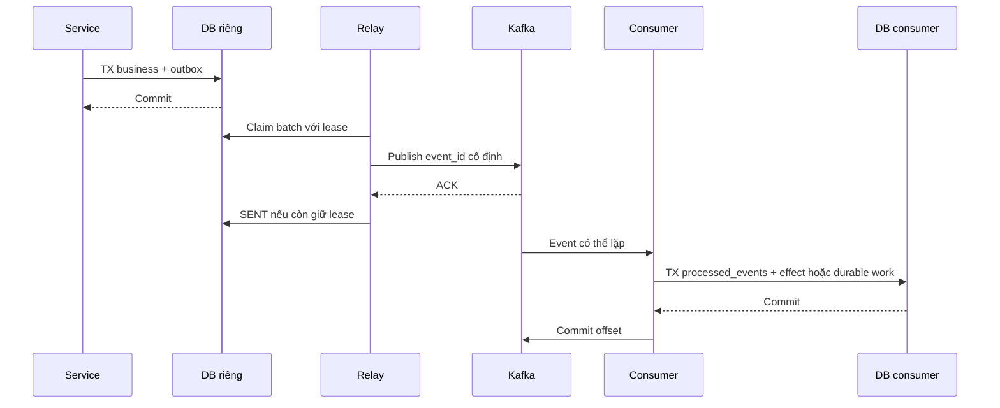

Relay không gửi version sau khi version trước cùng aggregate chưa được ACK/đánh dấu SENT; event consumer vẫn tự bảo vệ trước replay/retry. Với cache, consumer ghi yêu cầu invalidate bền vững trước ACK rồi worker thực hiện; không đánh dấu đã xử lý khi Redis invalidate chưa có cơ chế retry. TTL là giới hạn stale bổ sung.

## 2. `user-service`

### 2.1 Đăng ký và đăng nhập

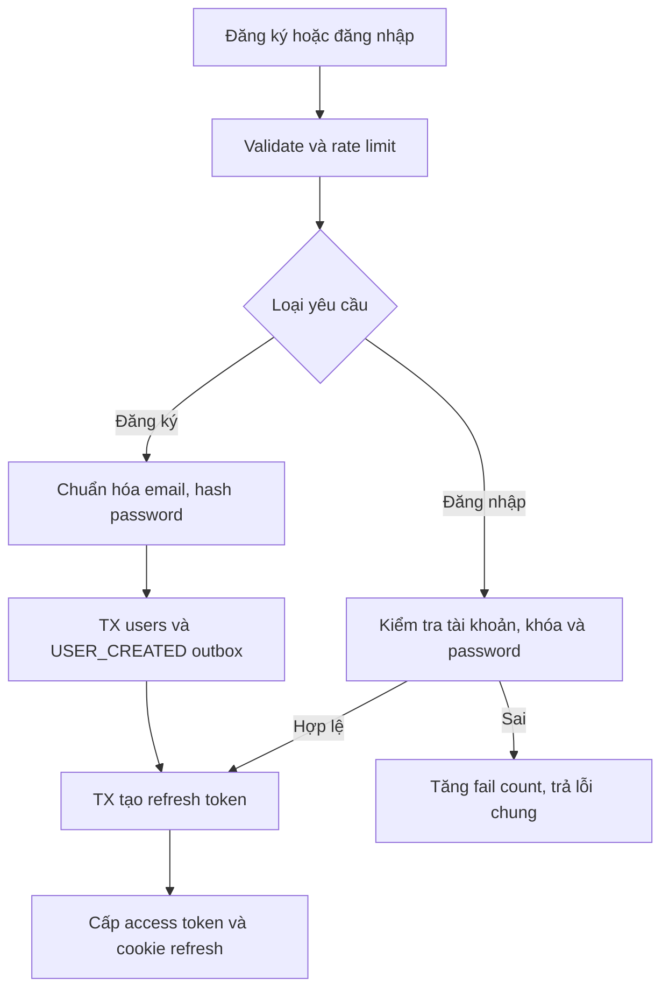

| Luồng | Các bước và ghi dữ liệu | Lỗi / bảo vệ |
|---|---|---|
| Đăng ký email | Validate → normalize → hash → insert users + outbox USER_CREATED → tạo refresh token hash | UNIQUE email chặn race; không nhận role từ client; xác minh email trước chức năng đòi email verified |
| Đăng nhập password | Rate limit IP/account → kiểm tra locked_until/status → verify hash → tạo refresh_tokens | Sai 5 lần khóa 15 phút theo PRD; lỗi chung không tiết lộ email tồn tại; Redis unavailable thì hạn chế/đóng đường login thay vì bỏ rate limit |
| Refresh | Lock token/family → kiểm tra hash, expiry, revoked → revoke token cũ + tạo token mới cùng transaction | Token cũ dùng lại: revoke family, bắt đăng nhập; client chỉ chạy một refresh đồng thời |
| Logout / đổi mật khẩu | Revoke family khi logout; đổi mật khẩu revoke mọi family và tăng auth_version | Đề xuất access token thường còn tối đa 15 phút; tài khoản khóa/quyền admin bị thu hồi phải được kiểm tra auth_version hiện hành tại đường nhạy cảm, không chỉ đợi JWT hết hạn |
| Quên mật khẩu | Trả thông báo chung → tạo reset token hash, hạn 30 phút → queue email → consume token dưới row lock, hash password mới, revoke sessions | Token dùng một lần; không log link/token; payload gửi email nhạy cảm dùng giao nhận tạm có hạn như OTP |
| Địa chỉ mặc định | Verify owner → lock users row → bỏ mặc định cũ và đặt mặc định mới cùng TX | Khi xóa địa chỉ mặc định, chọn địa chỉ còn lại trong cùng TX; partial UNIQUE chống hai mặc định |
| RBAC admin | SUPER_ADMIN thay đổi role → audit + tăng auth_version | Không tự nâng quyền; OPS/MARKETING/FINANCE chỉ có quyền endpoint được seed |

Cookie refresh/guest dùng Secure, HttpOnly và SameSite phù hợp deployment. Request mutation xác thực bằng cookie phải kiểm tra CSRF/origin; không mặc định tắt CSRF chỉ vì hệ thống có JWT. Access token ở bộ nhớ client; không lưu refresh token trong localStorage.

### 2.2 OTP, social và xác minh email — Phase 2 / theo tính năng

- **OTP request:** chuẩn hóa phone → rate limit phone/IP → tạo challenge 5 phút, HMAC code và bộ đếm trong Redis → đưa yêu cầu NOTIFY_OTP có challenge_id vào outbox. Code gửi đi chỉ giữ mã hóa tạm trong Redis; không đưa plaintext vào Kafka/log/DB.
- **OTP verify:** thao tác Redis nguyên tử so sánh HMAC, tăng số lần thử tối đa 5 và consume challenge đúng một lần → tìm/tạo user theo unique phone → phát session. Nếu crash sau consume trước cấp session, khách xin code mới; không dùng lại OTP đã consume. Gửi lại OTP vô hiệu challenge cũ.
- **Social:** kiểm tra state/nonce, issuer/audience và token theo provider → tìm `(provider, subject)` → đăng nhập. Email trùng không tự merge; yêu cầu đăng nhập tài khoản hiện hữu để liên kết. Danh tính mới cần email đã xác minh hoặc phone đã xác minh theo mô hình users.
- **Email verification:** token có purpose EMAIL_VERIFY, hash/expiry/used_at và target email; chỉ đánh dấu verified cho email khớp lúc cấp. Có thể dùng chung bảng token một lần như ghi ở mục 12, không thêm service.

## 3. `catalog-service`

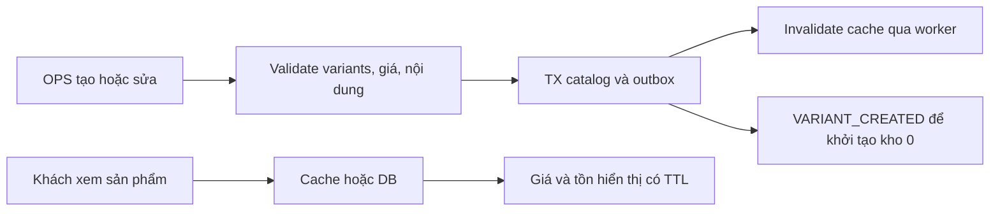

| Luồng | Xử lý | Lỗi / kết quả |
|---|---|---|
| Tạo/sửa sản phẩm | OPS auth → sanitize HTML/validate giá, size, màu, weight → TX product/variants/images + version + audit + outbox | SKU và bộ product-size-color unique; conflict trả 409; không xóa hard SKU đã công bố |
| Khởi tạo SKU kho | Catalog phát VARIANT_CREATED; inventory idempotently tạo stock_items số lượng 0 | Event chưa đến thì SKU được xem chưa sẵn sàng bán; nhập kho đợi đăng ký thành công |
| Publish/unpublish | Kiểm tra có biến thể, ảnh, nội dung bắt buộc → cập nhật trạng thái/version → invalidate | Ngưng bán không phá snapshot đơn cũ; checkout quote kiểm tra trạng thái ACTIVE |
| Danh sách/search/detail | Cache-aside → query DB phân trang → ảnh từ object storage/CDN → stock cache ngắn hạn | Cursor gồm sort value + id, không chỉ id; dữ liệu stock hiển thị không giữ hàng |
| Collections/lookbook/size guide | OPS chỉnh bảng tương ứng, validate thời gian/locale, sanitize → invalidation | Upload giới hạn size/type, xác nhận quyền sở hữu object; text thay thế cho ảnh |
| Review | ORDER_COMPLETED → eligibility 30 ngày + cộng sold_quantity một lần → member submit đúng variant → PENDING → OPS duyệt | UNIQUE eligibility chặn review trùng; sửa trong 7 ngày từ tạo và đưa về PENDING; tối đa 5 ảnh |
| Wishlist | Member PUT/DELETE sản phẩm vào wishlist_items | Idempotent bằng composite PK; không tự chuyển wishlist thành restock subscription |

Catalog quote nội bộ trả variants ACTIVE, phiên bản, giá cơ sở/override, tên/size/màu/ảnh/weight. Promotion chịu trách nhiệm giá campaign. Quote dùng thời hạn ngắn (đề xuất 2 phút) được server ký và ràng buộc actor, cart_version, items, địa chỉ, phương thức, tổng tiền; không chứa secret. Nếu giá/version thay đổi trước tạo order, trả PRICE_CHANGED kèm quote mới để khách xác nhận.

## 4. `cart-service`

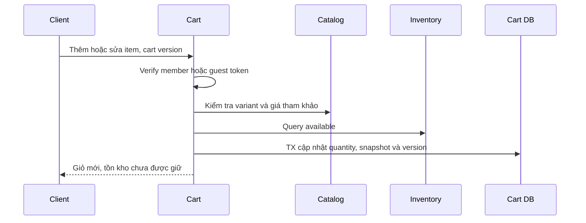

| Luồng | Xử lý | Lỗi / kết quả |
|---|---|---|
| Tạo/xem giỏ | Member lấy ACTIVE cart; guest cấp token ngẫu nhiên, lưu hash → đọc DB/cache | Không cho truy cập chỉ bằng ID; guest TTL 30 ngày; Redis hỏng đọc DB |
| Add/update/remove | Validate quantity 1–99; catalog ACTIVE; kiểm tra tồn tham khảo; TX kiểm tra cart/item version rồi ghi | Hết tồn trả lỗi kèm số lượng; version khác trả 409; không âm thầm ghi đè thay đổi thiết bị khác |
| Merge login | Xác minh đồng thời guest token và member → lock hai cart theo ID → nếu guest MERGED trả kết quả cũ → cộng qty, giữ created_at của item cũ hơn → đánh dấu MERGED | Cap 99 và available quan sát được; SKU không bán/không còn tồn bỏ khỏi kết quả nhưng trả danh sách điều chỉnh để UI báo; kho chưa được reserve |
| Preview | Đọc items → tính giá lại và fee/voucher preview | Preview không giữ quota; provider lỗi cho biết chưa tính được phí, không hiển thị tổng giả là giá chốt |
| Sau tạo đơn | Order gửi cleanup với order_id và item_id/version/quantity đã snapshot; TX xóa/giảm item khớp snapshot | Retry cùng order_id không trừ giỏ hai lần; item version đã đổi giữ nguyên và báo refresh; không xóa sạch giỏ hiện tại |

Order lấy snapshot giỏ qua internal API có actor và version. Request items nếu vẫn giữ trong API public phải khớp snapshot giỏ, không tồn tại hai nguồn số lượng độc lập.

## 5. `order-service` — điều phối checkout

### 5.1 Luồng online

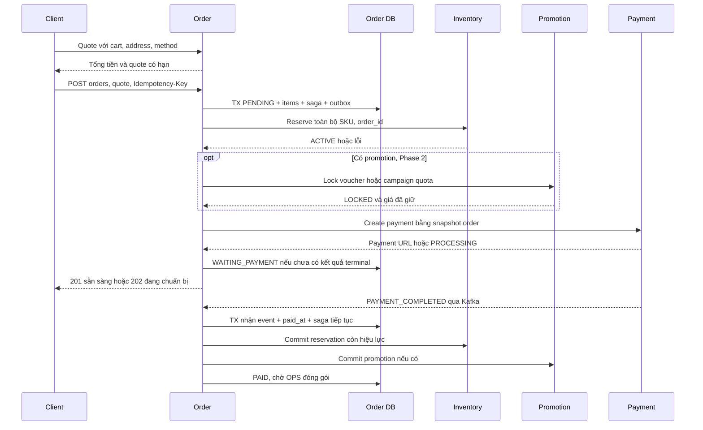

1. **Quote:** verify actor/cart/address/method, lấy giá catalog + promotion và phí shipping phía server. Client xác nhận quote và submit; không nhận amount do client tự tính. Quote không reserve hàng/quota.
2. **Tạo đơn:** kiểm tra chữ ký/expiry/binding quote, đối chiếu version/giá; sai giá trả 409 PRICE_CHANGED. Trong order-db transaction tạo order PENDING, items, saga RESERVE, idempotency resource, outbox ORDER_CREATED. Snapshot giá khóa tại transaction này; thay đổi giá catalog sau đó không sửa order.
3. **Reserve:** gửi cả items tới inventory, cùng order_id và request_hash. Online deadline bằng order.expires_at (15 phút từ lúc tạo, không gia hạn sau retry). Ghi kết quả bền vững; thiếu một SKU hủy toàn bộ reserve tại inventory rồi vào COMPENSATE.
4. **Promotion:** lock quota/voucher nếu có; tính lại số tiền đúng snapshot/quote. Nếu không giữ được giá/quota: bù trừ, yêu cầu khách checkout lại; không tự bỏ voucher hoặc tăng tiền.
5. **Payment:** intent CREATE_PAYMENT được ghi trước HTTP; payment nhận order_id và tự lấy tổng snapshot từ internal order API, hoặc nhận snapshot từ caller order đã xác thực và kiểm tra hash. Retry cùng order_id. Timeout lưu UNKNOWN rồi query payment; không lập giao dịch khác.
6. **Phản hồi:** hoàn tất nhanh trả 201 với URL; chưa xong trả 202 với order_no, status_url, retry_after. UI poll trạng thái đơn có quyền truy cập. Mục tiêu tạo đơn <2s đo việc tiếp nhận bền vững; thời gian URL sẵn sàng là metric riêng cần review lại SLO cũ.
7. **Nhận thanh toán:** trong một transaction lock order, ghi processed_events + payment_id/paid_at và saga work. Event có thể đến lúc order còn PENDING; lưu kết quả để saga tiếp tục, không bỏ event và không ghi WAITING_PAYMENT đè lên kết quả đã nhận.
8. **Commit kho/promotion:** chưa đóng order và reservation còn hạn thì commit inventory; promotion commit phần đã giữ. PAID chỉ khi hoàn thành các bước này. Nếu kho đã nhả hoặc quá hạn, chạy refund toàn bộ. Nếu promotion tạm lỗi sau commit kho, tiếp tục retry, chưa giao; lỗi vĩnh viễn thì restore kho và refund.
9. **Đóng gói:** OPS chuyển PAID → PACKING sau khi kiểm tra saga sẵn sàng. Order ghi durable step CREATE_SHIPMENT; shipment tạo thành công vẫn PACKING. Carrier nhận hàng mới SHIPPING.

Trong Phase 1 chưa promotion: các bước promotion là no-op với discount = 0; chưa tích hợp carrier thì shipping-service dùng SELF và bảng phí nội bộ. Đây là đề xuất làm MVP mua được hàng, không bỏ phần tính phí/giao hàng.

### 5.2 Luồng COD

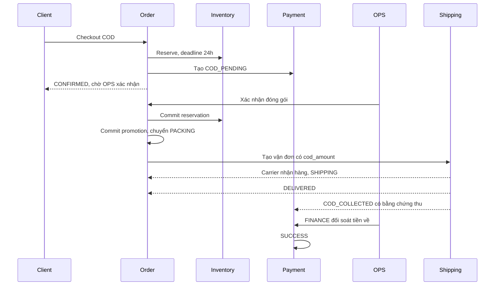

- CONFIRMED ở đây là shop đã tiếp nhận, vẫn chờ OPS; cần UI diễn đạt rõ. Deadline 24h và giới hạn đặt COD trên IP/phone/session là cấu hình được review.
- OPS xác nhận bằng CAS/row lock khi còn CONFIRMED và chưa quá hạn; chuyển saga từ WAIT_OPS sang COMMIT_STOCK. Inventory là trọng tài cuối khi commit tranh chấp job hết hạn; commit thua thì hủy, không PACKING.
- Khách hủy hoặc hết hạn trước OPS xác nhận: CANCELLING → release stock/promotion → đóng payment COD chưa thu → CANCELLED.
- Thu COD và tiền carrier chuyển về là hai việc riêng. ORDER_COMPLETED phục vụ review khi giao thành công; không đồng nghĩa doanh thu tiền đã đối soát. PAYMENT_COMPLETED của COD sau tiền về chỉ cập nhật tài chính, không chạy commit kho lần nữa.

### 5.3 State machine đơn

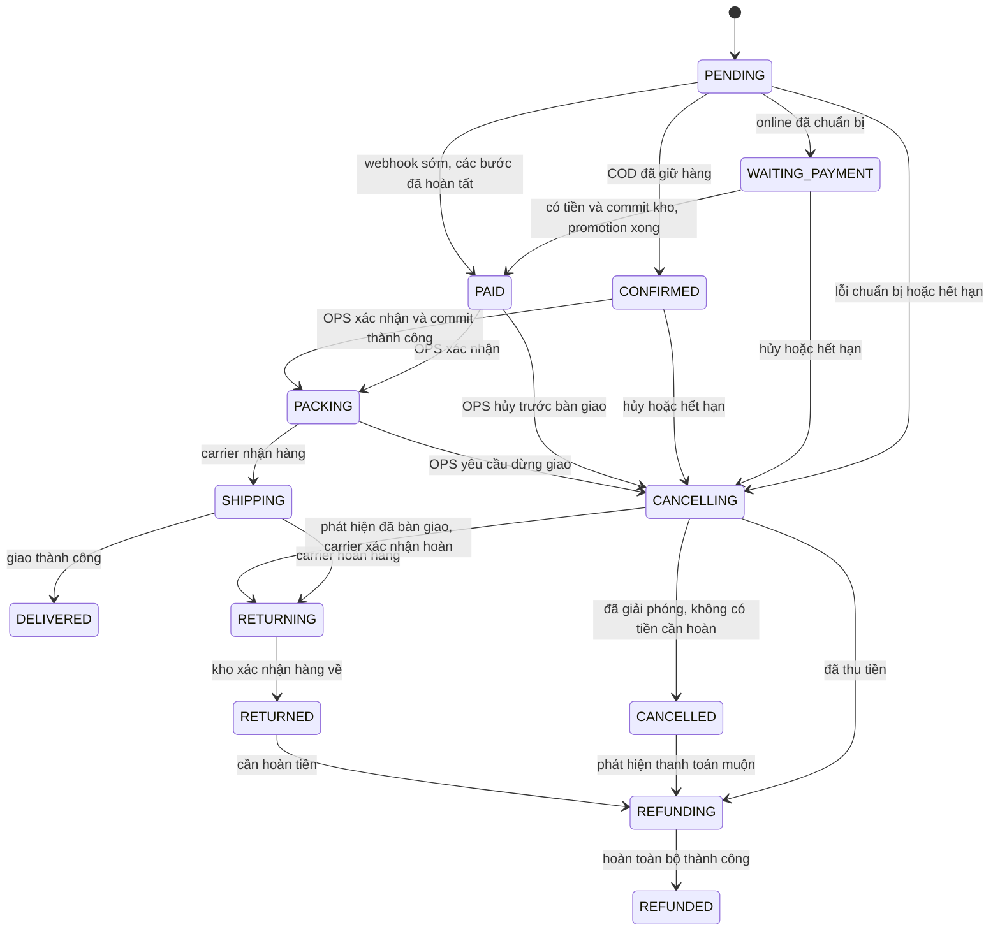

Payment_failed đến sau paid không hạ trạng thái. REFUNDED không tự tăng kho; việc trả kho có operation riêng. DELIVERED có thể có refund một phần và OPS return riêng nhưng vẫn giữ lịch sử delivered; không sửa lịch sử mua thành đơn chưa từng giao. Quy trình tự phục vụ đổi/trả sau giao chưa thuộc bản này.

### 5.4 Hết hạn, hủy và phục hồi saga

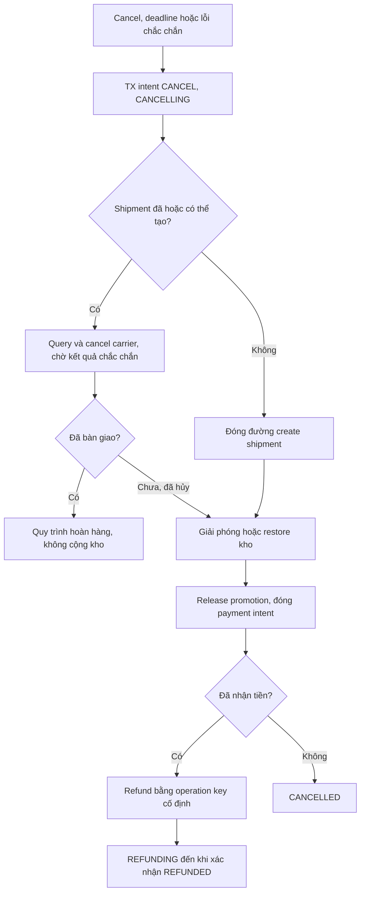

- Worker định kỳ quét saga chưa xong và đơn quá hạn, claim lease; query trạng thái resource rồi tiếp tục bước đã lưu. Không suy ra kết quả chỉ từ last_error hoặc thứ tự gọi trước crash.
- Cancellation ghi intent CANCEL trước mọi compensation. Worker FULFILL cũ không được ghi kết quả tiến tiếp sau khi intent/version đổi. Mỗi lệnh có khóa `order_id:operation`; target có trạng thái terminal/tombstone để lệnh đến muộn không tạo resource lại.
- Đặc biệt reserve timeout: gửi release cùng order_id + original hash. Inventory ghi RELEASED kể cả reserve chưa đến; reserve đến muộn không giữ hàng. Promotion áp dụng cùng quy tắc.
- Commit có thể đã thắng release: query reservation; COMMITTED phải dùng return/restore với key `cancel:{order_id}:{sku}`, không gọi release rồi cho rằng kho đã hoàn lại.
- Khi create shipment UNKNOWN, dừng restore/refund hoàn tất hủy cho đến khi xác định hàng chưa bàn giao hoặc vận đơn đã hủy. Carrier đã nhận hàng thì đi luồng return và cảnh báo OPS.
- Shipment cancel trước create phải lưu tombstone CANCELLED với snapshot/hash của original create request; create đến muộn bị từ chối. Payment close trước create tương tự lưu FAILED với order snapshot; webhook tiền thật sau đó vẫn được ghi nhận và hoàn.
- `CANCELLED` chỉ đạt khi stock/promotion đã giải phóng hoặc restore, shipment không thể xuất hàng, payment chưa thu đã đóng. Chưa biết kết quả thì giữ CANCELLING/MANUAL, không báo hoàn tất giả.
- Thanh toán đến sau deadline, kể cả provider báo paid_at trước deadline nhưng callback trễ: chính sách D07 kiểm tra reservation còn hiệu lực và order còn mở; nếu đã hết hạn/đóng thì refund. Không hứa khách vẫn nhận hàng chỉ dựa timestamp provider.
- Refund lỗi vẫn REFUNDING, giữ nghĩa vụ và alert. Notification gửi trạng thái đang xử lý, không gửi “đã hoàn tiền” trước xác nhận provider.

## 6. `inventory-service`

### 6.1 Reserve, commit, release

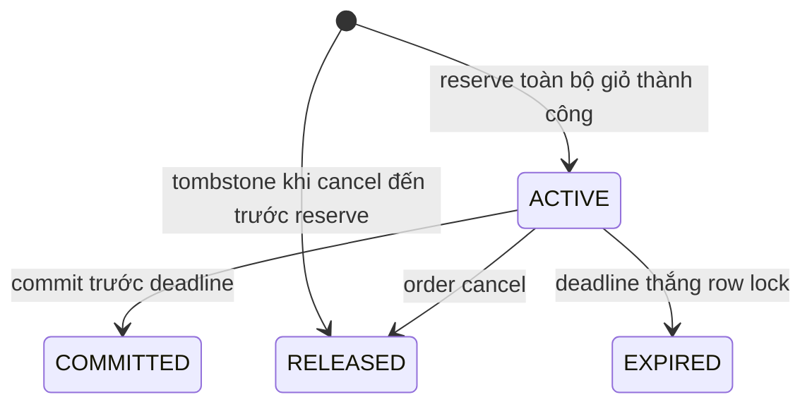

| Operation | Transaction trong inventory-db | Kết quả / lỗi |
|---|---|---|
| Register SKU | Consume VARIANT_CREATED + processed_events → insert stock_items 0 nếu chưa có | Duplicate không reset on_hand; variant_id/sku mismatch đưa DLQ/OPS |
| Reserve | Normalize/gộp SKU trùng, validate qty → lock/create reservation theo order_id → so request_hash → lock stock SKU theo thứ tự → kiểm tra đủ tất cả → tăng reserved + insert items + ledger + outbox | Một SKU thiếu rollback toàn bộ; cùng key/body trả reservation hiện có; terminal không mở lại |
| Commit | Lock reservation → ACTIVE và DB now < expires_at → lock SKU theo thứ tự → giảm on_hand/reserved theo items → COMMITTED + ledger/outbox | COMMITTED retry thành công không trừ thêm; RELEASED/EXPIRED trả 409; quá hạn chuyển EXPIRED và release trong cùng TX rồi trả kết quả thất bại sau commit |
| Release/expire | Lock reservation → ACTIVE: giảm reserved, ghi RELEASED/EXPIRED + ledger/outbox | COMMITTED trả trạng thái cần restore; đã RELEASED/EXPIRED là no-op; release trước reserve tạo tombstone |
| Return/restore | Chỉ caller order hoặc OPS có quyền; lock reservation → kiểm tra đã COMMITTED, tổng quantity trả chưa vượt commit → tăng on_hand + stock_returns + ledger/outbox | Không nhận số lượng trả tùy ý từ client; cần cancel chưa giao hoặc phiếu kiểm đếm hàng đã về; operation key chống cộng lại |

Không giữ một phần các SKU của đơn. Không giữ row lock khi gọi service khác. Stock constraint `0 <= reserved <= on_hand` là lớp bảo vệ cuối; không thay bằng Redis distributed lock.

### 6.2 Nhập kho, điều chỉnh và restock

- **Nhập/điều chỉnh:** OPS cung cấp lý do + key; CSV validate toàn bộ trước ghi, giới hạn đề xuất 1.000 dòng/lần, transaction khóa SKU thứ tự. Nhập cộng on_hand; điều chỉnh không được giảm on_hand dưới reserved. Lưu actor, ledger và audit.
- **Hết hạn:** job quét ACTIVE quá expires_at, xử lý như release dưới cùng row lock với commit; phát INVENTORY_RELEASED có reason EXPIRED. Order đối chiếu và chuyển compensation. Không chỉ xóa key Redis.
- **Restock:** phát INVENTORY_RESTOCKED khi **available** từ 0 lên >0 (kể cả nhả hàng). Inventory chọn subscription ACTIVE, dựng NOTIFY_RESTOCK_ALERT có recipient đã lấy từ user API hoặc snapshot consent, ghi QUEUED + outbox cùng TX. Notification không truy cập inventory-db.
- **Kết quả gửi:** notification phát NOTIFICATION_SENT/FAILED để inventory đánh dấu SENT hoặc cho retry theo giới hạn; tối đa một lần/ngày cho user/SKU. Đăng ký lại tăng generation. Consume ORDER_COMPLETED để ngưng subscription SKU đã mua; không consume payment để trừ kho.
- **Tồn thấp:** batch hàng ngày chọn available <= min_stock, tạo NOTIFY_LOW_STOCK với dedupe theo SKU/ngày.

## 7. `payment-service`

### 7.1 Tạo giao dịch và webhook

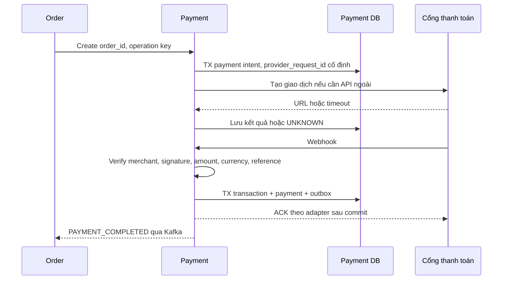

- Tạo payment chỉ từ order đã xác thực; amount lấy snapshot order. Public `/payments` nếu giữ lại chỉ yêu cầu tiếp tục payment của đơn thuộc actor, không cho client đổi amount/method.
- Tạo row trước gọi provider. COD tạo COD_PENDING ngay. Online giữ provider_request_id cố định qua mọi retry; thất bại mạng UNKNOWN → query trước, không gán FAILED do timeout cục bộ.
- Webhook kiểm tra chữ ký theo adapter, merchant, reference, amount/currency đã chuẩn hóa. Sai amount/merchant không được SUCCESS; log đã lọc + alert. Request chưa xác minh không được ghi giao dịch tài chính.
- Lock payment → insert payment_transactions nếu event mới → cập nhật trạng thái hợp lệ + outbox. ACK chỉ sau commit. DB lỗi trả phản hồi retry theo provider; không ACK success rồi mới lưu.
- SUCCESS không bị FAILED đến muộn ghi đè. FAILED/UNKNOWN có thể chuyển SUCCESS nếu bằng chứng xác minh provider xác nhận thu tiền; order quyết định fulfill hay refund. Cùng transaction thành công gửi lặp không tạo event nghiệp vụ lần hai.
- Browser return chỉ xem trạng thái server. Webhook/query mới xác nhận giao dịch. Query xác nhận payment đã thu tạo cùng effect như webhook, được khóa/dedupe cùng payment.
- Payment URL hết hạn không tự chứng minh chưa thu tiền. Reconciliation tiếp tục kiểm tra payment UNKNOWN/đơn đã hủy có dấu hiệu thanh toán.

### 7.2 Refund, COD và đối soát

| Luồng | Xử lý | Lỗi / kết quả |
|---|---|---|
| Refund toàn phần/một phần | FINANCE hoặc order yêu cầu → lock payment → kiểm tra tiền đã thu và amount còn khả dụng → insert refund + reserve amount → gọi provider ngoài TX | Retry cùng operation_key không reserve hai lần; tổng refund thành công + đang chờ không vượt tiền gốc |
| Refund callback/query | Xác minh → lock refund/payment → SUCCESS: chuyển refund_reserved sang refunded, outbox PAYMENT_REFUNDED có refund_id và cumulative total | FAILED chắc chắn mới nhả reserved; timeout UNKNOWN giữ reserved, reconcile |
| Hủy chưa thu | Order close payment → khóa intent; chặn tạo/tiếp tục giao dịch mới, gọi cancel provider nếu có | Không giả định close chặn tiền đang tới; late success vẫn phát event để refund |
| COD thu tiền | Consume COD_COLLECTED từ shipping, verify order/method/amount → COD_COLLECTED | Trạng thái DELIVERED không tự tạo COD_COLLECTED |
| COD tiền về | FINANCE cung cấp settlement_ref/bằng chứng hoặc batch đối soát → SUCCESS → PAYMENT_COMPLETED | Chống trùng settlement_ref; thiếu/thừa tiền tạo reconciliation_items, không tự ép khớp |
| Đối soát online | Job query UNKNOWN và batch theo ngày → so merchant ref, trạng thái, số tiền → áp dụng qua cùng hàm ghi giao dịch | Sai lệch mở item để FINANCE xử lý có audit; không sửa lịch sử theo file không xác minh |

Hoàn COD có thể cần chuyển khoản thủ công: FINANCE ghi bằng chứng và mã chuyển tiền duy nhất, cùng kiểm tra hạn mức refund; không gọi API refund online cho COD. Mất đáp ứng từ ngân hàng giữ UNKNOWN để đối chiếu.

## 8. `promotion-service` — Phase 2

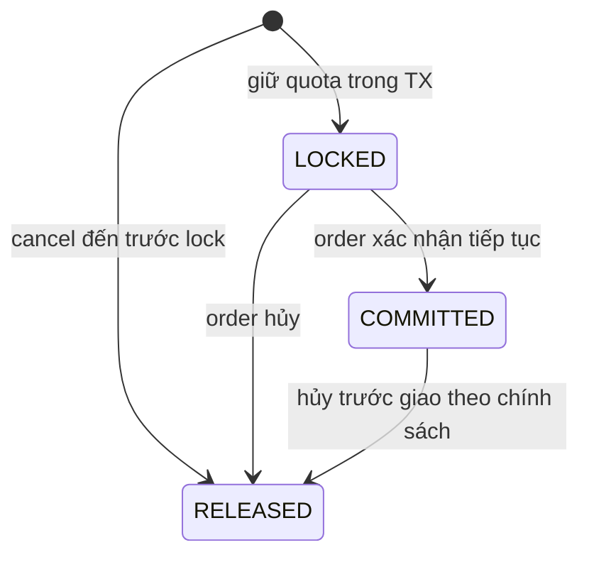

`promotion_orders` dùng COMMITTED; `voucher_redemptions` gọi trạng thái tương đương là REDEEMED.

| Luồng | Xử lý | Lỗi / giới hạn |
|---|---|---|
| CRUD voucher | MARKETING validate type/value/time/scope/limits → TX + audit | Không giảm limit dưới tổng reserved + used; không sửa giá trị của lượt đã giữ; copy snapshot amount vào redemption |
| Validate preview | Tính eligibility từ server actor, items, subtotal/fee; trả discount tham khảo | Preview không giữ lượt, không dùng subtotal/user_id client làm quyết định checkout |
| Lock | Lock/create promotion_orders → khóa voucher/user_usage và campaign_items theo thứ tự → kiểm tra giờ/scope/limit/D12 → cập nhật counters + reservations cùng TX | Không đủ bất kỳ quota nào rollback toàn bộ; same order/hash trả kết quả cũ; RELEASED không giữ lại |
| Commit | Lock promotion_orders + child rows → LOCKED sang COMMITTED/REDEEMED; reserved giảm, sold/redeemed tăng | Retry không tăng lần hai; hết giờ campaign vẫn commit reservation hợp lệ đã giữ; không tự expire khi order chưa rõ |
| Release | Khóa aggregate và child rows → trả counters tương ứng trạng thái hiện tại → RELEASED | Không trả hai lần; release trước lock tạo tombstone; partial refund sau giao không tự release |
| Campaign start/end | Admin publish kiểm tra không chồng lịch dưới lock → scheduler phát PRICE_CHANGED khi bắt đầu/kết thúc | API giá vẫn kiểm tra thời gian thực dù scheduler/cache trễ; catalog invalidation không phải nguồn hiệu lực giá |
| Reservation quá hạn | Query order saga; đã hủy thì xử lý lệnh release, đang xử lý giữ và alert | Không nhả quota chỉ vì service order tạm unavailable |

Giới hạn flash sale khác tồn kho vật lý: phải giữ được cả inventory và campaign quota. Một bên thành công, bên kia thất bại thì order điều phối bù trừ. PostgreSQL quyết định counters, Redis chỉ giúp hiển thị/giảm đọc.

## 9. `shipping-service`

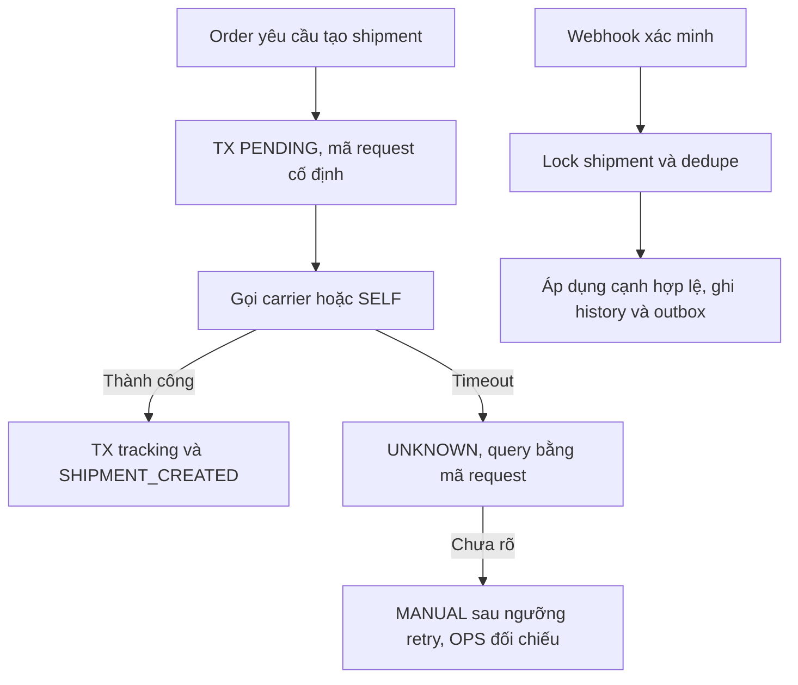

| Luồng | Xử lý | Lỗi / kết quả |
|---|---|---|
| Fee estimate/quote | Validate địa chỉ, lấy weight từ catalog snapshot → áp dụng rule/carrier → trả fee/cod_fee/carrier/expiry | Preview cache 1h được; giá chốt cần còn hiệu lực; carrier lỗi chỉ dùng bảng phí fallback đã cấu hình, có nhãn và khách xác nhận |
| Create | Chỉ order hoặc OPS thông qua order kiểm tra PACKING + saga ready → insert shipment PENDING → gọi carrier cùng provider_request_id → lưu tracking/outbox | UNIQUE order_id chặn hai vận đơn; không tạo từ ORDER_PAID song song REST |
| Retry create | Query theo merchant reference trước retry nếu request trước UNKNOWN | Tối đa 3 lần thử có kết quả xác định; không tìm được kết quả an toàn thì MANUAL, không chuyển hãng tự động |
| Cancel trước bàn giao | Lưu CANCEL_PENDING → query/cancel carrier → CANCELLED chỉ khi xác nhận | Carrier đã lấy hàng hoặc UNKNOWN: báo order chờ/return, không cho restore kho |
| Webhook status | Verify adapter → dedupe event → kiểm tra cạnh/sequence/timestamp → TX history + status/version + outbox | Event cũ ghi applied=false; thiếu tiền đề query carrier; không dùng bảng rank đơn giản cho mọi nhánh |
| SELF | OPS gán shipper, cập nhật cùng state machine, có audit và bằng chứng bàn giao/thu tiền | Không bypass validation chỉ vì cập nhật thủ công |
| Giao thất bại | FAILED có thể sang DELIVERING nếu hãng giao lại hoặc RETURNING khi quyết định hoàn | Không hủy đơn ngay ở lần giao thất bại đầu |
| Hàng hoàn về | Carrier RETURNED → báo OPS kiểm đếm; OPS xác nhận số lượng thực nhận qua order → inventory return | Không cộng kho từ webhook RETURNED nếu chưa xác nhận tình trạng hàng |

SHIPMENT_CREATED chỉ báo có vận đơn. PICKING cần adapter định nghĩa rõ “đang chờ lấy” hay “đã lấy”; order chuyển SHIPPING trên mốc **đã bàn giao được xác nhận**, bổ sung field `handed_over_at` trong event/snapshot. Cod collection/remittance là event tài chính riêng, không suy từ trạng thái vận đơn.

## 10. `notification-service`

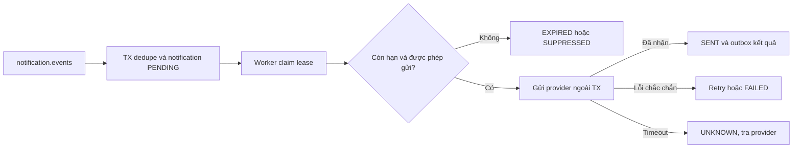

1. Consume NOTIFY_* từ một topic duy nhất, validate recipient/channel/template/locale/dedupe_key/expiry. Không đọc DB của user/order/inventory.
2. Resolve template, fallback vi nếu thiếu bản en; snapshot nội dung đã escape. Kiểm tra marketing_opt_in cho marketing; email giao dịch không bị tắt cùng opt-out marketing. Ghi processed_events + notification trong cùng TX.
3. Worker claim lease và gửi ngoài TX. Với OTP, lấy secret tạm qua internal API user-service; không ghi OTP vào rendered_body bền vững, không gửi khi hết hạn. Không fallback sang kênh chưa được người dùng xác minh/cho phép.
4. Dùng notification.id làm provider idempotency key nếu hỗ trợ. Provider ACK thành công → SENT + provider_message_id + outbox NOTIFICATION_SENT. SENT ở đây là provider nhận gửi, không khẳng định người dùng đã đọc/nhận.
5. Lỗi xác định retry email tối đa 5, SMS tối đa 3 theo PRD; hết lượt FAILED + alert. Timeout sau gửi: query bằng provider_message_id/key nếu hỗ trợ; nếu không, UNKNOWN để xử lý có kiểm soát. Không cam kết exactly-once giao đến hộp thư khi provider không hỗ trợ.
6. Retry/replay giữ dedupe_key; thao tác gửi lại thủ công phải có key mới, lý do và audit. Restock dùng kết quả gửi để inventory cập nhật subscription qua event.

CRUD template chỉ MARKETING, validate placeholder và render preview trước lưu; nội dung transactional ảnh hưởng payment/order cần review nội bộ. Marketing unsubscribe link dùng token có scope recipient/channel, lưu hash; request lặp vẫn thành công.

## 11. Ma trận trách nhiệm và event đề xuất

| Producer / topic | Event | Consumer và tác dụng |
|---|---|---|
| user / `user.events` | USER_CREATED | Projection/analytics khi cần; không tự gửi welcome nếu đã có NOTIFY_WELCOME |
| catalog / **`catalog.events` mới** | VARIANT_CREATED, CATALOG_CHANGED | Inventory đăng ký SKU; catalog worker invalidate cache từ durable task |
| order / `order.events` | ORDER_CREATED, ORDER_PAID, ORDER_CONFIRMED, ORDER_CANCELLED, ORDER_COMPLETED | Cart cleanup theo contract; catalog eligibility/sold count; inventory ngưng restock khi completed; **không tự create payment/deduct stock/create shipment** |
| inventory / `inventory.events` | INVENTORY_RESERVED/RELEASED/DEDUCTED/UPDATED/RESTOCKED | Order đối chiếu reservation; catalog invalidation; restock fan-out do inventory sở hữu |
| payment / `payment.events` | PAYMENT_CREATED/COMPLETED/FAILED/REFUNDED | Order tiếp tục saga hoặc cập nhật tài chính COD; refund event có refund_id, amount, refunded_total |
| promotion / `promotion.events` | PRICE_CHANGED | Catalog invalidation, không sửa snapshot đơn |
| shipping / `shipping.events` | SHIPMENT_CREATED/STATUS_UPDATED, **COD_COLLECTED/COD_REMITTED** | Order cập nhật giao hàng; payment xử lý thu/đối soát COD |
| Các service / `notification.events` | NOTIFY_* | Chỉ notification gửi; producer gửi recipient, locale, dedupe_key, data tối thiểu |
| notification / **`notification.results` mới** | NOTIFICATION_SENT/FAILED | Inventory cập nhật restock; user dọn secret tạm khi gửi OTP thành công |

Order phát NOTIFY_ORDER_CONFIRMED khi online đã commit xong hoặc COD đã được tiếp nhận; payment phát NOTIFY_PAYMENT_SUCCESS/REFUND_RESULT cho thông tin tiền; shipping phát NOTIFY_SHIPMENT_STATUS. Đây là thông báo khác mục đích, không dùng cả event domain và NOTIFY để gửi cùng template hai lần.

Envelope giữ event_id/event_type/version/occurred_at/aggregate_id của Interfaces, thêm `aggregate_version`, `correlation_id`; payload order-related luôn phân biệt order_id UUID và order_no. Events lifecycle có state/version để consumer không suy ra từ thứ tự giữa các topic. Kafka không cung cấp tổng thứ tự xuyên order/payment/inventory.

## 12. API và schema cần bổ sung / sửa sau review

Tất cả đường dẫn dưới đây là **đề xuất chưa phê duyệt**; base internal là `/internal/api/v1`, public `/api/v1`, admin `/admin/api/v1`. Mutation nội bộ yêu cầu service identity + Idempotency-Key + body hash và kiểm tra quyền theo caller.

| Khu vực | Endpoint / thay đổi | Dữ liệu và lý do |
|---|---|---|
| Public order | `POST /orders/quote` mới; `POST /orders` thêm quote_token/cart_version | Quote ràng buộc actor/items/address/method/price/expiry; 409 PRICE_CHANGED; tạo đơn có thể 202 |
| Internal cart | `GET /carts/{id}/snapshot`, `POST /carts/{id}/checkout-cleanup` | Actor/version bắt buộc; cleanup chứa order_id và items snapshot, idempotent |
| Internal catalog | `POST /catalog/variants/quote` | Batch variant IDs, trả giá/version/weight/status; không một HTTP call cho mỗi item |
| Internal order | `GET /orders/{order_id}/snapshot`, `GET /orders/{order_id}/saga-status` | Payment, promotion, shipping query snapshot/intent với quyền caller riêng |
| Internal inventory | Giữ reserve/commit/release; thêm `GET /inventory/reservations/{order_id}`, `POST /inventory/returns` | Reserve toàn giỏ có expires_at + request_hash; release original hash; return reason/evidence/quantities |
| Internal promotion | `POST /promotions/quote`, `POST /promotions/reservations/{lock,commit,release}`, `GET /promotions/reservations/{order_id}` | Bao phủ voucher và campaign quota trong một TX; thay lock/release voucher riêng ở checkout |
| Internal payment | `POST /payments`, `GET /payments/by-order/{order_id}`, `POST /payments/{order_id}/close`, `POST /payments/{payment_id}/refunds` | Amount server-owned; close có snapshot để ghi tombstone nếu create chưa đến |
| Public payment | `/payments` không nhận amount có quyền quyết định | Chỉ resume/query payment của order đã xác thực; refund chuyển admin FINANCE hoặc order internal |
| Internal shipping | `POST /shipping/shipments`, `GET /shipping/shipments/by-order/{order_id}`, `POST /shipping/shipments/{order_id}/cancel` | Snapshot/hash nhất quán; cancel-before-create có đủ snapshot; query UNKNOWN trước retry |
| Admin order | Action xác nhận COD/đóng gói/hủy/nhận hàng hoàn | Order kiểm tra trạng thái trước khi điều phối, không cho OPS ghi trực tiếp vào inventory/payment |
| Admin payment | Refund, COD settlement, resolve reconciliation | FINANCE; evidence, operation_key, audit; không coi shipping DELIVERED là đã thu |
| Public user | Forgot/reset password, verify email, social callback/link/unlink | Token purpose/expiry, ownership, không auto-merge email |
| Internal user | Resolve notification recipient; lấy secret tạm cho OTP/reset/verify | Caller notification duy nhất cho secret, hạn dùng, không log; nguyên tắc tối thiểu dữ liệu |
| Public catalog/inventory | Wishlist PUT/DELETE/list; subscribe/unsubscribe restock; review edit | Member ownership, idempotent subscription, thời hạn edit |
| Public notification | Unsubscribe marketing theo scoped token | Không cấp quyền xem tài khoản hoặc sửa thông báo giao dịch |
| Provider adapters | Verify/create/query/refund/ACK mapping cho từng provider | Đối chiếu sandbox + tài liệu provider chính thức trước code, không sao chép giả định SHA/header/status trong bản cũ |

Các điểm đối chiếu với schema 05:

- `user_action_tokens` có purpose RESET_PASSWORD/EMAIL_VERIFY và target_email; reset/verify dùng cùng mẫu token một lần.
- `shipments.handed_over_at` phân biệt đã tạo vận đơn với đã giao hàng cho hãng.
- Consumer cart dùng processed_events nếu cleanup bằng event; nếu REST dùng idempotency_requests, không bật cả hai cách. Đề xuất REST cleanup do saga gọi sau khi tạo order được tiếp nhận, lỗi cleanup không hủy order.

## 13. Kịch bản nghiệm thu thiết kế

Chưa có ứng dụng nên đây là các ca kiểm thử phải hiện thực cùng migration/service; không phải kết quả test đã chạy. Dùng DB thật cho race/transaction và provider giả lập cho network; không chỉ mock repository.

| ID | Tình huống | Kết quả phải đạt |
|---|---|---|
| T01 | Hai checkout tranh SKU cuối | Chỉ một reservation thành công; stock không âm |
| T02 | Đơn có SKU A đủ và B thiếu | Không giữ A; không phát event reserve thành công của transaction rollback |
| T03 | Reserve commit DB nhưng HTTP response mất | Retry cùng key trả reservation cũ; không giữ hai lần |
| T04 | Cancel đến inventory trước request reserve bị chậm | Tombstone ngăn reserve đến muộn |
| T05 | Payment success và expiry cùng lúc | Reservation row lock chọn một kết quả: commit một lần hoặc release + refund; không vừa bán vừa nhả |
| T06 | Webhook success lặp, event PAYMENT_COMPLETED replay | Một effect tài chính, một lần commit kho, một notification mỗi dedupe_key |
| T07 | Payment success đến khi order còn PENDING | Ghi nhận durable, saga tiếp tục, không bị WAITING_PAYMENT ghi đè |
| T08 | Late success sau CANCELLED | REFUNDING → REFUNDED; không mở lại đơn/không giữ hàng lại |
| T09 | Worker chết sau inventory commit trước lưu saga | Query reservation COMMITTED; tiếp tục, không trừ lần hai |
| T10 | Hai refund đồng thời vượt số tiền còn lại | Một request bị từ chối; thành công + pending <= payment.amount |
| T11 | Refund/create shipment timeout nhưng provider đã làm | Query cùng reference, không tạo lần hai; UNKNOWN nếu không thể xác minh |
| T12 | COD quá 24h và OPS confirm cạnh tranh | Hoặc commit để đóng gói hoặc hủy/nhả, không có PACKING thiếu kho |
| T13 | Hai người giữ voucher/lượt flash sale cuối | Chỉ một người giữ được quota; inventory phía thua được release |
| T14 | Promotion job thấy quá hạn lúc payment saga đang chạy | Không tự nhả khi kết quả order chưa rõ; giữ quota và reconcile |
| T15 | Shipment CREATED rồi webhook cũ / FAILED rồi giao lại | Order chưa SHIPPING trước bàn giao; không lùi terminal, cho phép nhánh giao lại hợp lệ |
| T16 | Hủy lúc create shipment đang UNKNOWN | Không tự restock cho đến khi chứng minh chưa giao/hủy carrier thành công |
| T17 | Return webhook lặp, OPS xác nhận hàng về hai lần | Kho chỉ cộng số lượng kiểm đếm một lần |
| T18 | Khách sửa giỏ khi cleanup đơn trước đến muộn | Item mới/sửa không bị mất; cleanup lặp không trừ lại |
| T19 | Merge giỏ retry/đồng thời | Số lượng chỉ cộng một lần, giữ ownership |
| T20 | Refresh token replay; social email trùng | Revoke family; không chiếm/merge tài khoản bằng email chưa chứng minh |
| T21 | Guest đoán order_no/cart_id | Không đọc/hủy/checkout tài nguyên không thuộc session |
| T22 | Notification crash sau provider ACK trước SENT | Query/dedupe provider; UNKNOWN khi không thể xác minh, không hứa exactly-once |
| T23 | Kafka down sau business commit; relay publish rồi crash | Outbox không mất; replay không nhân đôi effect |
| T24 | Giá/voucher/fee đổi giữa preview và đặt đơn | PRICE_CHANGED/quote mới; không tự thu tổng mới chưa xác nhận |
| T25 | Redis mất dữ liệu | Không mất giỏ/tồn/quota authoritative; auth/OTP fail an toàn, không bỏ giới hạn |
| T26 | Refund một phần sau DELIVERED | Tiền hoàn đúng, order còn lịch sử DELIVERED; kho không tự tăng |
| T27 | Giao COD thành công nhưng carrier chưa chuyển tiền | Order DELIVERED, payment COD_COLLECTED hoặc COD_PENDING theo bằng chứng; chưa SUCCESS |

## 14. Trình tự triển khai sau khi review

1. Chốt D01–D12, state machines và API delta; đồng bộ PRD/Interfaces/Architecture để có một bộ quyết định thống nhất.
2. Tạo migration + test constraints/race cho order/inventory/payment trước; dựng user/catalog/cart tối thiểu và SELF shipping để chạy luồng COD xuyên suốt.
3. Thêm một cổng online, kiểm thử webhook trùng/trễ, refund và crash recovery; sau đó tích hợp cổng còn lại.
4. Hoàn thiện promotion, carrier, OTP/social/reviews/restock theo Phase 2; kiểm tra lại ưu tiên P0 trong PRD vì hiện chưa hoàn toàn khớp roadmap.
5. Đo tải thực theo từng phase; tối ưu cache/index trước khi thêm sharding hoặc cơ chế quota Redis phức tạp.

## 15. Phiếu review

- [ ] Luồng online, COD, hủy, hoàn tiền, hoàn hàng đúng cách shop muốn vận hành.
- [ ] Chấp nhận order điều phối duy nhất, database quyết định kho/quota.
- [ ] Chấp nhận xử lý UNKNOWN/202 và UI đang xử lý; chốt lại cách đo SLO checkout.
- [ ] Chấp nhận các API/event mới, quyền truy cập và thay đổi state machine.
- [ ] Xác nhận các tình huống T01–T27 đủ làm cơ sở nghiệm thu phần lõi.
- [ ] Chốt scope Phase 1/2 và các chính sách chưa duyệt trước khi bắt đầu code.
