# 07 — Bộ sơ đồ thiết kế hệ thống

| Thuộc tính | Giá trị |
|---|---|
| Ngày | 2026-09-19 |
| Phiên bản | B1 |
| Trạng thái | **Baseline đồng bộ; dùng để review, không mô tả hệ thống đã triển khai** |
| Cơ sở nghiệp vụ | [Brief](01_brief.md), [PRD](02_prd.md) |
| Thiết kế tham chiếu | [Architecture](04_architecture.md), [Database Design](05_database_design.md), [Service Flows](06_service_flows.md) |

Sơ đồ bám theo D01–D12 ở 05/08 và luồng ở 06. PRD/Interfaces/Architecture đã đồng bộ B1; giả định thương mại còn chờ PO xác nhận theo 08. Quyền quyết định tồn kho/quota thuộc PostgreSQL; order điều phối checkout duy nhất.

Tất cả sơ đồ dùng Mermaid để lưu cùng Markdown. Use Case, Activity, Component và Deployment dùng hình/nhãn và chú giải tương ứng trên flowchart Mermaid, **không phải bộ ký pháp UML chuẩn đầy đủ**. Sequence, ERD và Class dùng cú pháp Mermaid chuyên biệt. Mục tiêu là review trách nhiệm, dữ liệu và hành vi; nếu hồ sơ yêu cầu UML chuẩn hình thức, cần chuyển bốn loại đầu sang công cụ UML/PlantUML.

## Mục lục và phạm vi

| Loại | Nội dung | Nơi đọc |
|---|---|---|
| Use Case Diagram | Khách mua hàng và đội vận hành | [UC-01, UC-02](#use-case) |
| Activity Diagram | Checkout, COD, hủy/hoàn tiền; phân vai xử lý | [ACT-01–03](#activity) |
| System Context Diagram | Một hệ thống, người dùng và các hệ thống ngoài | [CTX-01](#context) |
| Sequence Diagram | Các tương tác đã có và bổ sung thanh toán muộn | [SEQ-01 và mục lục Sequence](#sequence) |
| ERD | 9 database theo từng service, không FK xuyên DB | [Mục lục ERD](#erd) |
| Component Diagram | Ranh giới 9 service và thành phần bên trong order | [CMP-01, CMP-02](#component) |
| Deployment Diagram | Node/môi trường chạy, artifact và kết nối | [DEP-01](#deployment) |
| Class Diagram | Domain model order, inventory, payment | [CLS-01–03](#class) |
| Data Flow Diagram | Context DFD và phân rã cấp 1, luồng có tên | [DFD-0, DFD-1](#dfd) |

Ngoài ra đã có State Machine trong [06 §5.3, §6.1, §8](06_service_flows.md); giữ làm nguồn duy nhất cho trạng thái đơn/reservation/promotion trong bản thiết kế đề xuất.

## 1. Use Case Diagram

Chú giải: hình chữ nhật ngoài boundary là actor; hình bo tròn là mục tiêu người dùng; đường liền là tham gia use case, không phải thứ tự chạy. `include` hướng từ use case chính tới hành vi bắt buộc; `extend` hướng từ hành vi tùy chọn tới use case được mở rộng. Một người có thể được cấp nhiều role, nhưng quyền OPS và FINANCE không mặc nhiên giống nhau.

### UC-01 — Khách hàng

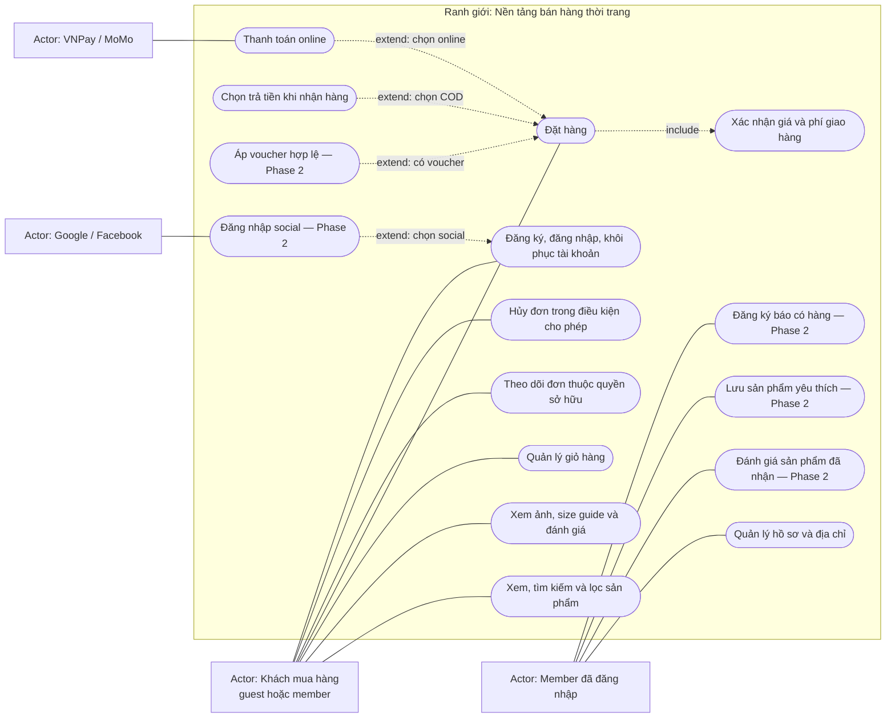

Member cũng sử dụng mọi chức năng của Khách mua hàng; guest xem/hủy đơn bằng guest credential, không chỉ bằng order_no. Online và COD là hai lựa chọn loại trừ nhau cho một đơn. Đánh giá cần eligibility từ đơn DELIVERED; wishlist/restock không tự giữ hàng.

### UC-02 — Quản trị và vận hành

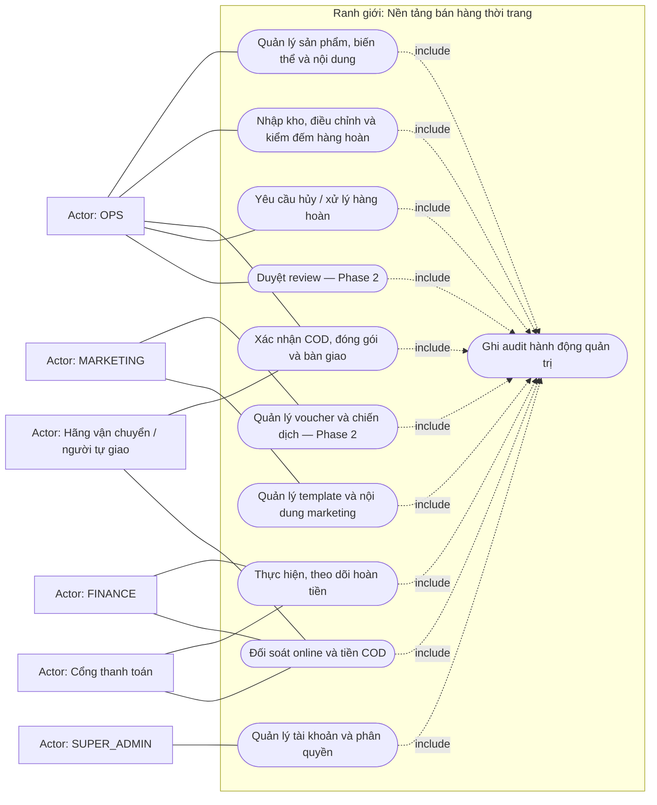

OPS yêu cầu hủy qua order; saga có quyền gọi refund nội bộ theo chính sách. Thao tác hoàn tiền thủ công thuộc FINANCE. Quản trị không được sửa trực tiếp bảng ở database. Dev/SRE thuộc vận hành hạ tầng, thể hiện ở Deployment thay vì thêm thành chức năng bán hàng.

## 2. Activity Diagram có phân vai

Mỗi subgraph là một partition trách nhiệm (swimlane theo ý nghĩa; renderer có thể bố trí khác nhau). Chấm START là bắt đầu, END là kết thúc phạm vi luồng; hình thoi là quyết định có guard. Đường quay lại là retry/chờ, không mặc định là transaction xuyên service. Các bước bất đồng bộ có lưu intent trong DB theo tài liệu 06.

### ACT-01 — Checkout online

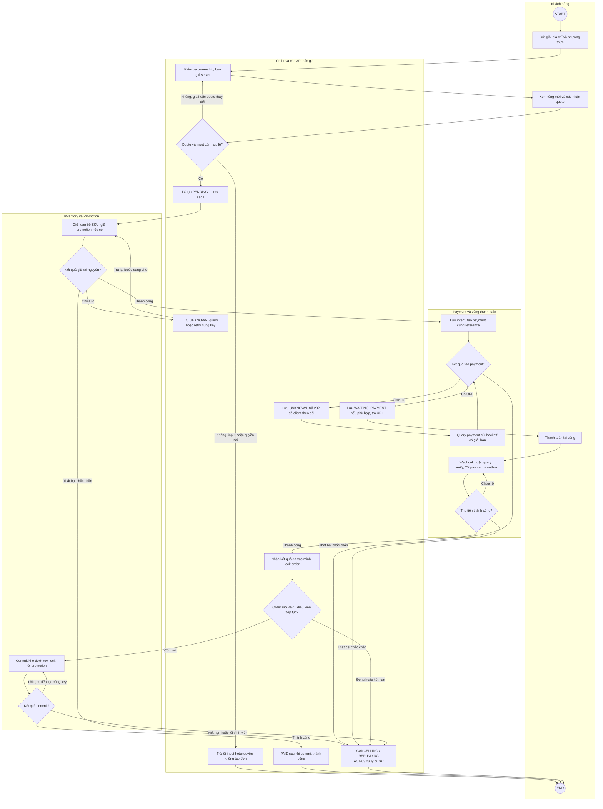

Guard tại commit kho mới là quyết định cuối cùng khi cạnh tranh job hết hạn; kiểm tra A11 không thay row lock ở A12. Payment create UNKNOWN được query trước khi có URL; 202 không yêu cầu khách thanh toán khi URL chưa sẵn sàng. Client dừng giữa chừng vẫn được job timeout phục hồi theo tài liệu 06. END ở nhánh AX nghĩa bàn giao sang ACT-03, không có nghĩa đã hoàn tiền xong.

### ACT-02 — COD từ tiếp nhận đến đối soát

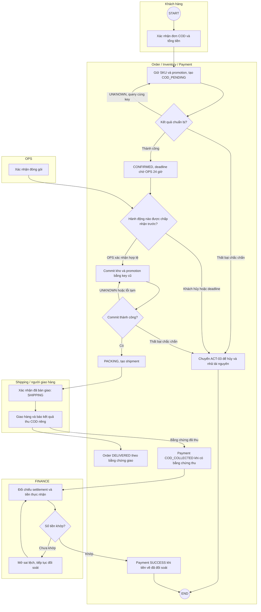

Đây là nhánh giao thành công. Lỗi chuẩn bị ở B2 đi ACT-03; lỗi/UNKNOWN tạo shipment ở B7 giữ PACKING và reconcile, không tự bàn giao. Giao thất bại đi luồng shipping/return ở tài liệu 06 §9. B8 không tự dẫn đến B9: đã giao và đã thu tiền là hai bằng chứng riêng.

### ACT-03 — Hủy, UNKNOWN và hoàn tiền

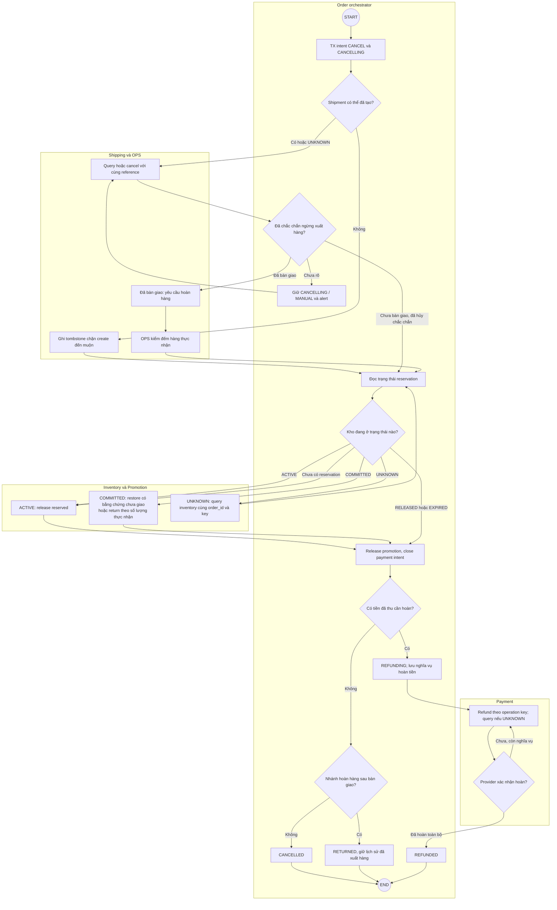

Khi chưa có reservation, C8 ghi tombstone RELEASED; retry không mở lại reserve. Trạng thái sau nhận hàng hoàn là RETURNED, không giả lập CANCELLED như đơn chưa giao; nếu cần refund thì RETURNED → REFUNDING. Kho thiếu/hỏng được OPS xử lý riêng, không cộng đủ số lượng đặt một cách tự động. Retry dài hạn chuyển MANUAL/alert, không vòng lặp HTTP liên tục.

## 3. System Context Diagram — CTX-01

Hệ thống được xem như **một khối**. Không vẽ microservice, database hay Kafka ở cấp này. Hai chiều trên mũi tên ghi loại tương tác, không phải đồng bộ/bất đồng bộ.

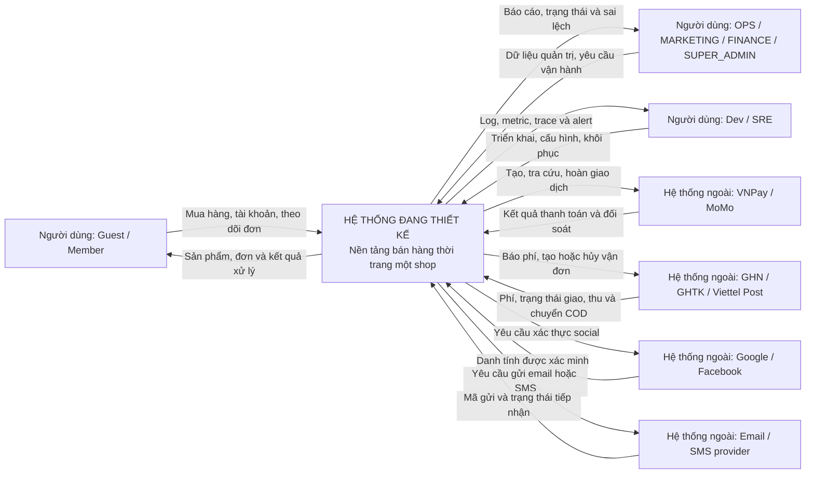

Khách thanh toán trên giao diện provider và nhận email/SMS qua provider; chi tiết tương tác trực tiếp nằm ở Sequence. SELF delivery thuộc thao tác OPS, không thêm một hệ thống ngoài giả định. Cloud/CDN/storage là lựa chọn triển khai, đặt ở Deployment.

## 4. Sequence Diagram

Các Sequence đã có ở [06_service_flows.md](06_service_flows.md): §1.3 outbox/consumer; §4 cart; §5.1 checkout online; §5.2 COD; §7.1 payment/webhook. Đây là nguồn sequence hiện hành; PRD dẫn tới cùng luồng này.

### SEQ-01 — Tiền đến sau khi đơn đã hủy

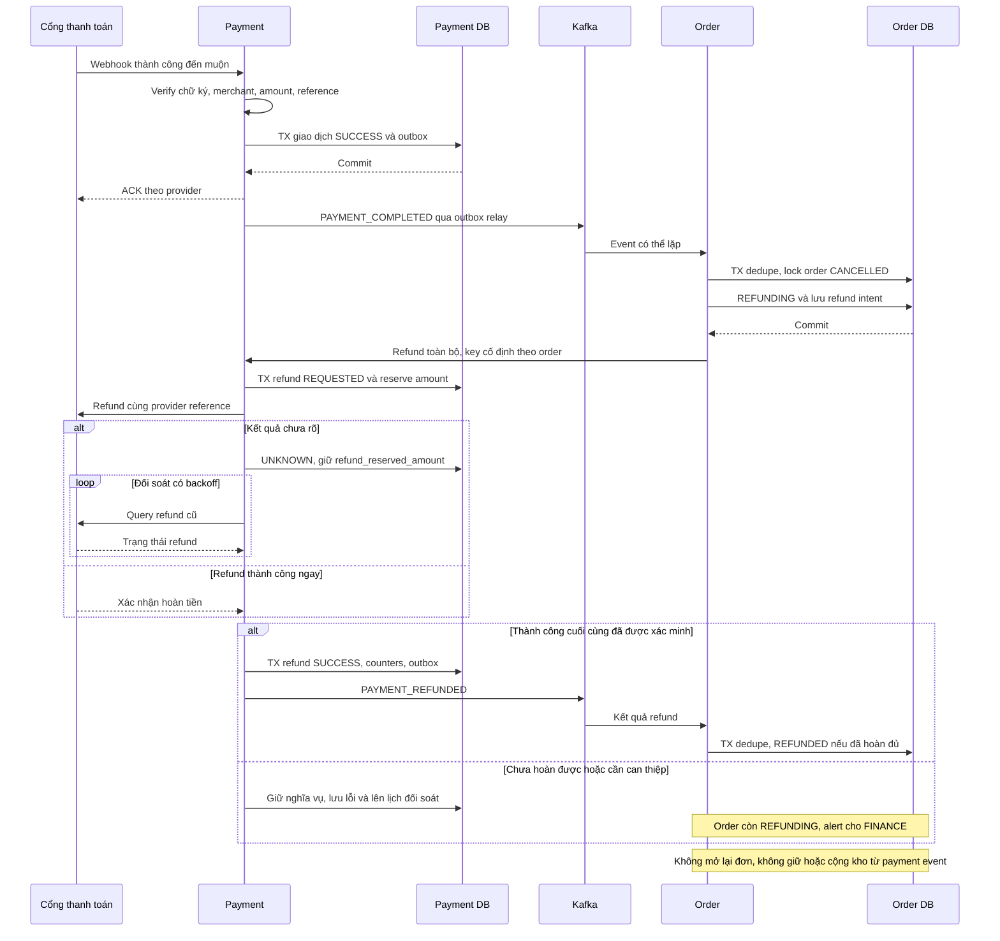

Refund chưa thành công vẫn REFUNDING và có alert theo 06 §7.2. Sơ đồ chọn tiền đề đơn CANCELLED đã hoàn tất giải phóng tài nguyên; nếu CANCELLING còn shipment UNKNOWN thì đi ACT-03 trước.

## 5. ERD — mục lục theo service

Giữ sơ đồ và bảng thuộc tính cạnh nhau trong [05_database_design.md](05_database_design.md), không chép thêm bản dễ lệch ở đây.

| Service | Mục trong tài liệu 05 | Quan hệ chính |
|---|---|---|
| User | §4 | users → addresses, OAuth, tokens, roles/permissions |
| Catalog | §5 | products → variants/images; collections; eligibility → reviews; wishlist |
| Cart | §6 | carts → cart_items; cart guest → cart đích sau merge |
| Order | §7 | orders → items/history; order ↔ saga |
| Inventory | §8 | reservation → items → SKU; stock ledger/returns/subscriptions |
| Payment | §9 | payment → transactions/refunds/reconciliation |
| Promotion | §10 | promotion_orders → voucher/campaign reservations |
| Shipping | §11.1 | shipment → status history |
| Notification | §11.2 | template → notifications |

ERD chỉ vẽ FK trong từng database. ID tham chiếu service khác không phải đường FK; outbox/idempotency/audit là các bảng kỹ thuật độc lập, xem 05 §3.

## 6. Component Diagram

Chú giải: component là khối phần mềm chịu trách nhiệm rõ; nút tròn `I...` là hợp đồng cung cấp, không hàm ý phải tạo một Java interface. Đường liền từ component tới interface ghi `provides`; đường nét đứt từ caller tới interface ghi `requires`. Với event, mũi tên ghi rõ publish/consume. Diagram này mô tả phụ thuộc, không mô tả thứ tự checkout.

### CMP-01 — Ranh giới 9 service và interface checkout

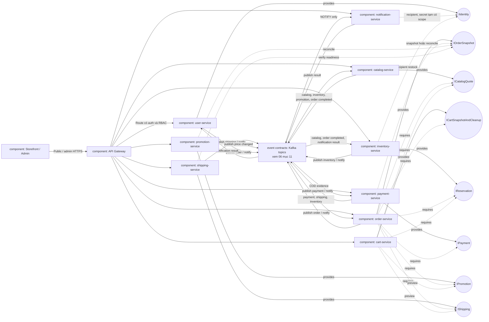

Public route không expose mọi operation của service: reserve/commit/refund nội bộ nằm sau internal auth, whitelist caller và network policy. Các đường service-to-service ở hình là phụ thuộc logic; transport internal đi qua Gateway như hợp đồng hiện tại. Các callback query IO chỉ đọc snapshot, không tạo mutation vòng lặp. Mỗi component truy cập DB riêng theo ERD; không vẽ lại 9 DB để giữ sơ đồ dễ đọc.

### CMP-02 — Thành phần bên trong `order-service`

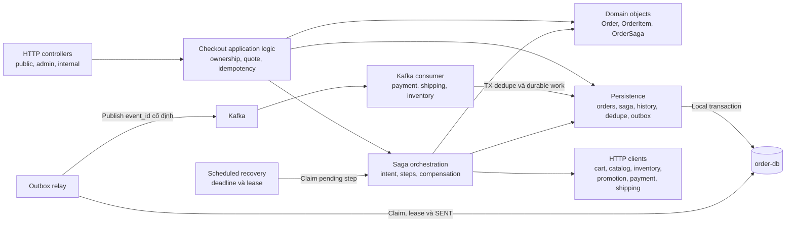

Các khối là trách nhiệm trong cùng ứng dụng Spring Boot, không phải service mới hoặc framework bắt buộc. Consumer lưu work rồi worker/saga tiếp tục ngoài transaction nhận event. Không gọi HTTP provider trong transaction DB. Cấu trúc package theo Engineering Guide 12, không cần interface/factory cho từng khối.

## 7. Deployment Diagram — DEP-01

Đây là **topology production đề xuất**, không phải hạ tầng đang chạy. Kế thừa Kubernetes/Gateway/Kafka/Nacos của Architecture; dùng PostgreSQL và Redis managed trong hình như một phương án chờ review. AWS hay GCP, số node, vùng đặt máy và ngân sách chưa được chốt.

Subgraph `node` là nơi thực thi; khối bên trong ghi workload/artifact được triển khai. Mũi tên là kết nối mạng hoặc đường deploy có nhãn. Một Deployment với nhiều replica có thể được scheduler đặt trên nhiều worker node, không phải tất cả pod nằm trên một máy như vị trí trên hình.

```mermaid
flowchart TB
    Browser["node: Thiết bị khách / admin<br/>artifact: React chạy trong browser"]
    Providers["node: Các provider bên ngoài<br/>payment, carrier, social, email/SMS"]
    Dev["node: Máy Dev / SRE"]
    CI["node: CI runner<br/>Build, test và push image"]
    Registry["node: Container registry<br/>artifact: images theo version"]
    GitOps["node: Git repository<br/>artifact: manifests theo môi trường"]
    subgraph Cloud["Ranh giới cloud của shop — lựa chọn nhà cung cấp chưa chốt"]
        Edge["node: Public edge<br/>TLS / WAF / CDN"]
        Assets["node: Object storage<br/>artifact: React bundle và ảnh sản phẩm"]
        subgraph Cluster["node: Kubernetes production cluster — đề xuất"]
            Ingress["workload: Ingress controller<br/>chỉ public routes / webhook allowlist"]
            subgraph AppPool["node pool: Application workers / namespace prod"]
                GW["Deployment: Gateway<br/>2+ replicas"]
                Apps["8 Deployments MVP, promotion từ Phase 2<br/>replicas và HPA theo sizing đã duyệt"]
                Secrets["Kubernetes Secrets<br/>quyền theo service account"]
            end
            subgraph StatefulPool["node pool: Stateful workloads / PVC"]
                Kafka["StatefulSet: Kafka KRaft<br/>3 broker tham chiếu, cần sizing"]
                Nacos["StatefulSet: Nacos<br/>HA topology cần O01/O02"]
                NacosData["Nacos metadata store<br/>cấu hình backend riêng cần chốt"]
            end
            subgraph OpsPool["workloads: Platform / Observability"]
                Argo["ArgoCD<br/>áp dụng manifests"]
                OTel["OTel collector / scrape / log agents"]
                Observe["Prometheus, Loki, Tempo, Grafana<br/>storage và retention theo ngân sách"]
            end
        end
        subgraph PrivateData["node: Managed data services / private network — đề xuất"]
            PG["PostgreSQL primary và replica<br/>9 database, credentials riêng từng service"]
            Redis["Redis managed<br/>cache, OTP, rate limit"]
            Backup["Backup / WAL archive<br/>object storage riêng, quyền hạn chế"]
        end
    end
    Browser -->|HTTPS và static assets| Edge
    Edge -->|Static origin| Assets
    Edge -->|API HTTPS| Ingress
    Providers -->|Webhook HTTPS| Edge
    Ingress -->|Public route allowlist| GW
    GW -->|Cluster Service routing| Apps
    Apps -->|Internal route, service identity| GW
    Apps -->|TLS, credentials từng DB| PG
    Apps -->|Cache / auth ephemeral| Redis
    GW -->|Rate limit| Redis
    GW -->|Registry / config| Nacos
    Apps -->|Registry / config| Nacos
    Nacos -->|Metadata riêng nền tảng| NacosData
    Apps -->|Produce / consume| Kafka
    Apps -->|Service account được cấp quyền| Secrets
    Apps -->|Ảnh và upload được kiểm soát| Assets
    Apps -->|HTTPS egress theo adapter| Providers
    PG -->|Base backup và WAL| Backup
    Apps -->|Metric / log / trace| OTel
    GW -->|Metric / log / trace| OTel
    OTel --> Observe
    Dev -->|Push source| CI
    CI -->|Push image sau test| Registry
    CI -->|Cập nhật image version| GitOps
    Argo -->|Đọc manifests| GitOps
    Argo -->|Deploy workloads| Apps
    Argo -->|Deploy gateway| GW
    AppPool -->|Pull image qua kubelet| Registry
    Dev -->|Truy cập riêng có auth| Observe
    Dev -->|Review / approve rollout| GitOps
```

Các ràng buộc phải giữ khi hiện thực:

- Public Ingress không route `/internal/*`; cùng Gateway có đường nội bộ riêng chỉ nhận caller service đã xác thực. NetworkPolicy/RBAC/service identity bảo vệ cả mạng và ứng dụng; namespace tự nó không phải biên bảo mật đầy đủ.
- Chín database không đồng nghĩa chín máy PostgreSQL. Mỗi service chỉ có credential của DB mình; không được query chéo DB. Replica DB không có nghĩa backup thay thế được.
- Worker nền như saga recovery, relay, notification sender chạy trong service Deployment tương ứng, claim lease để nhiều replica không làm hiệu ứng trùng. Chưa tách thêm worker service.
- Kafka/Nacos replica cần phân bố chống cùng điểm lỗi và volume bền vững. Hình không khẳng định chỉ cần ghi `replicas: 3` là đã có HA; topology failure domain phải review với ngân sách.
- Nacos metadata backend có persistence riêng, không dùng một trong 9 DB nghiệp vụ. Loại backend/version là việc cần chốt khi dựng platform.
- Dev/staging dùng cấu hình và credentials riêng; production cluster riêng là lựa chọn còn mở O01 đã được ghi ở 04/08. Không triển khai thêm cluster chỉ vì sơ đồ này.
- Observability có storage riêng và RBAC; không ghi token/OTP/payment secret vào log. Hạ tầng của CI/registry/Git host là dịch vụ bên ngoài ranh giới cloud trong hình, không được cấp quyền DB production.
- Hình nhấn luồng ứng dụng. ArgoCD cũng có thể quản lý platform theo manifest được review; kiểm tra backup/restore, HPA và SLO khi triển khai, không coi topology này là bằng chứng đã đạt tải.

## 8. Class Diagram — domain model phần lõi

Đây là thiết kế class mức domain cho ba vùng có invariant quan trọng nhất; **không phải class đã tồn tại trong code**, không yêu cầu sinh code từ hình. Các service còn lại dùng schema/flow trong 05–06 và chưa cần sơ đồ controller/repository lặp lại. Tên trạng thái chỉ tập giá trị ở tài liệu 05; Java enum hay cách mapping cụ thể chốt khi code.

Chú giải: `*--` composition; `-->` association nội bộ service; `..>` dependency. Dấu `+` là operation/thuộc tính được mô tả công khai ở mức thiết kế, không yêu cầu entity thực tế phải để public field. Không nối object graph ORM qua ranh giới service.

### CLS-01 — Order và saga

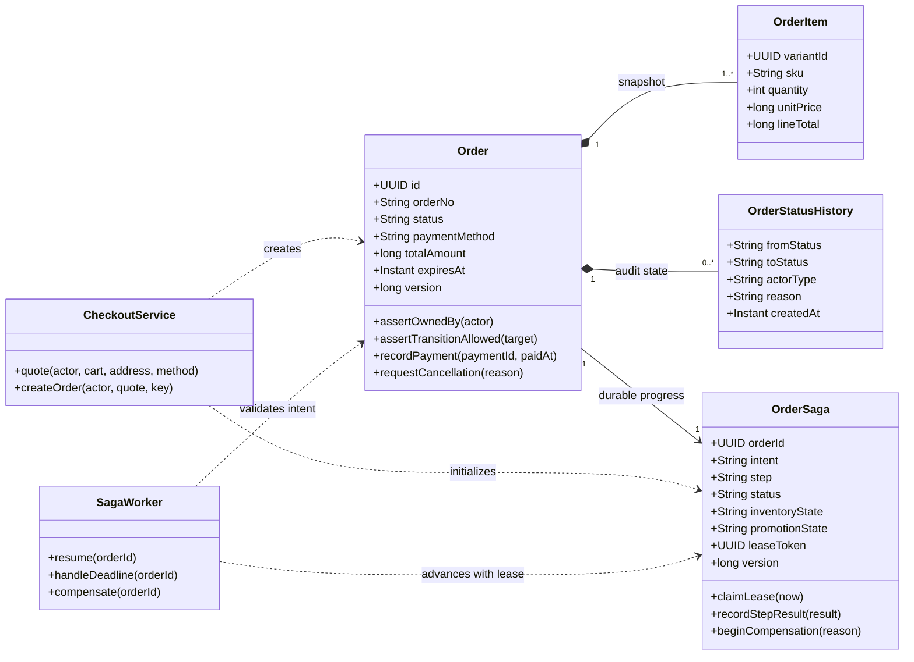

Order và OrderSaga ghi trong order-db. Tổng tiền không nhận từ client; order items/address/fee giữ snapshot. SagaWorker lưu bước trước khi gọi service khác và ghi kết quả bằng lease token/version; Order không tự gọi network trong domain method. Class biểu diễn orchestration hiện có, không thêm một saga framework hoặc service mới.

### CLS-02 — Inventory: reserve khác với return

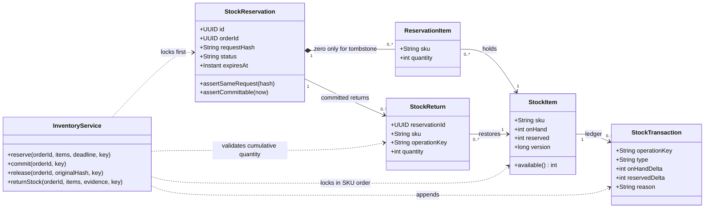

`0 <= reserved <= onHand`; reserve đa SKU là một local transaction. ACTIVE reservation phải có ít nhất một item; tombstone cancel-before-reserve có thể không có item. Return kiểm tra tổng trả không vượt số lượng đã commit và bằng chứng hàng; release chỉ nhả reserved, không hoàn hàng đã xuất.

### CLS-03 — Payment và refund

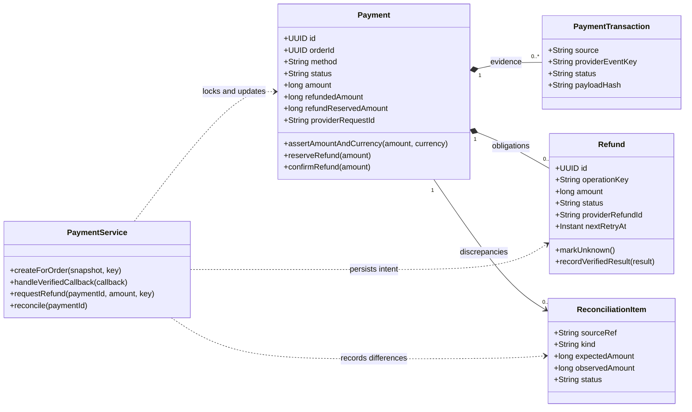

`refundedAmount + refundReservedAmount <= amount`; reserve refund dưới khóa payment trước network call. UNKNOWN giữ nghĩa vụ, không mở refund mới cùng mục đích. `orderId` chỉ là ID tham chiếu, không association tới class Order ở service khác. Thao tác provider thuộc adapter đã xác minh; không coi method name trong hình là đặc tả SDK provider.

## 9. Data Flow Diagram

Quy ước cấp: **DFD-0 là context process 0**, DFD-1 phân rã process 0 thành 7 process nghiệp vụ (9 service). Đây là góc nhìn **dữ liệu**, không mô tả thời gian thực thi, if/else hay network protocol.

- Hình chữ nhật: external entity; hình tròn: process có số; hình trụ D1–D7: logical data store. Dùng ký hiệu Mermaid thay cho ký hiệu Yourdon/Gane–Sarson đầy đủ.
- Mỗi mũi tên có tên dữ liệu/request/result đi qua; không có đường external entity → data store hoặc data store → data store.
- D2 và D4 gộp tên kho dữ liệu cho dễ đọc, **không gộp database vật lý**. Catalog chỉ ghi catalog-db, cart chỉ ghi cart-db; inventory và promotion tương tự.
- DFD bao phủ nghiệp vụ bán hàng Release 1. Deploy, logs/traces và backup không thuộc process 0 này, được mô tả ở DEP-01.

### DFD-0 — Ranh giới dữ liệu bán hàng

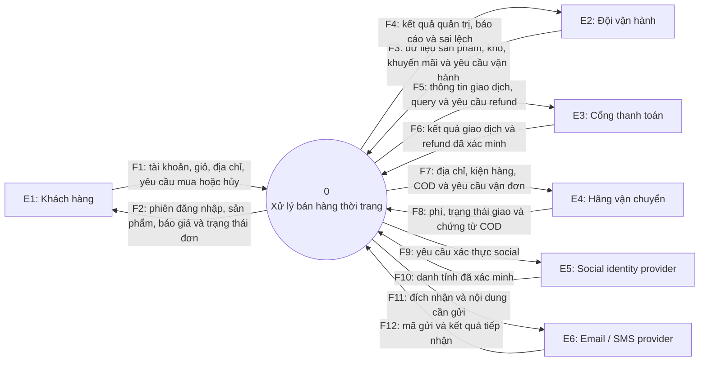

F1/F2 bao gồm profile, wishlist, review, restock và unsubscribe khi tính năng tương ứng bật; F3/F4 bao gồm role, template, hủy/hoàn hàng, refund và settlement. Đây là các gói dữ liệu ở context, được tách rõ hơn ở DFD-1.

### DFD-1 — Phân rã process 0

```mermaid
flowchart TB
    EC["E1: Khách hàng"]
    EA["E2: Đội vận hành"]
    EP["E3: Cổng thanh toán"]
    ES["E4: Hãng vận chuyển"]
    EI["E5: Social IdP"]
    EM["E6: Email / SMS provider"]
    P1(("1.0<br/>Tài khoản<br/>user-service"))
    P2(("2.0<br/>Sản phẩm và giỏ<br/>catalog + cart"))
    P3(("3.0<br/>Đơn hàng<br/>order-service"))
    P4(("4.0<br/>Kho và ưu đãi<br/>inventory + promotion"))
    P5(("5.0<br/>Thanh toán<br/>payment-service"))
    P6(("6.0<br/>Giao hàng<br/>shipping-service"))
    P7(("7.0<br/>Thông báo<br/>notification-service"))
    D1[("D1: user-db")]
    D2[("D2: catalog-db / cart-db<br/>hai DB riêng")]
    D3[("D3: order-db")]
    D4[("D4: inventory-db / promotion-db<br/>hai DB riêng")]
    D5[("D5: payment-db")]
    D6[("D6: shipping-db")]
    D7[("D7: notification-db")]
    EC -->|Thông tin đăng nhập, profile và địa chỉ| P1
    P1 -->|Session, profile và kết quả xác minh| EC
    EC -->|Bộ lọc, giỏ, review và wishlist| P2
    P2 -->|Sản phẩm và snapshot giỏ| EC
    EC -->|Quote, checkout, tra cứu hoặc hủy đơn| P3
    P3 -->|Báo giá và trạng thái đơn| EC
    EC -->|Đăng ký hoặc hủy restock| P4
    P4 -->|Trạng thái subscription| EC
    EC -->|Lựa chọn unsubscribe marketing| P7
    P7 -->|Kết quả cập nhật preference| EC
    EA -->|Tài khoản và quyền| P1
    P1 -->|Kết quả phân quyền| EA
    EA -->|Sản phẩm, nội dung, duyệt review| P2
    P2 -->|Kết quả quản trị catalog| EA
    EA -->|Nhập kho, voucher và campaign| P4
    P4 -->|Tồn kho và kết quả giữ quota| EA
    EA -->|Xác nhận đơn, hủy, kiểm đếm hàng hoàn| P3
    P3 -->|Trạng thái xử lý đơn| EA
    EA -->|Refund và bằng chứng settlement| P5
    P5 -->|Kết quả hoàn tiền và sai lệch đối soát| EA
    EA -->|Bằng chứng bàn giao SELF và thu tiền| P6
    P6 -->|Danh sách vận đơn và vấn đề giao hàng| EA
    EA -->|Template, nội dung marketing| P7
    P7 -->|Kết quả quản trị và trạng thái gửi| EA
    P1 -->|F9: yêu cầu social auth| EI
    EI -->|F10: verified identity| P1
    P3 -->|Yêu cầu snapshot giỏ và giá| P2
    P2 -->|Items, giá và phiên bản| P3
    P3 -->|Snapshot cleanup giỏ và dữ liệu đơn đã giao| P2
    P2 -->|Thông tin SKU mới và yêu cầu tồn hiển thị| P4
    P4 -->|Tồn hiển thị và giá campaign| P2
    P3 -->|Đơn, SKU, số lượng, yêu cầu quota| P4
    P4 -->|Reservation, trạng thái và discount| P3
    P3 -->|Order snapshot và nghĩa vụ thu hoặc hoàn| P5
    P5 -->|Kết quả payment và refund| P3
    P3 -->|Địa chỉ, items, yêu cầu phí hoặc vận đơn| P6
    P6 -->|Phí, vận đơn, trạng thái bàn giao hoặc hoàn| P3
    P6 -->|Chứng từ thu và chuyển COD| P5
    P5 -->|F5: thông tin create, query, refund| EP
    EP -->|F6: kết quả giao dịch hoặc refund| P5
    P6 -->|F7: địa chỉ, kiện hàng, COD và yêu cầu vận đơn| ES
    ES -->|F8: phí, tracking, chứng từ COD| P6
    P1 -->|Yêu cầu thông báo tài khoản, secret reference| P7
    P3 -->|Thông báo trạng thái đơn, recipient snapshot| P7
    P4 -->|Thông báo restock và tồn thấp| P7
    P5 -->|Thông báo tiền đã thu hoặc hoàn| P7
    P6 -->|Thông báo trạng thái vận chuyển| P7
    P7 -->|Kết quả gửi thông báo tài khoản và OTP| P1
    P7 -->|Kết quả gửi restock| P4
    P7 -->|F11: recipient và nội dung gửi| EM
    EM -->|F12: message id và kết quả tiếp nhận| P7
    P1 -->|Tài khoản, token hash, quyền| D1
    D1 -->|Hồ sơ và trạng thái auth| P1
    P2 -->|Sản phẩm, review, giỏ và version| D2
    D2 -->|Catalog và giỏ đã lưu| P2
    P3 -->|Order snapshot, saga, history, outbox| D3
    D3 -->|Đơn và tiến độ saga| P3
    P4 -->|Stock ledger, reservation, quota| D4
    D4 -->|Tồn kho và hạn mức hiện tại| P4
    P5 -->|Payment, refund và bằng chứng| D5
    D5 -->|Trạng thái và nghĩa vụ tài chính| P5
    P6 -->|Shipment và lịch sử nhận từ hãng| D6
    D6 -->|Vận đơn và tracking hiện tại| P6
    P7 -->|Template, notification, preference| D7
    D7 -->|Nội dung, consent và tiến độ gửi| P7
```

Tên event tương ứng với dữ liệu đơn đã giao, tồn hiển thị/giá campaign và SKU mới xem ma trận ở 06 §11; DFD này thể hiện các luồng dữ liệu chính và không thay thế danh mục event. Redis là cache/ephemeral auth đã giải thích trong thiết kế DB; không thay kho dữ liệu authoritative ở hình.

### Kiểm tra cân bằng DFD

| Luồng context | Process cấp 1 bảo toàn dữ liệu vào/ra |
|---|---|
| F1 / F2 — khách hàng | 1.0 account, 2.0 catalog/cart, 3.0 order, 4.0 subscription, 7.0 preference |
| F3 / F4 — quản trị | 1.0–7.0 theo role, không ghi trực tiếp D1–D7 |
| F5 / F6 — thanh toán | 5.0 ↔ E3 |
| F7 / F8 — vận chuyển | 6.0 ↔ E4 |
| F9 / F10 — social | 1.0 ↔ E5 |
| F11 / F12 — gửi thông báo | 7.0 ↔ E6 |

P7 → P1 chỉ mang kết quả thông báo tài khoản/OTP; P7 → P4 mang kết quả restock. Nội dung event thực tế được giới hạn theo consumer. Kafka là transport giữa process, không được coi là database của mọi service hoặc transaction coordinator trong DFD.

## 10. Checklist review bộ sơ đồ

- [ ] UC-01/02 đủ vai trò và chức năng trong Release 1; quyền hủy/refund đúng quy trình shop.
- [ ] ACT-01/02/03 khớp thời hạn 15 phút/24 giờ, xử lý UNKNOWN và chính sách tiền đến muộn.
- [ ] CTX-01 thể hiện đúng bên ngoài hệ thống, không đưa database nội bộ vào context.
- [ ] CMP-01/02 giữ một orchestrator và database ownership; không có handler kép REST/event gây effect lặp.
- [ ] DEP-01 được review cùng ngân sách; cloud, managed data, production cluster và Nacos metadata chưa mặc nhiên được duyệt.
- [ ] CLS-01/02/03 giữ invariant domain và không yêu cầu thêm framework/abstraction ngoài nhu cầu.
- [ ] DFD-0/1 cân bằng external input/output, có data store owner và tên luồng dữ liệu.
- [ ] Sequence/ERD tham chiếu đúng bản 05–06; 02–04 đã đồng bộ B1; khi thay đổi tiếp phải cập nhật cùng contract/test liên quan.

Chưa có renderer được cấu hình trong repo. Baseline B1 đã kiểm tra cấu trúc Markdown/liên kết; chưa xác nhận bố cục bằng Mermaid preview. PLT-02 bổ sung bước preview các loại sơ đồ trên renderer/version được nhóm chọn trước ký review sơ đồ; không xem kiểm tra fence là bằng chứng render.

## 11. Ghi chú baseline B1 cho người hiện thực

- Các node “pending step”, “relay” và “notification sender” dùng lease recovery, không tạo worker service riêng. Sequence event chính xác có aggregate_sequence theo 03/05.
- Order có background_tasks để cleanup cart độc lập saga, và order_returns/items lưu evidence OPS theo 05 §15. Class diagram biểu diễn phần lõi, không phải danh sách đủ mọi bảng.
- Payment có closed_at giữ intent đóng dù late success; settlement gross/fees/net riêng. Shipping COD_REMITTED là bằng chứng cần đối soát, không phải tự khẳng định bank transfer đã nhận.
- Source schema/state machine là 05/06, API là 03. Diagram không thay contract test hoặc bằng chứng render.
